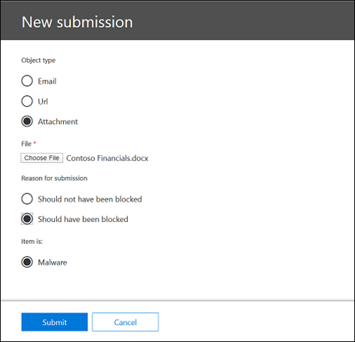

# 管理者提出を使用して、疑いのあるスパム、フィッシング、Url、およびファイルを Microsoft に送信する

Exchange Online のメールボックスを使用する Office 365 組織の管理者である場合は、Office 365 セキュリティ & コンプライアンスセンターの送信ポータルを使用して、電子メールメッセージ、Url、添付ファイルをスキャン用に Microsoft に送信できます。

電子メールを送信すると、受信メールがテナントに許可されている可能性のあるポリシーや、メール内のすべての Url と添付ファイルの調査に関する情報が得られます。 メールが許可されているポリシーには、個々のユーザーの信頼できる差出人のリストと、Exchange メールフロールール (トランスポートルールとも呼ばれる) などのテナントレベルのポリシーが含まれます。

その他の方法で、電子メールメッセージ、Url、添付ファイルを Microsoft に提出する方法については、 

## はじめに把握しておくべき情報

- セキュリティ & コンプライアンスセンターに<https://protection.office.com/>表示されます。 **送信**ページに直接移動するには、 <https://protection.office.com/reportsubmission>を使用します。

- Exchange Online PowerShell へ接続するには、「[Exchange Online PowerShell に接続する](https://docs.microsoft.com/powershell/exchange/exchange-online/connect-to-exchange-online-powershell/connect-to-exchange-online-powershell)」を参照してください。 スタンドアロンの Exchange Online Protection の PowerShell に接続するには、「 [Exchange Online protection の powershell への接続](https://docs.microsoft.com/powershell/exchange/exchange-eop/connect-to-exchange-online-protection-powershell)」を参照してください。

- これらの手順を実行する前に、アクセス許可を割り当てる必要があります。 スパム対策ポリシーを追加、変更、および削除するには、**組織の管理**、**セキュリティ管理者**、または**セキュリティリーダー**の役割グループのメンバーである必要があります。 セキュリティ & コンプライアンスセンターの役割グループの詳細については、「 [Office 365 セキュリティ & コンプライアンスセンターのアクセス許可](permissions-in-the-security-and-compliance-center.md)」を参照してください。

- ユーザーがメッセージやファイルを Microsoft に送信する方法の詳細については、「 [microsoft にレポートメッセージとファイルを](report-junk-email-messages-to-microsoft.md)送信する」を参照してください。

## Office 365 スキャンに対して疑わしいコンテンツを Microsoft に送信する方法

Microsoft にコンテンツを送信するには、送信ページの左上にある [**新しい送信**] ボタンをクリックします。 ページの右側にあるポップアップが表示され、電子メール、URL、またはファイルのいずれかを送信するオプションが表示されます。

### 疑わしいメールを Microsoft に送信する

1. 電子メールを送信するには、[**電子**メール] を選択し、電子メール**ネットワークのメッセージ ID**を指定するか、電子メールファイルをアップロードします。

2. ポリシーチェックの実行対象となる受信者を指定します。 ポリシーチェックは、ユーザーまたはテナントレベルのポリシーによって、電子メールがスキャンをバイパスしたかどうかを判断します。

3. 電子メールがブロックされているかどうかを指定します。 メールがブロックされている必要がある場合は、スパム、フィッシング、またはマルウェアとしてブロックされているかどうかを指定します。 可能な種類がわからない場合は、最適な判断を行ってください。

   - 送信時のポリシーによってフィルターがバイパスされた場合は、そのポリシーに関する情報が表示されます。

   - 1つまたは複数のポリシーによってフィルターがバイパスされていない場合、スキャンは数分で完了します。 [状態] リンクをクリックすると、送信に関する追加情報が表示されます。 これには、ポリシーチェックの結果と rescan verdict が含まれます。 メモこれにより、Office 365 ATP の完全なフィルター処理スタックからメールが再度実行されることはありませんが、メール、URL、またはファイルの特定の属性に基づいて、部分的な再スキャンが実行されます。

4. [**送信**] ボタンをクリックします。

### 疑わしい URL を Microsoft に送信する

1. URL を送信するには、ポップアップから [ **url** ] を選択します。 プロトコル (**https://**) を含む完全な URL を入力します。

   [**フィルター済み**] を選択した場合は、URL がフィッシングまたはマルウェアであるかどうかを指定します。

2. [**送信**] ボタンをクリックします。

### 疑わしいファイルを Microsoft に送信する

1. ファイルを送信するには、ポップアップ**からファイルを選択し**、スキャンしたいファイルをアップロードします。

2. [**送信**] ボタンをクリックします。
