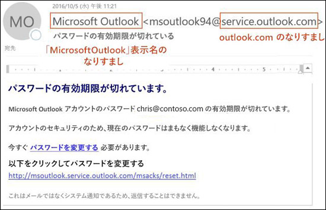
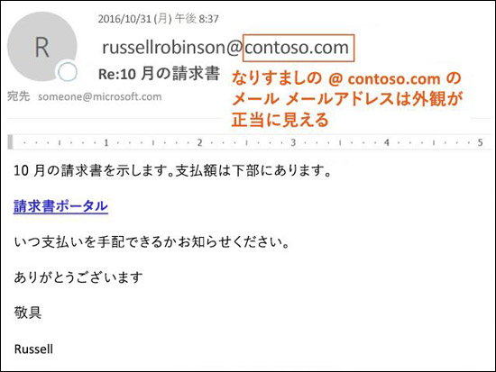

# EOP のスプーフィング対策保護

[!INCLUDE [Microsoft 365 Defender rebranding](../includes/microsoft-defender-for-office.md)]

Exchange Online のメールボックスを使用している Microsoft 365 組織または Exchange Online のメールボックスを使用していないスタンドアロンの Exchange Online Protection (EOP) 組織では、なりすましの (偽装) 送信者から組織を保護するための機能が EOP に含まれています。

ユーザーの保護について、Microsoft はフィッシングの脅威を重大視しています。 スプーフィングは、攻撃者が一般的に使用する手法です。 **スプーフィングされたメッセージは、実際の送信元とは異なるユーザーまたは場所から発信されたように見えます**。 この手法は、多くの場合、ユーザーの認証情報を詐取しようとするフィッシング活動で使用されます。 EOP のスプーフィング対策テクノロジは、メッセージ本文の From ヘッダー (メール クライアントでメッセージ送信者を表示するために使用されます) の偽造を特に調べます。 EOP が From へッダーが偽造されていると判断する場合、メッセージはスプーフィングされたものとして識別されます。

EOP では、次のスプーフィング対策テクノロジを使用できます。

- **スプーフィング インテリジェンス**: 内部および外部ドメインの送信者からのスプーフィングされたメッセージを確認し、その送信者を許可またはブロックします。 詳細については、「[Microsoft 365 でのスプーフィング インテリジェンスの構成](learn-about-spoof-intelligence.md)」を参照してください。

- **フィッシング詐欺対策ポリシー**: EOP では、フィッシング詐欺対策ポリシーにより、スプーフィング インテリジェンスを有効または無効にしたり、Outlook の認証されていない送信者識別情報を有効または無効にしたり、スプーフィングされた送信者をブロックするときのアクション ([迷惑メール] フォルダーまたは [検疫] に移動する) を指定したりすることができます。 Office 365 advanced Threat Protection (Office 365 ATP) で使用可能な高度なフィッシング詐欺対策ポリシーには、偽装対策設定 (送信者とドメインの保護)、メールボックス インテリジェンス設定、および調整可能な高度なフィッシングしきい値も含まれています。 詳細については、「[Microsoft 365 でのフィッシング詐欺対策ポリシー](set-up-anti-phishing-policies.md)」を参照してください。

- **メール認証**: スプーフィング対策の不可欠な部分は、DNS のSPF、DKIM、DMARC レコードによるメール認証 (メール検証とも呼ばれます) を使用することです。 ドメインのこれらのレコードを構成して、送信先のメール システムがドメインの送信者からのものであると主張するメッセージの有効性をチェックできるようにすることができます。 受信メッセージの場合、Microsoft 365 では送信者のドメインのメール認証が必要です。 詳細については、「[Microsoft 365 でのメール認証](email-validation-and-authentication.md)」をご覧ください。

2018 年 10 月以降、スプーフィング対策保護は EOP で提供されています。 以前は、スプーフィング対策保護は Office 365 ATP を使用する組織にのみ提供されていました。

EOP は、標準のメール認証方法と送信者評価手法の組み合わせによって認証されないメッセージを分析してブロックします。

## フィッシング攻撃でスプーフィングが使用される方法

スプーフィング メッセージは、ユーザーに次のようなの悪影響を及ぼします。

- ** ユーザーがスプーフィングされたメッセージにだまされる**: スプーフィングされたメッセージが受信者にリンクをクリックするように誘導し、認証情報を提出させたり、マルウェアをダウンロードさせたり、機密コンテンツを含めてメッセージに返信させたりします (ビジネス メール詐欺または BEC と呼ばれます)。

  次のメッセージは、なりすましの送信者 msoutlook94@service.outlook.com を使用するフィッシングの例です。

  

  このメッセージは service.outlook.com から送信されていまでしたが、攻撃者は **From** ヘッダー フィールドをスプーフィングして、そこから送信されたように見せかけていました。 これは、受信者をだまして、**パスワードを変更する**リンクをクリックさせたり、認証情報を提供させたりしようとする試みでした。

  次のメッセージは、スプーフィングされたメールドメイン contoso.com を使用する BEC の例です。

  

  メッセージは正当なものに見えますが、送信者はスプーフィングされています。

- **ユーザーが本物と偽物のメッセージを混同する**: フィッシング詐欺を知っているユーザーでも、実際のメッセージとスプーフィングされたメッセージの違いを見分けるのが難しい可能性があります。

  次のメッセージは、Microsoft Security アカウントからの実際のパスワード リセット メッセージの例です。

  

  メッセージは実際には Microsoft から送信されたものですが、ユーザーは疑っています。 本物と偽物のパスワード リセット メッセージを見分けることが難しいため、ユーザーは、メッセージを無視したり、スパムとして報告したり、フィッシング詐欺として Microsoft に不要な報告を返したりすることがあります。

## スプーフィングのさまざまな種類

Microsoft では、2 種類のスプーフィングされたメッセージを区別しています。

- **組織内スプーフィング**: _自己完結型_スプーフィングとも呼ばれます。 以下に例を示します。

  - 送信者と受信者は同じドメインにあります。
    > From: chris@contoso.com   To: michelle@contoso.com

  - 送信者と受信者は同じドメインのサブドメインにあります。
    > From: laura@marketing.fabrikam.com   To: julia@engineering.fabrikam.com

  - 送信者と受信者は同じ組織に属する異なるドメインに属しています (つまり、両方のドメインが同じ組織内の[承認済みドメイン](https://docs.microsoft.com/exchange/mail-flow-best-practices/manage-accepted-domains/manage-accepted-domains)として構成されています)。
    > From: sender @ microsoft.com   To: recipient @ bing.com

    スパムボットの収集活動を阻止するために、メールアドレスにスペースが使用されます。

  組織内のスプーフィングのために[複合認証](email-validation-and-authentication.md#composite-authentication)に失敗したメッセージには、次のヘッダー値が含まれます。

  `Authentication-Results: ... compauth=fail reason=6xx`

  `X-Forefront-Antispam-Report: ...CAT:SPOOF;...SFTY:9.11`

  - `reason=6xx` は組織内スプーフィングを示します。

  - SFTY はメッセージの安全レベルです。 9 はフィッシング詐欺、11 は組織内スプーフィングを示します。

- **クロスドメイン スプーフィング**: 送信者ドメインと受信者ドメインは異なり、互いに関係がありません (外部ドメインとも呼ばれます)。 以下に例を示します。
    > From: chris@contoso.com   To: michelle@tailspintoys.com

  クロスドメイン スプーフィングのために[複合認証](email-validation-and-authentication.md#composite-authentication)に失敗したメッセージには、次のヘッダー値が含まれます。

  `Authentication-Results: ... compauth=fail reason=000/001`

  `X-Forefront-Antispam-Report: ...CAT:SPOOF;...SFTY:9.22`

  - `reason=000` は、メッセージが明示的なメール認証に失敗したことを示します。 `reason=001` は、メッセージが暗黙的なメール認証に失敗したことを示します。

  - SFTY はメッセージの安全レベルです。 9 はフィッシング詐欺、22 はクロスドメイン スプーフィングを示します。

スプーフィングに関連するカテゴリおよび複合認証 (compauth) 値の詳細については、「[Microsoft 365 のスパム対策メッセージ ヘッダー](anti-spam-message-headers.md)」をご覧ください。

DMARC の詳細については、「[DMARC を使用して Microsoft 365 でメールを検証する](use-dmarc-to-validate-email.md)」を参照してください。

## スプーフィングのマークが付けられたメッセージの数量に関するレポート

EOP 組織は、セキュリティ/コンプライアンス センターのレポート ダッシュボードの**スプーフィング検出**レポートを利用できます。 詳細については、「[スプーフィング検出レポート](view-email-security-reports.md#spoof-detections-report)」を参照してください。

Office 365 ATP 組織は、セキュリティ/コンプライアンス センターで脅威エクスプローラーを使用して、フィッシング詐欺に関する情報を表示できます。 詳細については、「[Microsoft 365 脅威の調査および対応](office-365-ti.md)」をご覧ください。

## スプーフィング対策保護の問題

メーリング リスト (ディスカッション リストとも呼ばれます) では、メッセージの転送方法と変更方法が原因で、スプーフィング対策に関する問題があることがわかっています。

たとえば、Gabriela Laureano (glaureano @ contoso.com) はバード ウォッチングに興味があり、メーリングリスト birdwatchers @ fabrikam.com に参加し、リストに次のメッセージを送信します。

> **差出人:** "Gabriela Laureano" \<glaureano@contoso.com\>   **宛先:** Birdwatcher のディスカッション リスト\<birdwatchers@fabrikam.com\>   **件名:** 今週、レーニア山からアオカケス を見ることができます   今週、レーニア山からの風景を 眺めてみませんか?

メーリングリスト サーバーはメッセージを受信し、その内容を変更して、リストのメンバーにリプレイします。 リプレイされたメッセージの From アドレス (glaureano @ contoso.com) は同じですが、件名行にタグを追加して、メッセージの下側にフッターを追加します。 この種の変更は、メーリング リストでは一般的なものですが、スプーフィングの誤検出の原因になることがあります。

> **差出人:** "Gabriela Laureano" \<glaureano@contoso.com\>   **宛先:** Birdwatcher のディスカッション リスト\<birdwatchers@fabrikam.com\>   **件名:** [BIRDWATCHERS] 今週、レーニア山からアオカケス を見ることができます    今週、レーニア山からの風景を 眺めてみませんか?    このメッセージは、Birdwatchers ディスカッション リストに送信されました。 いつでも購読を解除できます。

メーリング リストのメッセージがスプーフィング対策チェックにパスできるようにするには、メーリングリストを制御するかどうかに応じて、次の手順を実行します。

- 組織でメーリング リストを所有している場合:

  - DMARC.org で次のよくある質問を確認してください: [I operate a mailing list and I want to interoperate with DMARC, what should I do?](https://dmarc.org/wiki/FAQ#I_operate_a_mailing_list_and_I_want_to_interoperate_with_DMARC.2C_what_should_I_do.3F)。

  - 次のブログ記事の手順を参照してください: [DMARC との相互運用で失敗を回避するためのメーリング リスト運営者向けのヒント](https://blogs.msdn.microsoft.com/tzink/2017/03/22/a-tip-for-mailing-list-operators-to-interoperate-with-dmarc-to-avoid-failures/)。

  - メーリング リスト サーバーに ARC をサポートする更新プログラムをインストールすることを検討してください (<http://arc-spec.org> を参照)。

- 組織でメーリング リストを所有していない場合:

  - メーリング リストの管理者に、メーリング リストがリレーしているドメインのメール認証を構成するように依頼します。

    ドメインの所有者に対して相当数の送信者が電子メール認証レコードの設定が必要なことを返信することで、ドメインの所有者の行動を促します。 Microsoft は必要なレコードを公開するためにドメインの所有者と協力しますが、個々のユーザーの要求が大きな支援になります。

  - メール クライアントで、メッセージを受信トレイに移動する受信トレイ ルールを作成してください。 「[スプーフィング インテリジェンスを使用して、認証されていないメールの許可された送信者を構成する](email-validation-and-authentication.md#use-spoof-intelligence-to-configure-permitted-senders-of-unauthenticated-email)」で説明されているように、管理者にオーバーライドの構成を依頼することもできます。

  - Microsoft 365 でサポート チケットを作成して、メーリング リストを正当なものとして扱うためのオーバーライドを作成します。 詳細については、「[一般法人向けサポートへのお問い合わせ - 管理者向けヘルプ](../../admin/contact-support-for-business-products.md)」を参照してください。

他のすべてが失敗した場合は、Microsoft に対してメッセージを誤検知として報告できます。 詳細については、「[メッセージとファイルを Microsoft に報告する](report-junk-email-messages-to-microsoft.md)」を参照してください。

また、サポート チケットとして Microsoft にこの件を提出できる管理者に問い合わせることもできます。 Microsoft のエンジニアリング チームは、メッセージにスプーフィングのマークが付けられた理由を調査します。

## スプーフィング対策保護に関する考慮事項

現在、Microsoft 365 にメッセージを送信している管理者である場合は、メールが正しく認証されていることを確認する必要があります。 それ以外の場合は、スパムまたはフィッシング詐欺としてマークされる可能性があります。 詳細については、「[認証されていないメールを送信している正当な送信者のためのソリューション](email-validation-and-authentication.md#solutions-for-legitimate-senders-who-are-sending-unauthenticated-email)」をご覧ください。

個人ユーザー (または管理者) の [信頼できる差出人のリスト] に含まれる送信者は、スプーフィング保護を含む、フィルター処理スタックの一部をバイパスします。 詳細については、「[Outlook の信頼できる差出人](create-safe-sender-lists-in-office-365.md#use-outlook-safe-senders)」を参照してください。

管理者は、可能な場合、許可された送信者リストまたは許可されたドメイン リストを使用して回避する必要があります。 これらの送信者は、迷惑メール、スプーフィング、およびフィッシング詐欺保護をすべてバイパスします。また、送信者認証 (SPF、DKIM、DMARC) も使用できません。 詳細については、「[許可された送信者リストまたは許可されたドメイン リストを使用する](create-safe-sender-lists-in-office-365.md#use-allowed-sender-lists-or-allowed-domain-lists)」を参照してください。
