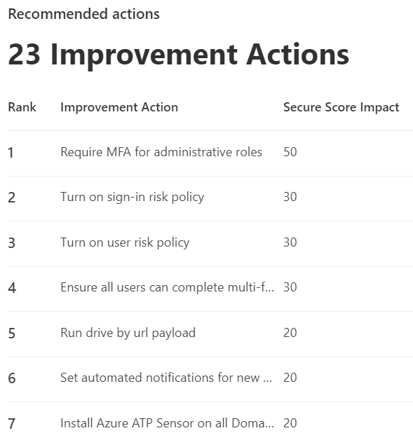

# 攻撃シミュレーショントレーニングを通じて洞察を得るGain insights through Attack simulation training

攻撃シミュレーショントレーニングの範囲内では、シミュレーションの結果と、従業員が出てきたトレーニングに基づいて、Microsoft が洞察を提供しています。Within Attack simulation training, Microsoft provides you with insights based on outcomes of simulations and training employees went through. これらの洞察は、従業員が脅威への対応についての進行状況を把握するのに役立つだけでなく、従業員やお客様の攻撃に備えた環境をより適切に準備するための次のステップも提供します。These insights will help inform you on progress your employees are doing on threat readiness, as well as recommend next steps to better prepare your employees and your environment for attacks.

[!INCLUDE [Prerelease information](../includes/prerelease.md)]

現在利用できる拡張された洞察を継続的に作業しており、動作に影響を与え、推奨される処置を現在利用できます。We are continuously working on expanding insights available to you, with behavior impact and recommended actions currently available.
開始するには、 [Microsoft 365 セキュリティセンターで、攻撃シミュレーショントレーニング](https://security.microsoft.com/attacksimulator?viewid=overview)に向かいます。To start, head over to [Attack simulation training on the Microsoft 365 security center](https://security.microsoft.com/attacksimulator?viewid=overview).

## 侵害率に対する動作の影響Behavior impact on compromise rate

[アタックシミュレーショントレーニングの **概要** ] タブでは、 **妥協率カードに対する動作の影響** を確認できます。On the Attack simulation training **Overview** tab, you'll find the **behavior impact on compromise rate** card. このカードは、予想される **妥協率** と対比して実行したシミュレーションで従業員がどのように処理されたかを示しています。This card shows how employees dealt with simulation you ran in contrast to the **predicted compromise rate**. これらの洞察を使用して、同じ従業員グループに対して複数のシミュレーションを実行することによって、従業員の脅威の準備状況を追跡できます。You can use these insights to track progress in employees threat readiness by running multiple simulations against the same groups of employees.

グラフには次のものが表示されます。In the graph you can see:

- [予測される **侵害率** ] 攻撃シミュレーショントレーニングを使用して、テナント全体で同じ種類のペイロードを使用したシミュレーションの平均妥協率を表します。**Predicted compromise rate** which reflects the average compromise rate for simulations using the same type of payload across tenants using Attack simulation training.
- [ **実際の侵害率** ] は、シミュレーションを使用した従業員のパーセンテージを表します。**Actual compromise rate** reflects the percentage of employees that fell for the simulation.

さらに、 `<number> less susceptible to phishing` 攻撃によって侵害された実際の従業員数と予想される妥協率の違いを反映しています。Additionally, `<number> less susceptible to phishing` reflects the difference between actual number of employees compromised by the attack and the predicted compromise rate. この数人の従業員は今後同様の攻撃によって侵害される可能性が低くなりますが、 `<percent%> better than predicted rate` 予想される妥協率と比較して従業員全体がどのように影響を受けたかを示します。This number of employees is less likely to be compromised by similar attacks in the future, while `<percent%> better than predicted rate` indicates how employees did overall in contrast with the predicted compromise rate.

詳細なレポートを表示するには、シミュレーション手法や対象ユーザー総数など、シミュレーション自体からの追加コンテキストに関する情報を提供する [ **シミュレーションとトレーニングの有効性の表示] レポート** をクリックします。To see a more detailed report, click on **View simulations and training efficacy report** which provides the same information with additional context from the simulation itself, like simulation technique and total users targeted.

## 推奨処理Recommended actions

[シミュレーション [ **Simulations** ] タブ](https://security.microsoft.com/attacksimulator?viewid=simulations)でシミュレーションのいずれかを選択すると、シミュレーションの詳細が表示されます。On the [**Simulations** tab](https://security.microsoft.com/attacksimulator?viewid=simulations) selecting any of the simulation will take you to simulation details. ここでは、[ **推奨** されるアクション] セクションについて説明します。Here you will find the **Recommended actions** section.

「推奨されるアクション」セクションでは、 [Microsoft セキュリティスコア](../mtp/microsoft-secure-score.md)で利用できる推奨事項について説明します。The recommended actions section details recommendations as available in [Microsoft Secure Score](../mtp/microsoft-secure-score.md). これらの推奨事項は、シミュレーションで使用されるペイロードに基づいており、従業員や環境を保護するのに役立ちます。These recommendations are based on the payload used in the simulation and will help you protect your employees and your environment. 各改善アクションをクリックすると、その詳細が表示されます。Clicking on each improvement action will take you to its details.

