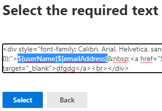

# 攻撃シミュレーショントレーニング用のカスタムペイロードを作成するCreate a custom payload for Attack simulation training

Microsoft では、さまざまなソーシャルエンジニアリング手法に対して、攻撃シミュレーショントレーニングと組み合わせた堅牢なペイロードカタログを提供しています。Microsoft offer a robust payload catalog for various social engineering techniques to pair with your attack simulation training. ただし、組織にとってより適切に機能するカスタムのペイロードを作成することをお勧めします。However, you might want to create custom payloads that will work better for your organization. ここでは、Microsoft Defender for Office 365 を使用して、攻撃シミュレーショントレーニングのペイロードを作成する方法について説明します。The following describes how to create a payload in attack simulation training through Microsoft Defender for Office 365.

[!INCLUDE [Prerelease information](../includes/prerelease.md)]

[ [専用 **ペイ** ロード] タブ](https://security.microsoft.com/attacksimulator?viewid=payload)または [シミュレーション作成ウィザード](attack-simulation-training.md#selecting-a-payload)内の [ **ペイロードの作成** ] をクリックすると、ペイロードを作成できます。You can create a payload by clicking on **Create a payload** in either the [dedicated **Payloads** tab](https://security.microsoft.com/attacksimulator?viewid=payload) or within the [simulation creation wizard](attack-simulation-training.md#selecting-a-payload).

ウィザードの最初の手順では、ペイロードの種類を選択します。The first step in the wizard will have you select a payload type. **現在、電子メールのみ利用可能** です。**Currently only email is available**.

次に、関連する手法を選択します。Next, select an associated technique. [ソーシャルエンジニアリング手法を選択](attack-simulation-training.md#selecting-a-social-engineering-technique)する方法について詳しくは、こちらを参照してください。See more details on techniques at [Selecting a social engineering technique](attack-simulation-training.md#selecting-a-social-engineering-technique).

次の手順では、ペイロードの名前を指定します。In the next step name your payload. 必要に応じて、説明を指定することもできます。Optionally, you can give it a description.

## ペイロードの構成Configure payload

ここで、ペイロードを作成します。Now it's time to build your payload. [ **送信者の詳細** ] セクションに、送信者の名前、電子メールアドレス、電子メールの件名を入力します。Input the sender's name, email and the email's subject in the **Sender details** section. 指定されたリストからフィッシング URL を選択します。Pick a phishing URL from the the provided list. この URL は、後でメッセージの本文に埋め込まれます。This URL will later be embedded into the body of the message.

> [!TIP]
> ペイロードの送信者に対して内部電子メールを選択することができます。この場合、ペイロードは会社の別の従業員からのものとして表示されます。You can choose an internal email for your payload's sender, which will make the payload appear as coming from another employee of the company. これにより、ペイロードに対する弱点が増加し、内部の脅威のリスクについて従業員を教育することができます。This will increase susceptibility to the payload and will help educate employees on the risk of internal threats.

ペイロードの作成には、リッチテキストエディターを使用できます。A rich text editor is available to create your payload. 事前に作成した電子メールをインポートすることもできます。You can also import an email you've created beforehand. 電子メールの本文を構造化する際には、 **動的タグ** を利用して、対象の電子メールをカスタマイズします。As you structure the body of the email, take advantage of the **dynamic tags** to personalize the email to your targets. [ **フィッシング] リンク** をクリックして、以前選択したフィッシング URL を電子メールの本文に追加します。Click on **Phishing link** to add the previously selected phishing URL into the body of the email.

> [!TIP]
> 少し時間を節約するには、 **電子メールメッセージ内のすべてのリンクをフィッシングリンクに置き換える** オプションをオンにします。To save yourself some time, toggle on the option to **replace all links in the email message with the phishing link**.

必要に応じてペイロードの作成が完了したら、[ **次へ** ] をクリックします。Once you're done building the payload to your liking, click **Next**.

## インジケーターの追加Adding indicators

インジケーターを使用すると、従業員が攻撃を仕掛ける際に、今後の攻撃で探すことができる手がかりがわかります。Indicators will help employees going through the attack simulation understand clue they can look for in future attacks. 開始するには、[ **インジケーターの追加** ] をクリックします。To start, click **Add indicator**.

使用するインジケーターをドロップダウンリストから選択します。Select an indicator you'd like to use from the drop-down list. このリストは、フィッシング電子メールメッセージに表示される最も一般的なヒントを含む合わせです。This list is curated to contain the most common clues that appear in phishing email messages. 選択したら、 **メールの本文から** インジケーターの配置がに設定されていることを確認し、[ **テキストの選択** ] をクリックします。Once selected, make sure the indicator placement is set to **From the body of the email** and click on **Select text**. このインジケーターが表示されるペイロードの部分を選択状態にし、[ **選択] を** クリックします。Highlight the portion of your payload where this indicator appears and click **Select**.

インジケーターを説明するカスタムの説明を追加し、インジケータープレビューフレーム内をクリックして、インジケーターのプレビューを表示します。Add a custom description to describe the indicator and click within the indicator preview frame to see a preview of your indicator. 完了したら、[ **追加** ] をクリックします。Once done, click **Add**. ペイロードのすべてのインジケーターについて説明するまで、この手順を繰り返します。Repeat these steps until you've covered all indicators in your payload.

## ペイロードの確認Review payload

ペイロードの作成が完了しました。You're done building your payload. 次に、詳細を確認して、ペイロードのプレビューを表示します。Now it's time to review the details and see a preview of your payload. プレビューには、作成したすべてのインジケーターが含まれます。The preview will include all indicators you've created. この手順では、ペイロードの各部分を編集できます。You can edit each part of the payload from this step. 問題がなければ、ペイロードを **送信** します。Once satisfied, **Submit** your payload. 

> [!IMPORTANT]
> 作成したペイロードの **テナント** は、ソースとして設定されます。Payloads you've created will have **Tenant** set as their source. ペイロードを選択するときは、 **テナント** が除外されていないことを確認してください。When selecting payloads, make sure you don't have **Tenant** filtered out.