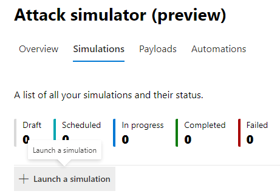
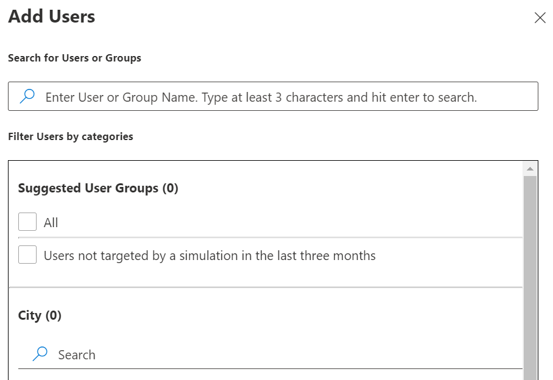
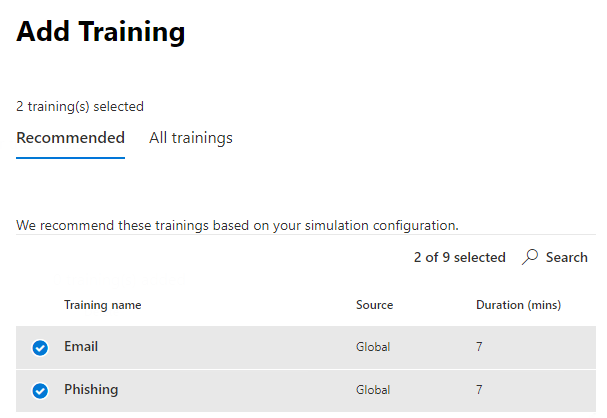

# フィッシング攻撃をシミュレートする

アタックシミュレータのトレーニング Microsoft Defender for Office 365 を使用すると、組織内の危険なサイバー攻撃のシミュレーションを実行して、セキュリティポリシーとプラクティスをテストしたり、組織の従業員をトレーニングして、認識を拡大し、攻撃に対する弱点を減らすことができます。 次に、攻撃シミュレータトレーニングを使用してフィッシング攻撃をシミュレートする手順を説明します。

[!INCLUDE [Prerelease information](../includes/prerelease.md)]

シミュレートされたフィッシング攻撃を開始するには、 [Microsoft 365 セキュリティセンター](https://security.microsoft.com/)に移動します。 [ **電子メール & グループ作業** ] で、[ **アタックシミュレータ** ] をクリックし、[ [**シミュレーション**](https://security.microsoft.com/attacksimulator?viewid=simulations) ] タブに切り替えます。

[ **シミュレーション** ] **の下で、[シミュレーションの開始** ] を選択します。

> [!NOTE]
> シミュレーションの作成中はいつでも、保存して閉じて、後でシミュレーションの構成を続行することができます。

## ソーシャルエンジニアリング手法の選択

[MITRE ATT&](https://attack.mitre.org/techniques/enterprise/)の合わせの® framework から、4つの異なる手法から選択します。 さまざまなペイロードをさまざまな方法で使用できます。

- **資格** 情報の収集では、ユーザー名とパスワードを送信する入力ボックスを使用して、従業員からの資格情報を既知の参照 web サイトに取り込みます。
- **マルウェアの添付ファイル** は、メッセージに悪意のある添付ファイルを追加します。 この添付ファイルを開くと、攻撃者がターゲットのデバイスを侵害する際に役立つ任意のコードが実行されます。
- **添付ファイルのリンク** は、資格情報ハーベストハイブリッドの種類です。 攻撃者が電子メールの添付ファイルに URL を挿入します。 添付ファイル内の URL は、資格情報のハーベストと同じ方法に従います。
- **マルウェアへのリンク** は、既知のファイル共有サイトでホストされているファイルから任意のコードを実行します。 この悪意のあるファイルへのリンクが、ターゲットに送信されるメッセージに追加され、それをクリックすると、ファイルが実行され、攻撃者がターゲットのデバイスを侵害することができます。

> [!TIP]
> 各手法の説明内で [ **詳細の表示** ] をクリックすると、その手法に関する詳細情報と、その手法のシミュレーション手順が表示されます。
>
> 

この方法を選択し、[] をクリックしたら、シミュレーションで名前と説明 **を指定し** ます。

## ペイロードの選択

次に、既存のペイロードカタログからペイロードを選択する必要があります。

ペイロードには、次の項目を選択するのに役立つさまざまなデータポイントがあります。

- **[利率] クリック** すると、このペイロードをクリックしたユーザー数がカウントされます。
- [予測される **侵害率** ] Microsoft Defender for Office 365 のお客様について、このペイロードの履歴データに基づいて、このペイロードによって侵害されるユーザーの割合を予測します。
- **シミュレーションが開始** された数このペイロードが他のシミュレーションで使用された回数。
- **フィルター** によって使用可能な **複雑さ** は、ペイロード内のインジケーターの数に基づいて計算されます。これは、攻撃の対象となるターゲットを示すものです。 その他の指標により、複雑さが軽減されます。
- **ソース** ( **フィルター** 経由で利用可能) は、テナントでペイロードが作成されたかどうか、または Microsoft の既存のペイロードカタログ (グローバル) の一部であるかどうかを示します。

リストからペイロードを選択すると、ペイロードのプレビューが追加情報と共に表示されます。

独自のペイロードを作成したい場合は、「 [アタックシミュレーショントレーニングのペイロードを作成](attack-simulation-training-payloads.md)する」をお読みください。

## 対象ユーザーの設定

ここで、このシミュレーションの対象ユーザーを選択します。 **組織内のすべてのユーザーを含める** か、 **特定のユーザーとグループのみ** を含めるかを選択できます。 

**特定のユーザーとグループのみを含める** ように選択する場合は、次のいずれかの方法を使用できます。

- **ユーザーを追加** します。これにより、テナントの検索や、過去3か月間にシミュレーションの対象となっていないユーザーを対象にしたユーザーを対象とした、高度な検索とフィルター処理の機能を活用できます。
  
- **CSV からインポート** このシミュレーションでは、あらかじめ定義されたユーザーのセットをインポートすることができます。

## トレーニングの割り当て

トレーニングを受けている従業員は、同じような攻撃の影響を受けないため、各シミュレーションに対してトレーニングを割り当てることをお勧めします。

トレーニングを割り当てるか、自分でトレーニングコースやモジュールを選択するかを選択できます。

[ **トレーニング期限日** ] を選択して、従業員が適切な方法でトレーニングを完了できるようにします。

> [!NOTE]
> 自分でコースとモジュールを選択した場合でも、推奨コンテンツと利用可能なすべてのコースおよびモジュールを表示することができます。
>
> 

次の手順では、自分で選択するように選択した場合は、トレーニングを **追加** し、トレーニングランディングページをカスタマイズする必要があります。 トレーニングランディングページをプレビューしたり、ヘッダーと本文を変更したりすることができます。

## 詳細を起動して確認する

すべての構成が完了したので、このシミュレーションをすぐに開始するか、後でスケジュールすることができます。 このシミュレーションを終了するタイミングも選択する必要があります。 このシミュレーションとの対話のキャプチャは、選択した時間を過ぎて停止します。 

**地域対応のタイムゾーン配信を有効** にして、地域に基づいて就業時間中に従業員にシミュレートされた攻撃メッセージを送信します。

完了したら、[ **次へ** ] をクリックして、シミュレーションの詳細を確認します。 いずれかのパーツの [ **編集** ] をクリックして戻り、変更が必要な詳細情報を変更します。 完了したら、[ **送信** ] をクリックします。
