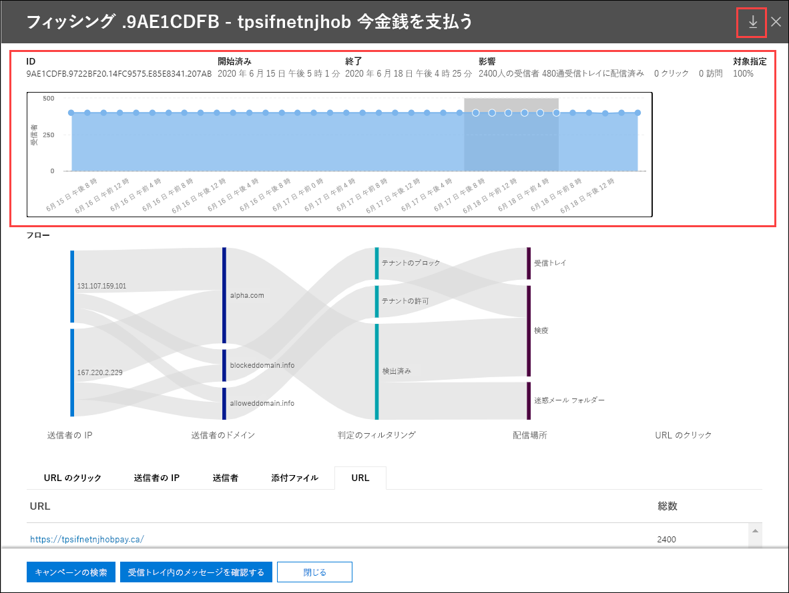

# ATP のキャンペーン ビュー

キャンペーン ビューは、セキュリティ/コンプライアンス センターの Advanced Threat Protection (ATP) & の機能で、サービスのフィッシング攻撃を特定して分類します。 キャンペーン ビューは、次の目的に使用できます。

- フィッシング攻撃を効率的に調査し、対処する。

- 攻撃対象を正確に理解する。

- 意思決定者に価値を示す。

キャンペーン ビューを使用すると、人間には真似できない速さと完全さで攻撃の全体像を把握できます。

## キャンペーンとは

キャンペーンとは、1 つまたは複数の組織に対する組織的なメール攻撃のことです。 資格情報と企業データを不用とするメール攻撃は、大きくて漏える多い情報です。 攻撃を停止するためのテクノロジが増加すると、攻撃者は攻撃を継続できるように取り上げ、方法を変更します。

Microsoft では、サービス全体のフィッシング対策、スパム対策、マルウェア対策に関する大量のデータを活用してキャンペーンを特定できるようにします。 いくつかの要素に従って攻撃情報を分析し、分類します。 たとえば、次のようにします。

- **攻撃ソース**: ソース IP アドレスと送信者のメール ドメイン。

- **攻撃メッセージの**プロパティ: メッセージのコンテンツ、スタイル、トーン。

- **攻撃の受信者**: 受信者のドメイン、受信者の職務 (管理者、役員など)、会社の種類 (大企業、中小企業、公的組織、民間組織など)、業界。

- **攻撃の**ペイロード: 悪意のあるリンク、添付ファイル、またはメッセージ内のその他のペイロード。

キャンペーンの有効期間は短くしたり、アクティブ期間およびアクティブ期間が無効な月間にしたりできます。 キャンペーンは、特定の組織に応じて立てたり、組織が複数の企業にまたがって大規模なキャンペーンに参加してくる場合があります。

## セキュリティ センターのセキュリティ &キャンペーン ビュー

キャンペーン ビューは、セキュリティ/[コンプライアンス センターの脅 &威管理キャンペーン](https://protection.office.com)で、または直接**Threat management** \> **Campaigns**利用できます <https://protection.office.com/campaigns> 。

次の方法でキャンペーン ビューを取得することもできます。

- **脅威の管理** \>**エクスプローラー** \>**View** \>**キャンペーン**

- **脅威の管理** \>**エクスプローラー** \>**View** \>**すべての電子メール** \>**[キャンペーン]** タブ

- **脅威の管理** \>**エクスプローラー** \>**View** \>**フィッシング語** \>**[キャンペーン]** タブ

- **脅威の管理** \>**エクスプローラー** \>**View** \>**マルウェア** \>**[キャンペーン]** タブ

キャンペーン ビューにアクセスするには、セキュリティ/コンプライアンス **センターの組織管理**、 **セキュリティ管理者**、または **セキュリティ閲覧者** の役割グループのメンバー&必要があります。 詳細については、「[セキュリティ/コンプライアンス センターのアクセス許可](permissions-in-the-security-and-compliance-center.md)」を参照してください。

## キャンペーンの概要

概要ページには、すべてのキャンペーンに関する情報が表示されます。

既定の [ **キャンペーン] タブ** では、 **キャンペーンの種類の** 領域には、1 日あたりの受信者数を示す棒グラフが表示されます。 既定では、グラフにはフィッシ**ング データとマルウェア データの両方****が表示**されます。

> [!TIP]
> キャンペーンのデータが表示されていない場合は、日付範囲またはフィルターを変更してみて [ください](#filters-and-settings)。

概要ページの残りの部分では、キャンペーン タブに **次の情報を示** します。

- [**Name (名前)**]

- [**Sample subject (件名のサンプル)**]: キャンペーンのいずれかのメッセージの件名行。 キャンペーン内のすべてのメッセージの件名が同じであるとはずです。

- **Targeted**(対象指定): (組織内のキャンペーン受信者の数)/ (サービス内のすべての組織のキャンペーン内の受信者の合計数) によって計算された割合。 この値は、キャンペーンの特に、その広告を組織の (より高い価値) とサービス内の他の組織 (値を低い) に適用するかを示します。

- **Type:** この値は、**フィッシングまたはマルウェア****のいずれかです**。

- **サブタイプ**: この値には、キャンペーンの詳細が含まれます。 たとえば、次のようにします。

  - **フィッシング**: 使用可能な場合、このキャンペーンによってフィッシングされるブランド。 たとえば、、 `Microsoft` 、 、 , 、 、 `365` `Unknown` `Outlook` などです `DocuSign` 。

  - **Malware**: For example, `HTML/PHISH` or `HTML/<MalwareFamilyName>` .

可能な場合、このキャンペーンによってフィッシングされるブランド。 ATP テクノロジによる検出の場合、プレフィックス **ATP- が** subtype 値に追加されます。

- [**Recipients (受信者)**]: このキャンペーンの攻撃対象となったユーザーの数。

- **受信トレイ:** このキャンペーンからメッセージを受信したユーザーの数 ([迷惑メール] フォルダーには配信されません)。

- **クリック済**み : URL をクリックしたか、フィッシングメッセージ内で添付ファイルを開いたユーザーの数。

- **クリック率**: "クリックされた受信トレイ"**によって計算される**  /  **割合。** この値は、キャンペーンの有効性と、受信者がメッセージをフィッシングとして識別できて、ペイロード URL をクリックしないかどうかを示すインジケーターです。

  この値は、マルウェア キャンペーンでは使用されません。

- **[訪問済**み]: ユーザー数をペイロード Web サイトに対して実際に行ったユーザー数。 クリックされた値 **はあっても** 、Web サイトへの安全なリンクによるアクセスがブロックされている場合、この値は 0 になります。

キャ **ンペーンの元のタブ** には、世界地図にメッセージ ソースが表示されます。

### フィルターと設定

[キャンペーン ビュー] ページの上部には、特定のキャンペーンの検索と分離に役立つフィルター設定とクエリ設定があります。

最も基本的なフィルター処理として使用できるフィルターは、開始日時と終了日時です。

ビューをさらにフィルター処理するには、[キャンペーンの種類] ボタンをクリック**Campaign type**し、選択して、[更新] をクリックして、複数の値をフィルター処理で 1 つの**プロパティに対して実行します**。

利用可能なキャンペーンのプロパティを次の一覧に示します。

- 基本

  - **キャンペーンの種類**: マルウェア**またはフィ****ッシングを選択します**。 選択範囲をクリアすると、両方を選択した場合と同じ結果になります。
  - **キャンペーン名**
  - **キャンペーン サブタイプ**
  - **送信者**
  - **受信者**
  - **送信元ドメイン**
  - **[件名]**
  - **添付ファイルの名前**
  - **マルウェア ファミリー**
  - **配信操作**
  - **検出テクノロジ**
  - **Tags**
  - **システムオーバーライド**

- 詳細情報

  - **インターネット メッセージ ID:** メッセージ ヘッダー **内の Message-ID** ヘッダー フィールドで使用可能です。 角かっ `<08f1e0f6806a47b4ac103961109ae6ef@server.domain>` こなどに注:
  
  - **ネットワーク メッセージ ID:** メッセージ ヘッダー内の **X-MS-Exchange-Organization-Network-Message-Id** ヘッダー フィールドで使用可能な GUID 値です。
  
  - [**Sender IP (送信者の IP)**]
  
  - **添付ファイルの SHA256:** Windows でファイルの SHA256 ハッシュ値を検索するには、コマンド プロンプトで次のコマンドを実行します `certutil.exe -hashfile "<Path>\<Filename>" SHA256` 。
  
  - **クラスター ID**
  
  - **アラート ポリシー ID**

- URL

  - **URL ドメイン**
  - **URL ドメインおよびパス**
  - **URL**
  - **URL パス**
  - **Click dict**

複数のプロパティによるフィルター処理など、より高度なフィルター処理の場合は、[ **フィルターの設定] ボタン** をクリックしてクエリを作成します。 同じキャンペーンのプロパティが利用できますが、次の機能強化が含まれています。

- [条件の追加 **] をクリックして、** 複数の条件を選択できます。
- 条件の間に **、And** または **Or** 演算子を選択できます。
- 条件リストの **下部にある** 条件グループの項目を選択すると、複雑な複合条件を作成できます。

完了したら、[クエリ] ボタンを **クリック** します。

基本フィルターまたは高度なフィルターを作成した後は、[保存] クエリまたは [保存] のクエリを**使用して****そのフィルターを保存できます**。 後でキャンペーン ビューに戻って、保存されたクエリ設定をクリックして、保存されたフィルター **を読み込むことができます**。

グラフまたはキャンペーンの一覧をエクスポートするには、[**エクスポート]** をクリックして [エクスポート] をクリックし **、[グラフ データ****をエクスポート] または [キャンペーン リストのエクスポート] をクリックします**。

Microsoft Defender ATP サブスクリプションがある場合は **、WDATP をクリックして** 、Microsoft Defender ATP を使用してキャンペーン情報に接続または切断できます。 詳しくは [、「Microsoft Defender ATP を使用して Office 365 ATP を統合する」をご覧ください](https://docs.microsoft.com/microsoft-365/security/office-365-security/integrate-office-365-ti-with-wdatp)。

## キャンペーンの詳細

キャンペーンの名前をクリックすると、キャンペーンの詳細がポップアップに表示されます。

### キャンペーン情報

キャンペーンの詳細ビューの上部で、次のキャンペーン情報が提供されます。

- **ID:** 一意のキャンペーン識別子。

- **開始****日:** キャンペーンの開始日と終了日。 これらの日付は、概要ページで選選したフィルター日付より多くの場合があります。

- **影響**: このセクションには、選択した (またはタイムラインで選択した) 期間フィルターに関する次のデータが含まれます。
  
  - 受信者の総数。
  - 「受信トレイ」された (受信トレイに配信された、迷惑メール フォルダーに対してでない) メッセージの数。
  - フィッシング メッセージの URL ペイロードをクリックしたユーザーの数。
  - URL のアクセス数の多いユーザー数。

- **Targeted**(対象指定): (組織内のキャンペーン受信者の数)/ (サービス内のすべての組織のキャンペーン内の受信者の合計数) によって計算された割合。 この値はキャンペーンの有効期間全体をとって計算され、フィルターの日付は変更されないことに注意してください。

- キャンペーン アクティビティの対話型タイムライン: タイムラインはキャンペーンの有効期間全体に発生したアクティビティを示します。 既定では、概要で選択した日付範囲フィルターがシェーダ表示されます。 クリックしてドラッグすると、特定のスタート ポイントとエンド ポイントを選択できます。この場合、次のセクションで説明するように、[影響] 領域とページの残りの<u>部分に表示されるデータが変更されます**Impact**</u>。

タイトル バーで、[ダウンロード キャンペー **ンの書き込** み] ボタン Download キャンペーンの書き込みアイコンをクリックすると、キャンペーンの詳細を Word 文書  (既定では CampaignReport.docx という名前) にダウンロードできます。 このドキュメントには、キャンペーンの有効期間全体に関する詳細が含まれていることに注意してください (選したフィルターの日付を含むことも含む)。

### キャンペーン フロー

キャンペーンの詳細ビューの中央に、キャンペーンに関する重要な詳細が、水 **平** 方向のフロー図 _(San キー_ の図) の [フロー] セクションに表示されます。 これらの詳細情報は、キャンペーンの要素および組織に与えている可能性のある影響を理解する上で役立ちます。

> [!TIP]
> Flow 図に表示される情報 **は、** 前のセクションで説明したように、タイムラインのシェーデン日付範囲によって制御されます。

図内の横方向の帯にマウスのポインターを合わせると、関連するさまざまなメッセージが表示されます (特定のソース IP からのメッセージ、指定した送信者ドメインを使用した、特定のソース IP からのメッセージなど)。

図には、次の情報が含まれます。

- [**Sender IPs (送信者の IP)**]

- [**Sender domains (送信者のドメイン)**]

- **フィルターの確認**: これらの値は、スパム対策メッセージ ヘッダーに記述されている利用可能なフィッシング [およびスパムフィルターの頂点に関連しています](anti-spam-message-headers.md)。 次の表に使用可能な値を示します。

  ****

  |値|スパム フィルターの確認|説明|
  |---|---|---|
  |**可**|`SFV:SKN`    `SFV:SKI`|メッセージは、スパム フィルターによって評価される前に、スパム フィルターまたはスキップされていないフィルターとしてマークされました (たとえば、メール フロー ルールによって、トランスポート ルールとも呼ばれる)。  その他の理由でスパム フィルターがスキップされた場合 (たとえば、送信者と受信者が同じ組織内にあるように見える)。|
  |**ブロック済み**|`SFV:SKS`|メッセージは、スパム フィルターによって評価される前にスパムとしてマークされました (例: メール フロー ルールによって)。|
  |[**Detected (検出済み)**]|`SFV:SPM`|スパム フィルタリングによって、メッセージがスパムとしてマークされました。|
  |**検出されません (Not Detected)**|`SFV:NSPM`|スパム フィルタリングによって、メッセージは迷惑メールでないとしてマークされました。|
  |**リリース済み**|`SFV:SKQ`|メッセージは検疫から解放されたため、スパム フィルタリングがスキップされました。|
  |**テナントによる許可**\*|`SFV:SKA`|メッセージがスパム対策ポリシーの設定 (送信者が許可された送信者リストまたは許可されたドメイン リストに含ていたなど) によってスキップされたスパム フィルタリングをスキップした。|
  |**テナント ブロック**\*\*|`SFV:SKA`|メッセージはスパム対策ポリシー設定 (送信者が許可された送信者リストまたは許可されたドメイン リストに含ていたなど) によって、スパム フィルタリングによってブロックされました。|
  |**ユーザー許可**\*|`SFV:SFE`|送信者が Outlook の差出人セーフ リストに含ていたため、メッセージにスパム フィルタリングが省略されました。|
  |**ユーザー ブロック**\*\*|`SFV:BLK`|送信者は Outlook のユーザーの受信拒否リストに含っていたため、スパム フィルタリングによってメッセージがブロックされました。|
  |**ZAP**|該当なし|[スパム対策ポリシー設定 ([迷惑メール] フォルダーまたは [検疫済み] に移動)](zero-hour-auto-purge.md) に従って、配信されたメッセージに対して、配信されたメッセージに対してゼロアオージ (ZAP) アクションが実行されたとき。|
  |

  \* 許可されたメッセージがサービスによってブロックされる可能性が大きいため、スパム対策ポリシーを確認します。

  \*\* これらのメッセージは検疫され、配信されないため、スパム対策ポリシーを確認します。

- [**Delivery locations (配信場所)**]: 実際に受信者に (受信トレイまたは迷惑メールフォルダーに) 配信されたメッセージについては、メッセージに含まれるペイロード URL をユーザーがクリックしなかった場合でも調査することをお勧めします。 検疫済みメッセージを検疫から削除することもできます。 詳細については [、EOP の検疫済み電子メール メッセージを参照してください](quarantine-email-messages.md)。

  - **フォルダーの削除**
  - **Dropped**
  - **External:** 受信者は、ハイブリッド環境の社内電子メール組織にあります。
  - **失敗**
  - **Forwarded**
  - [**Inbox (受信トレイ)**]
  - [**Junk folder (迷惑メール フォルダー)**]
  - [**Quarantine (検疫)**]
  - **不明**

- **URL clicks:** These are described in the next section.

> [!NOTE]
> 10 個を超えるアイテムを含むすべてのレイヤーでは、上位 10 個のアイテムが表示され、他の項目は他のアイテムにま **とめてバンドルされます**。

#### URL のクリック

フィッシング メッセージが受信者 (受信トレイまたは迷惑メール フォルダー) に配信される場合、ユーザーがペイロード URL をクリックする機ッスは常に存在します。 配信されたメッセージの URL をクリックしないと成功の小さい測定値になりますが、フィッシング メッセージがメールボックスに配信された最初の場所である理由を特定する必要があります。

ユーザーがフィッシング メッセージのペイロード URL をクリックすると、その操作はキャンペーンの詳細ビューの図 **の URL** クリックに表示されます。

- **可**

- **BlockPage**: 受信者がペイロード URL をクリックしたが、悪意のある Web サイトへのアクセスは、組織 [の ATP](atp-safe-links.md) の安全なリンク ポリシーによってブロックされました。

- **BlockPageOverride**: メッセージ内のペイロード URL を受信者がクリックしたが、ATP の安全なリンクによってその停止が試みましたが、ブロックの上書きは許可されました。 「安全なリンク」ポリシーを [調査して](set-up-atp-safe-links-policies.md) 、ユーザーが安全なリンクの詳細を上書きし、悪意のある Web サイトにアクセスし続けた理由を確認する必要があります。

- **PendingDetonationPage**: ATP の安全な添付ファイルは、仮想コンピューター環境でペイロード URL を開いて、その結果を確認するプロセスです。

- **PendingDetonationPageOverride:** 受信者は、ペイロードの分析プロセスを上書きして、結果を待たずに URL を開くことを許可されていました。

### タブ

キャンペーンの詳細ビューのタブを使用すると、キャンペーンをさらに詳しい情報にすることができます。

> [!TIP]
> タブに表示される情報は、[キャンペーン情報] セクションで説明されているとおりに、タイムライン内 [の日付範囲によって制御](#campaign-information) されます。

- **URL のクリック**:ユーザーがフィッシング メッセージのペイロード URL をクリックしなかった場合、このセクションは空白になります。 ユーザーが URL をクリックできる場合は、次の値が入力されます。

  - [**User**\*]
  - [**URL**\*]
  - **クリック時刻**
  - **Click dict**

- [**Sender IPs (送信者の IP)**]

  - [**Sender IP (送信者の IP)**\*]
  - **総数**
  - **受信トレイ**
  - **受信トレイに出ない**
  - **SPF が渡**されました:送信者は [Sender Policy Framework (SPF) によって認証されました](how-office-365-uses-spf-to-prevent-spoofing.md)。 SPF 検証に合格しない送信者は、送信者が認証されていないか、正当な送信者を偽装していることを示しています。

- [**Senders (送信者)**]

  - **Sender:** SMTP MAIL FROM コマンドの実際の送信者アドレスを指定しますが、メール クライアントでユーザーに表示される差出人: メール アドレスとは異なりません。
  - **総数**
  - **受信トレイ**
  - **受信トレイに出ない**
  - **DKIM が渡**されました: 送信者は [Domain Keys Identified Mail (DKIM) によって認証されました](support-for-validation-of-dkim-signed-messages.md)。 DKIM 検証にパスしない送信者は、送信者が認証されていない、または正当な送信者を偽装していることを示しています。
  - **DMARC のパス**: 送信者はドメイン ベースのメッセージ認証、レポート、および一時的 [な Conformance (DMARC) によって認証されました](use-dmarc-to-validate-email.md)。 DMARC 検証にパスされない送信者は、送信者が認証されていないか、正当な送信者を偽装していることを示しています。

- **添付ファイル**

  - **Filename**
  - **SHA256**
  - **マルウェア ファミリー**
  - **総数**

- **URL**

  - [**URL**\*]
  - [**Total Count (総数)**]

\* この値をクリックすると、指定したアイテム (ユーザー、URL など) についての詳細情報を含む新しいポップアップがキャンペーンの詳細ビューの上に開きます。 キャンペーンの詳細ビューに戻るには、表示されたフライアウトで [**Done (完了)**] をクリックします。

### ボタン

キャンペーンの詳細ビューのボタンを使用すると、脅威エクスプローラーを使用してキャンペーンを詳しく調査できます。

- [**Explore campaign (キャンペーンの調査)**]: **Campaign ID (キャンペーンの ID)** 値を検索フィルターとして使用する新しい脅威エクスプローラーの検索タブが開かれます。

- **受信トレイに置かれていたメッセージ**の確認: キャンペーン **ID** と配信場所を使用する新しい脅威エクスプローラーの **検索タブが開きます。[受信トレイ** ] は検索フィルターとして表示されます。
