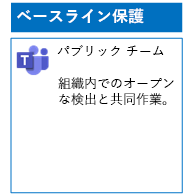
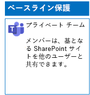
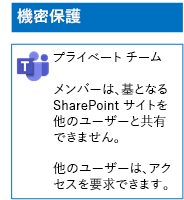
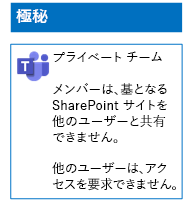

# ファイルの 3 層の保護用にチームを展開するDeploy teams for three tiers of protection for files

この記事にある手順を使用して、ベースライン、機密、高機密のチームを設計し、展開します。Use the steps in this article to design and deploy baseline, sensitive, and highly confidential teams. この 3 層の保護の詳細については、「[Microsoft Teams のファイルを保護する](secure-files-in-teams.md)」を参照してください。For more information about these three tiers of protection, see [Secure files in Microsoft Teams](secure-files-in-teams.md).

## ベースライン チームBaseline teams

ベースライン保護には、パブリックとプライベートの両方のチームが含まれます。Baseline protection includes both public and private teams. パブリック チームは、組織内のだれでも検出およびアクセスできます。Public teams can be discovered and accessed by anybody in the organization. プライベート サイトは、チームと関連付けられた Office 365 グループのメンバーのみが検出とアクセスを行うことができます。Private sites can only be discovered and accessed by members of the Office 365 group associated with the team. これらのどちらの種類のチームでも、メンバーは他のユーザーとサイトを共有できます。Both of these types of teams allow members to share the site with others.

### パブリックPublic

[この記事](https://support.office.com/article/174adf5f-846b-4780-b765-de1a0a737e2b)の手順を実行して、パブリック アクセスとアクセス許可を使用するベースライン チームを作成します。Follow the instructions in [this article](https://support.office.com/article/174adf5f-846b-4780-b765-de1a0a737e2b) to create a baseline Team with public access and permissions.

最終的な構成をここに示します。Here is your resulting configuration.

### プライベートPrivate

[この記事](https://support.office.com/article/174adf5f-846b-4780-b765-de1a0a737e2b)の手順を実行して、プライベート アクセスとアクセス許可を使用するベースライン チームを作成します。Follow the instructions in [this article](https://support.office.com/article/174adf5f-846b-4780-b765-de1a0a737e2b) to create a baseline Team with private access and permissions.

最終的な構成をここに示します。Here is your resulting configuration.

## 機密性の高いチームSensitive teams

機密性の高いチームの場合は、まず、[プライベート チームを作成](https://support.office.com/article/174adf5f-846b-4780-b765-de1a0a737e2b)します。For a sensitive team, you start by [creating a private team](https://support.office.com/article/174adf5f-846b-4780-b765-de1a0a737e2b).

次に、基となる SharePoint サイトを構成して、チーム メンバーによる共有を防ぎます。Next, you configure the underlying SharePoint site to prevent sharing by team members.

1. チームのツール バーで、**[ファイル]** をクリックします。In the tool bar for the team, click **Files**.

2. 省略記号をクリックし、**[SharePoint で開く]** をクリックします。Click the ellipsis, and then click **Open in SharePoint**.

3. 基となる SharePoint サイトのツール バーで、設定アイコンをクリックしてから、**[サイトの権限]** をクリックします。In the tool bar of the underlying SharePoint site, click the settings icon, and then click **Site permissions**.

4. **[サイトの権限]** ウィンドウで、**[共有の設定]** の **[共有設定を変更します]** をクリックします。In the **Site permissions** pane, under **Sharing Settings**, click **Change sharing settings**.

5. **[共有アクセス許可]** で、**[サイト所有者のみが、ファイル、フォルダー、およびサイトを共有できます]** を選択して、**[保存]** をクリックします。Under **Sharing permissions**, choose **Only site owners can share files, folders, and the site**, and then click **Save**.

結果の構成は次のようになります。Here is your resulting configuration.

## 非常に機密性の高いチーム。Highly confidential teams

非常に機密性の高いチームの場合は、まず、[プライベート チームを作成](https://support.office.com/article/174adf5f-846b-4780-b765-de1a0a737e2b)します。With a highly confidential team, you start by [creating a private team](https://support.office.com/article/174adf5f-846b-4780-b765-de1a0a737e2b).

次に、基となる SharePoint サイトを構成して、チーム メンバーによる共有とチーム メンバー以外からのアクセス要求を防ぎます。Next, you configure the underlying SharePoint site to prevent sharing by team members and the requesting of access by non-members of the team.

1. チームのツール バーで、**[ファイル]** をクリックします。In the tool bar for the team, click **Files**.

2. 省略記号をクリックし、**[SharePoint で開く]** をクリックします。Click the ellipsis, and then click **Open in SharePoint**.

3. 基となる SharePoint サイトのツール バーで、設定アイコンをクリックしてから、**[サイトの権限]** をクリックします。In the tool bar of the underlying SharePoint site, click the settings icon, and then click **Site permissions**.

4. [**サイトの権限**] ウィンドウで、[**共有の設定**] の [**共有設定を変更します**] をクリックします。In the **Site permissions** pane, under **Sharing Settings**, click **Change sharing settings**.

5. [**共有アクセス許可**] で、[**ファイル、フォルダー、およびサイトを共有できるのはサイトの所有者だけです**] を選択します。Under **Sharing permissions**, choose **Only site owners can share files, folders, and the site**.

6. [**アクセス要求の許可**] をオフにし、[**保存**] をクリックします。Turn off **Allow access requests**, and then click **Save**.

結果の構成は次のようになります。Here is your resulting configuration.

## 次の手順Next step

[保持ラベルと DLP を使用してチーム内のファイルを保護するProtect files in teams with retention labels and DLP](deploy-teams-retention-DLP.md)

## 関連項目See also

[Microsoft Teams のファイルを保護するSecure files in Microsoft Teams](secure-files-in-teams.md)

[クラウド導入およびハイブリッド ソリューションCloud adoption and hybrid solutions](https://docs.microsoft.com/office365/enterprise/cloud-adoption-and-hybrid-solutions)
