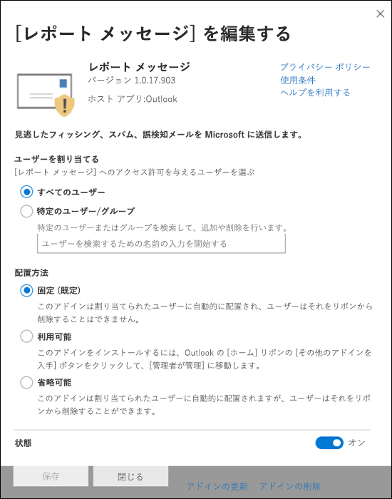

# レポート メッセージ アドインを有効にする

> [!NOTE]
> Exchange Online メールボックスを持つ Microsoft 365 組織の管理者の場合は、セキュリティ/コンプライアンス センターの提出ポータルを使用&ことをお勧めします。 詳細については、「管理者送信 [を使用して、スパム、フィッシング、URL、ファイルを Microsoft に送信する」を参照してください](admin-submission.md)。

Outlook および Web 上の Outlook (以前の Outlook Web App) 用迷惑メール報告アドインを使用すると、Microsoft およびその関連物に対して誤検知 (適切でないメールのマークが付けられています) や、誤って分析を行うために誤検知 (悪意のあるメールとして許可) を簡単に報告できます。 Microsoft は、これらの申請を使用して、電子メール保護テクノロジの効果を向上させております。

たとえば、多数のメッセージがフィッシングとして報告されているとします。 この情報は、セキュリティ ダッシュボードやその [他のレポート](security-dashboard.md) に示されます。 組織のセキュリティ チームはこの情報を、フィッシング対策ポリシーの更新が必要かを示す上で使用できます。 また、迷惑メールとして迷惑メールとしてフラグが付けられますが、迷惑メールとして迷惑メールとして迷惑メールと報告されるメッセージの多くは、組織のセキュリティ チームがスパム対策ポリシーの調整 [を必要とする場合があります](configure-your-spam-filter-policies.md)。

さらに、組織で [Office 365 Advanced Threat Protection プラン 1](office-365-atp.md) またはプラン [2](office-365-ti.md)を使用している場合も、メッセージ報告アドインは組織のセキュリティ チームに役立つ情報を提供し、そのチームがセキュリティ ポリシーを確認および更新するために使用できる有用な情報を提供します。

管理者は、組織に対してメッセージ報告アドインを有効にすり、個々のユーザーが自分でこのアドインをインストールできるようになります。

個別のユーザーの場合は、自分 [のユーザーのメッセージ報告アドインを有効にできます](#get-the-report-message-add-in-for-yourself)。

グローバル管理者または Exchange Online 管理者で、Exchange が OAuth 認証を使用するように構成されている場合は、 [組織のメッセージ報告アドインを有効にできます](#get-and-enable-the-report-message-add-in-for-your-organization)。 メッセージ報告アドインは、一元展開によって [利用できるようになりました](https://docs.microsoft.com/microsoft-365/admin/manage/centralized-deployment-of-add-ins)。

## はじめに把握しておくべき情報

- メッセージ報告アドインは、ほとんどの Microsoft 365 サブスクリプションと次の製品で機能します。

  - Outlook on the web
  - Outlook 2013 SP1 以降
  - Outlook 2016 for Mac
  - Microsoft 365 Apps for Enterprise に含まれる Outlook

- メッセージ報告アドインは、オンプレミス Exchange 組織内のメールボックスでは使用できません。

- 報告されたメッセージを、指定したメールボックスにコピーまたはリダイレクトする構成ができます。 詳細については [、「Exchange Online でスパムやフィッシング メッセージのユーザーを送信するためのメールボックスを指定する」を参照してください](user-submission.md)。

- 既存の Web ブラウザーは、レポート メッセージ アドインを使用できるはい。 しかし、アドインが使用できないか、または期待したとおりに機能しない場合は、別のブラウザーを試してください。

- 組織のインストールでは、OAuth 認証を使用するように組織を構成する必要があります。 詳細については、アドイン [の一元展開が組織で動作しているかどうかを判断する」を参照してください](../../admin/manage/centralized-deployment-of-add-ins.md)。

- 管理者は、グローバル管理者役割グループのメンバーである必要があります。 詳細については、「[セキュリティ/コンプライアンス センターのアクセス許可](permissions-in-the-security-and-compliance-center.md)」を参照してください。

## 自分用のレポート メッセージ アドインを入手する

1. Microsoft AppSource に移動して <https://appsource.microsoft.com/marketplace/apps> 、レポート メッセージ アドインを検索します。 メッセージ報告アドインに直接アクセスするには、次に進み <https://appsource.microsoft.com/product/office/wa104381180> 、.

2. Click **GET IT NOW**.

   

3. 表示されるダイアログで、使用条件とプライバシー ポリシーを確認し、[続行] をクリック **します**。

4. 職場または学校のアカウント (一名: 企業用) または Microsoft アカウント (個人用使用用) を使用してサインインします。

アドインをインストールして有効にすると、次のアイコンが表示されます。

- Outlook では、アイコンは次のように表示されます。

  

- Outlook on the web では、アイコンは次のようになります。

  

アドインの使用方法については、「レポート メッセージ [アドインを使用する」を参照してください](https://support.microsoft.com/office/b5caa9f1-cdf3-4443-af8c-ff724ea719d2)。

## 組織のレポート メッセージ報告アドインを取得し有効にする

> [!NOTE]
> アドインが組織に表示するまで最大 12 時間かかることがあります。

1. Microsoft 365 管理センター ([アドインの展開 **&で、[アドインの** 展開] ページに <https://admin.microsoft.com/AdminPortal/Home#/Settings/ServicesAndAddIns> **移動します**。

   ![Microsoft 365 管理センターの [サービスとアドイン] ページ](../../media/ServicesAddInsPageNewM365AdminCenter.png)

2. 表示される **新しいアドイン のポップ** アップを展開するには、情報を確認して、[次へ] をクリック **します**。

3. 次のページで、ストアから **Choose from the Store**.

   ![[新しいアドイン ページの展開] ページ](../../media/NewAddInScreen2.png)

4. 表示される**アドインの選択ページで**、[検索] ボックスをクリック**Search**し、[レポート**メッセージ] と入力**して、[検索] アイコン**を**  。 結果の一覧で、[レポート メッセージ] **を検索し、[** 追加] を **クリックします**。

   

5. 表示されるダイアログで、ライセンスとプライバシーの情報を確認し、[続行] をクリック **します**。

6. 表示される **[アドインの構成]** ページで、以下の設定を構成します。

   - **割り当て**済みユーザー: 次のいずれかの値を選択します。

     - **すべてのユーザー** (既定)
     - **特定のユーザー/グループ**
     - **私だけです**

   - **[Deployment method]**(展開方法): 次の値のいずれかを選択します。

     - **固定 (既定値)**: アドインは指定されたユーザーに自動的に展開され、ユーザーはこれを削除できません。
     - **使用可能**: ユーザーは、[ **自**宅でアドインを \> **取得] にインストール** \> **できます**。
     - **省略可能**: アドインは指定されたユーザーに自動的に展開されますが、削除することもできます。

   ![[アドイン] ページの構成](../../media/configure-add-in.png)

   完了したら、[展開] をクリック **します**。

7. 表示 **される [レポート メッセージ** の展開] ページには進行状況レポートの後に、アドインが展開されたかを確認するメッセージが表示されます。 情報を読み込んでから、[次へ] を **クリックします**。

   ![[レポート メッセージの展開] ページ](../../media/deploy-report-message-page.png)

8. 表示される **[アナンス] アドイン** ページで情報を確認し、[閉じる] をクリック **します**。

   ![[アドインのアナンス] ページ](../../media/announce-add-in-page.png)

## レポート メッセージ アドインの使用方法

アドインが割り当てられたユーザーには、次のアイコンが表示されます。

- Outlook では、アイコンは次のように表示されます。

  

- Outlook on the web では、アイコンは次のようになります。

  

ユーザーに報告報告アドインについて通知する場合は、電子メール報告アドイン [を使用するリンクを含める必要があります](https://support.microsoft.com/office/b5caa9f1-cdf3-4443-af8c-ff724ea719d2)。

## メッセージ報告アドインの設定の確認または編集

1. Microsoft 365 管理センターで、次の場所 **の &で [アドインのサービス] ページ** に移動します <https://admin.microsoft.com/AdminPortal/Home#/Settings/ServicesAndAddIns> 。

   ![新しい Microsoft 365 管理センターの [サービスとアドイン] ページ](../../media/ServicesAddInsPageNewM365AdminCenter.png)

2. メッセージ報告アドイン **を検索** して選択します。

3. 表示される **[レポート メッセージの編集** ] ポップアップで、組織に応じて設定を確認し、編集します。 完了したら、**[保存]** をクリックします。

   

## 報告されたメッセージの表示と確認

ユーザーが Microsoft に報告したメッセージを確認するには、次のオプションがあります。

- 管理者の提出ポータルを使用します。 詳細については、「ユーザーが [Microsoft に提出したユーザーを表示する」を参照してください](admin-submission.md#view-user-submissions-to-microsoft)。

- 報告されたメッセージのコピーを送信するメール フロー ルール (トランスポート ルールとも呼ばれる) を作成する。 手順については、「メール フロー [ルールを使用して、ユーザーが Microsoft に報告する内容を参照する」を参照してください](use-mail-flow-rules-to-see-what-your-users-are-reporting-to-microsoft.md)。
