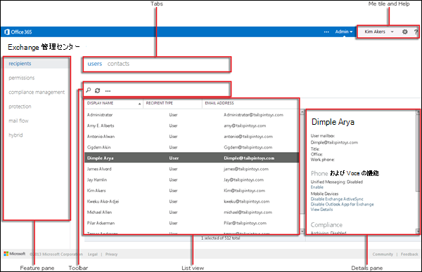

# Exchange Online Protection の Exchange 管理センター

Exchange 管理センター (EAC) は、Microsoft Exchange Online Protection (EOP) 向けの Web ベース管理コンソールです。

このトピックの Exchange Server バージョンについては、以下を参照してください。 「Exchange [administration center In Exchange Server」を](https://docs.microsoft.com/exchange/architecture/client-access/exchange-admin-center)参照してください。

このトピックの Exchange Online バージョンについては、こちらを参照してください。 「Exchange [Online の exchange 管理センター」を](https://docs.microsoft.com/exchange/exchange-admin-center)参照してください。

## EACへのアクセスについて

ほとんどの場合、EOP のお客様は、Microsoft 365 管理センターを通じて EAC にアクセスします。 EOP へのリンクは、 **[自分]** タイルの横にある **[管理]** タイルのドロップ ダウン メニューから選択できます。 **[管理]** タイルをクリックし、ドロップ ダウン メニューから **[Exchange Online Protection]** を選択すると、EAC にアクセスできます。

You can also access the EAC sign in page directly via the following URL: `https://admin.protection.outlook.com/ecp/<companydomain>`. For example, `https://admin.protection.outlook.com/ecp/contoso.onmicrosoft.com`. After specifying your user credentials you will be taken directly into the EAC.

## EAC で共通のユーザー インターフェイス要素

ここでは、EAC のユーザー インターフェイス要素について説明します。

### 機能ウィンドウ

EAC で実行する多くのタスクで、これがナビゲーションの第 1 階層になります。[機能] ウィンドウは、機能領域ごとに整理されています。

1. **受信者**: 内部ユーザーと外部連絡先を表示します。

2. **権限**: 管理者の役割を管理します。

3. **コンプライアンス管理**: ここで、管理者の役割グループレポートなどの監査ログとレポートを確認できます。

4. **保護**: これにより、組織のマルウェア対策およびスパム対策保護を管理し、検疫でのメッセージの管理を行うことができます。

5. **メールフロー**: ルール、承認済みドメイン、およびコネクタを管理し、メッセージ追跡を実行する場所を管理します。

### タブ

タブは、ナビゲーションの第 2 階層になります。各機能領域にはさまざまなタブがあり、それぞれのタブは各機能を表しています。

### ツールバー

ほとんどのタブは、クリックするとツールバーが表示されます。ツールバーには、特定のアクションを実行する複数のアイコンがあります。次の表は、各アイコンとそのアクションを示しています。

|**アイコン**|**名前**|**Action**|
|:-----|:-----|:-----|
|![[追加] アイコン](../../media/ITPro-EAC-AddIcon.gif)|追加、新規|このアイコンを使用して、新しいオブジェクトを作成します。これらの一部のアイコンには下方向キーが関連付けられており、これをクリックして、作成可能な追加のオブジェクトを表示できます。|
||編集|このアイコンを使用してオブジェクトを編集します。|
|![[削除] アイコン](../../media/ITPro-EAC-DeleteIcon.gif)|削除|このアイコンを使用してオブジェクトを削除します。一部の削除アイコンには下方向キーがあり、これをクリックして追加オプションを表示できます。|
|![[検索] アイコン](../../media/ITPro-EAC-.gif)|検索|このアイコンを使用して、検索するオブジェクトの検索文字列を入力できる検索ボックスを開きます。|
|![[最新の情報に更新] アイコン](../../media/ITPro-EAC-RefreshIcon.gif)|最新の情報に更新|このアイコンを使用してリスト ビューを更新します。|
|![[その他のオプション] アイコン](../../media/ITPro-EAC-MoreOptionsIcon.gif)|その他のオプション|このアイコンを使用して、そのタブのオブジェクトに対して実行できる他のアクションを表示します。たとえば、 **受信者 \> ユーザー**のアイコンをクリックすると、 **詳細検索**のオプションが表示されます。  |
||上方向キーと下方向キー|これらのアイコンを使用して、オブジェクトの優先度を上下に移動します。|
|![[削除] アイコン](../../media/ITPro-EAC-RemoveIcon.gif)|削除|このアイコンを使用して、一覧からオブジェクトを削除します。|

### リスト ビュー

タブを選択すると、通常、リスト ビューが表示されます。EAC リスト ビューの表示可能限度は、ほぼ 10,000 オブジェクトです。さらに、ページングが含まれているため、結果をページングできます。

### 詳細ウィンドウ

リスト ビューからオブジェクトを選択すると、そのオブジェクトに関する情報が詳細ウィンドウに表示されます。場合によっては、[詳細] ウィンドウに管理タスクが含まれていることがあります。

### [自分] タイルとヘルプ

**[自分]** タイルでは、EAC からのサインアウトおよび他のユーザーとしてサインインが行えます。 **[ヘルプ]** ドロップ ダウン メニューから次のアクションを行えます。

1. **ヘルプ**: ヘルプをクリックして、オンラインヘルプコンテンツを表示します。

2. **ヘルプバブルを無効に**する: ヘルプバブルは、オブジェクトを作成または編集するときに、フィールドのコンテキストヘルプを表示します。 ヘルプ バブルをオフにしたり、無効になっている場合はオンにすることができます。

3. **Copyright**: このリンクをクリックして、Exchange Online Protection の著作権に関する情報を確認します。

4. **プライバシー**: クリックして、Exchange Online Protection のプライバシーポリシーを確認します。

## サポートされているブラウザー

EAC を最大限に活用できるように、常に最新のブラウザー、Office クライアント、アプリを使用することをお勧めします。 また、ソフトウェア更新プログラムも、利用可能になり次第インストールすることをお勧めします。 サポートされるブラウザーおよびサービスのシステム要件の詳細については、「 [Office のシステム要件](https://products.office.com/office-system-requirements)」を参照してください。

## EOP でサポートされている言語

Exchange Online Protection でサポートされ、利用可能な言語は、以下のとおりです。

- アムハラ語

- アラビア語

- バスク語 (バスク)

- バングラ語 (インド)

- ブルガリア語

- カタルニア語

- 簡体字中国語

- 繁体字中国語

- クロアチア語

- チェコ語

- デンマーク語

- オランダ語

- オランダ語

- 英語

- エストニア語

- フィリピン語 (フィリピン)

- フィンランド語

- フランス語

- ガリシア語

- ドイツ語

- ギリシャ語

- グジャラート語

- ヘブライ語

- ヒンディー語

- ハンガリー語

- アイスランド語

- インドネシア語

- イタリア語

- 日本語

- カンナダ語

- カザフ語

- スワヒリ語

- 韓国語

- ラトビア語

- リトアニア語

- マレー語 (ブルネイ・ダルサラーム国)

- マレー語 (マレーシア)

- マラヤーラム語

- マラーティー語

- ノルウェー語 (ブークモール)

- ノルウェー語 (ニーノシュク)

- オリヤー語

- ペルシャ語

- ポーランド語

- ポルトガル語 (ブラジル)

- ポルトガル語 (ポルトガル)

- ルーマニア語

- ロシア語

- セルビア語 (キリル、セルビア)

- セルビア語 (ラテン)

- スロバキア語

- スロベニア語

- スペイン語

- スウェーデン語

- タミール語

- テルグ語

- タイ語

- トルコ語

- ウクライナ語

- ウルドゥ語

- ベトナム語

- ウェールズ語

