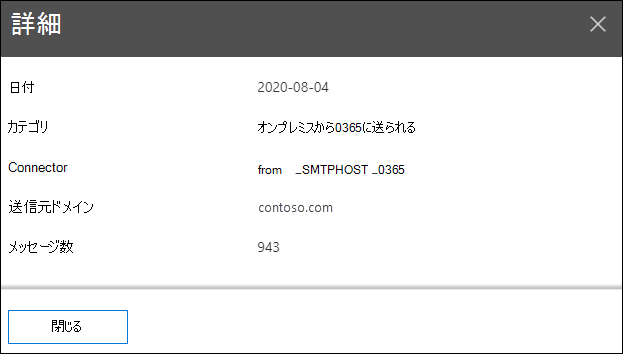

# セキュリティ & コンプライアンスセンターのメールフローマップ

[!INCLUDE [Microsoft 365 Defender rebranding](../includes/microsoft-defender-for-office.md)]

[セキュリティ & コンプライアンスセンター](https://protection.office.com)の [メールフローダッシュボード](mail-flow-insights-v2.md)の **メールフローマップ** は、組織内のメールフローについての洞察を提供します。 この情報を使用すると、パターンを学習し、異常を特定し、発生した問題を解決できます。

既定では、このウィジェットは、前の日のメールフローパターンを、 *Sankey* 図と呼ばれるグラフに表示します。 左向き矢印←および→右矢印を使用して、   さまざまな日からの情報を表示することができます。 それぞれの異なる色は、異なる受信コネクタまたは送信コネクタ経由のメールフローを表します (またはコネクタを使用しない)。 特定の色の上にカーソルを置くと、そのコネクタの種類に応じたメッセージ数が表示されます。

## メールフローマップのレポートビュー

**メールフローマップ** ウィジェットをクリックすると、 **メールフローマップ** レポートが表示されます。

次のグラフがレポートビューで利用できます。

- **データの表示: 概要** : これは基本的に、ウィジェットの大きな表示です。 特定の色の上にカーソルを置くと、そのコネクタの種類に応じたメッセージ数が表示されます。

  

- **データの表示: 詳細** : このビューには、コネクタと送信先ドメインの詳細が表示されます。 上位の送信者と受信者のドメインが一覧表示され、残りは **他のユーザー** に配置されます。 特定の色とセクションの上にカーソルを移動すると、メッセージの数が表示されます。

  

レポートビューで [ **フィルター** ] をクリックすると、 **開始日** と **終了日** を含む日付範囲を指定できます。

特定の日付範囲のレポートに対して1人以上の受信者を電子メールで送信するには、[ **ダウンロードの依頼** ] をクリックします。

関連する洞察は、使用可能な場合はメールフローマップの下に表示されます (たとえば、[ [可能なメールループ](mfi-mail-loop-insight.md)の状況を修正する] など)。

## メールフローマップの詳細表ビュー

レポートビューで [ **詳細テーブルの表示** ] をクリックすると、次の情報が表示されます。

- **Date**
- **カテゴリ**
- **コネクタ/サードパーティのサービスプロバイダー**
- **送信者/受信者ドメイン**
- **メッセージ数**

詳細テーブルビューで [ **フィルター** ] をクリックすると、 **開始日** と **終了日** を含む日付範囲を指定できます。

行を選択すると、同様の詳細がフライアウトに表示されます。

特定の日付範囲のレポートに対して1人以上の受信者を電子メールで送信するには、[ **ダウンロードの依頼** ] をクリックします。

レポートビューに戻るには、[ **レポートの表示** ] をクリックします。

## 関連項目

メールフローダッシュボードの他の洞察の詳細については、「 [セキュリティ & コンプライアンスセンター」の「mail flow insights](mail-flow-insights-v2.md)」を参照してください。
