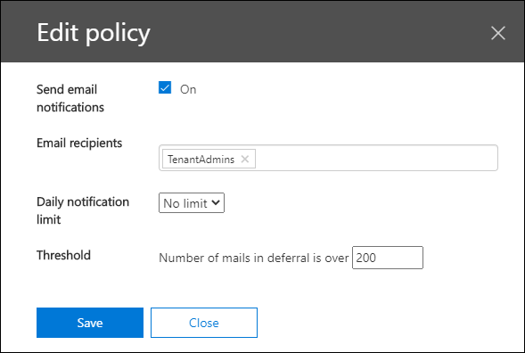

# セキュリティ & コンプライアンスセンターでのキューの把握Queues insight in the Security & Compliance Center

コネクタを使用して組織からオンプレミスまたはパートナーの電子メールサーバーにメッセージを送信できない場合、メッセージは Microsoft 365 でキューに入れられます。When messages can't be sent from your organization to your on-premises or partner email servers using connectors, the messages are queued in Microsoft 365. このような状態になる一般的な例を次に示します。Common examples that cause this condition are:

- コネクタが正しく構成されていません。The connector is incorrectly configured.
- オンプレミス環境でネットワークまたはファイアウォールの変更が行われています。There have been networking or firewall changes in your on-premises environment.

Microsoft 365 は、24時間、引き続き配信を再試行します。Microsoft 365 will continue to retry to delivery for 24 hours. 24時間後、メッセージは期限切れになり、配信不能レポート (Ndr またはバウンスメッセージとも呼ばれる) で送信者に返されます。After 24 hours, the messages will expire and will be returned to the senders in non-delivery reports (also known as a NDRs or bounce messages).

キューに入っている電子メールのボリュームが事前に定義されたしきい値 (既定値は200メッセージ) を超えている場合、情報は次の場所で利用できます。If the queued email volume exceeds the pre-defined threshold (the default value is 200 messages), the information is available in the following locations:

- [セキュリティ & コンプライアンスセンター](https://protection.office.com)の[メールフローダッシュボード](mail-flow-insights-v2.md)で洞察を得る**キュー** 。The **Queues** insight in the [Mail flow dashboard](mail-flow-insights-v2.md) in the [Security & Compliance Center](https://protection.office.com). 詳細については、このトピックの「 [メールフローダッシュボード](#queues-insight-in-the-mail-flow-dashboard) 」セクションの「キューの洞察」を参照してください。For more information, see the [Queues insight in the Mail flow dashboard](#queues-insight-in-the-mail-flow-dashboard) section in this topic.
  
- [[セキュリティ & コンプライアンスセンター](https://protection.office.com) (**alerts** dashboard または) のアラート**ダッシュボードに通知**が表示され \> **Dashboard** <https://protection.office.com/alertsdashboard> ます。An alert is displayed in **Recent alerts** the Alerts dashboard in the [Security & Compliance Center](https://protection.office.com) (**Alerts** \> **Dashboard** or <https://protection.office.com/alertsdashboard>).

  

- 管理者は、 **メッセージが遅延**した既定の警告ポリシーの構成に基づいて電子メール通知を受信します。Admins will receive an email notification based on the configuration of the default alert policy named **Messages have been delayed**. この通知の通知設定を構成するには、次のセクションを参照してください。To configure the notification settings for this alert, see the next section.

  アラートポリシーの詳細については、「 [セキュリティ & コンプライアンスセンターのアラートポリシー](../../compliance/alert-policies.md)」を参照してください。For more information about alert policies, see [Alert policies in the Security & Compliance Center](../../compliance/alert-policies.md).

## キューの通知をカスタマイズするCustomize queue alerts

1. [ [セキュリティ & コンプライアンスセンター](https://protection.office.com)] で、[ **alerts** \> **Alert policies** ] または [open] に移動し <https://protection.office.com/alertpolicies> ます。In the [Security & Compliance Center](https://protection.office.com), go to **Alerts** \> **Alert policies** or open <https://protection.office.com/alertpolicies>.

2. [ **通知ポリシー** ] ページで、[ **メッセージが遅延して**います] という名前のポリシーを見つけて選択します。On the **Alert policies** page, find and select the policy named **Messages have been delayed**.

3. メッセージが開く遅延ポップアップが表示 **されて** いる場合は、アラートをオンまたはオフにして通知設定を構成できます。In the **Message have been delayed** flyout that opens, you can turn the alert on or off and configure the notification settings.

   

   - **状態**: アラートをオンまたはオフに切り替えることができます。**Status**: You can toggle the alert on or off.

   - **電子メール受信者** および **毎日の通知制限**: [ **編集** ] をクリックして、次の設定を構成します。**Email recipients** and **Daily notification limit**: Click **Edit** to configure the following settings:

4. 通知設定を構成するには、[ **編集**] をクリックします。To configure the notification settings, click **Edit**. 表示される [ **ポリシーの編集** ] ポップアップで、次の設定を構成します。In the **Edit policy** flyout that appears, configure the following settings:

   - **電子メール通知の送信**: 既定値は on です。**Send email notifications**: The default value is on.
   - **電子メール受信者**: 既定値は **tenantadmins**です。**Email recipients**: The default value is **TenantAdmins**.
   - **毎日の通知制限**: 既定値は **無制限**です。**Daily notification limit**: The default value is **No limit**.
   - **しきい**値: 既定値は200です。**Threshold**: The default value is 200.

   

5. 完了したら、[ **保存** して **閉じる**] をクリックします。When you're finished, click **Save** and **Close**.

## メールフローダッシュボードでのキューの把握Queues insight in the Mail flow dashboard

キュー内のメッセージボリュームがしきい値を超えていない場合でも、[メールフローダッシュボード](mail-flow-insights-v2.md)の [**キュー** ] 洞察を使用して、キューに入れられたメッセージ数が多すぎることを確認してから、キューに入れられたメッセージ数が大きくなる前に処理を実行することができます。Even if the queued message volume hasn't exceeded the threshold and generated an alert, you can still use the **Queues** insight in the [Mail flow dashboard](mail-flow-insights-v2.md) to see messages that have been queued for more than one hour, and take action before the number of queued messages becomes too large.

ウィジェットのメッセージ数をクリックすると、キューに **置か** れたメッセージが次の情報と共に表示されます。If you click the number of messages on the widget, a **Messages queued** flyout appears with the following information:

- **キューに入れられたメッセージ数****Number of queued messages**
- **コネクタ名**: コネクタ名をクリックして、Exchange 管理センター (EAC) でコネクタを管理します。**Connector name**: Click on the connector name to manage the connector in the Exchange admin center (EAC).
- **キューの開始時刻****Queue started time**
- **期限切れの古いメッセージ****Oldest messages expired**
- **移行先サーバー****Destination server**
- **最後の IP アドレス****Last IP address**
- **最後のエラー****Last error**
- **修正方法**: 一般的な問題と解決策を入手できます。**How to fix**: Common issues and solutions are available. [ **今すぐ修正** する] リンクが利用可能な場合は、それをクリックして問題を解決します。If is a **Fix it now** link is available, click it to fix the problem. エラーおよび可能な解決方法の詳細については、使用可能なリンクをクリックしてください。Otherwise, click on any available links for more information about the error and possible solutions.

メッセージの詳細で [ **キューの表示** ] をクリックした後に、同じポップアップが表示されるアラート **が遅延して** います。The same flyout is displayed after you click **View queue** in the details of a **Messages have been delayed** alert.

## 関連項目See also

メールフローダッシュボードの他の洞察の詳細については、「 [セキュリティ & コンプライアンスセンター」の「mail flow insights](mail-flow-insights-v2.md)」を参照してください。For information about other insights in the Mail flow dashboard, see [Mail flow insights in the Security & Compliance Center](mail-flow-insights-v2.md).
