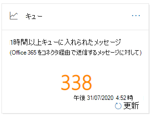

# コンプライアンス センターのセキュリティ&分析情報Queues insight in the Security & Compliance Center

コネクタを使用して、組織からオンプレミスまたはパートナーのメール サーバーにメッセージを送信しなけなけなけない場合、メッセージは Microsoft 365 でキューに入れられます。When messages can't be sent from your organization to your on-premises or partner email servers using connectors, the messages are queued in Microsoft 365. この状態の原因となされる一般的な例を次に示します。Common examples that cause this condition are:

- コネクタが正しく構成されていません。The connector is incorrectly configured.
- オンプレミス環境にネットワークやファイアウォールの変更がある。There have been networking or firewall changes in your on-premises environment.

Microsoft 365 は、24 時間おりに引き続き配信を試行します。Microsoft 365 will continue to retry to delivery for 24 hours. 24 時間後、メッセージは期限切れになってから配信不能レポート (NDR またはバウンス メッセージとも呼ばれる) で送信者に返されます。After 24 hours, the messages will expire and will be returned to the senders in non-delivery reports (also known as a NDRs or bounce messages).

キュー内のメール ボリュームが事前に定義されたしきい値 (既定値は 200 メッセージ) を超えた場合、情報は次の場所で入手できます。If the queued email volume exceeds the pre-defined threshold (the default value is 200 messages), the information is available in the following locations:

- コンプライアンス **センター** のメール フロー ダッシュボード [のキュー](mail-flow-insights-v2.md) &のインサイトです。The **Queues** insight in the [Mail flow dashboard](mail-flow-insights-v2.md) in the Security & Compliance Center. 詳細については、このトピック [のメール フロー ダッシュボード セクションのキューのインサイト](#queues-insight-in-the-mail-flow-dashboard) を参照してください。For more information, see the [Queues insight in the Mail flow dashboard](#queues-insight-in-the-mail-flow-dashboard) section in this topic.
  
- アラートは、セキュリティ/ **コンプライアンス センター (** アラート ダッシュボードまたは& [) の [最近のアラート](https://protection.office.com) ]**ダッシュボード** \> **に表示** されます <https://protection.office.com/alertsdashboard> 。An alert is displayed in **Recent alerts** the Alerts dashboard in the [Security & Compliance Center](https://protection.office.com) (**Alerts** \> **Dashboard** or <https://protection.office.com/alertsdashboard>).

  

- 管理者は、Messages という名前の既定のアラート ポリシーの構成に基づいて **メール通知を受信します**。Admins will receive an email notification based on the configuration of the default alert policy named **Messages have been delayed**. このアラートの通知設定を構成するには、次のセクションをご覧ください。To configure the notification settings for this alert, see the next section.

  アラート ポリシーの詳細については、セキュリティ センター [とコンプライアンス センターのアラート ポリシー&を参照してください](../../compliance/alert-policies.md)。For more information about alert policies, see [Alert policies in the Security & Compliance Center](../../compliance/alert-policies.md).

## キュー通知をカスタマイズするCustomize queue alerts

1. セキュリティ コンプライアンス センター [で&、[アラート](https://protection.office.com)] アラート **ポリシーに** \> **移動するか、開** きます <https://protection.office.com/alertpolicies> 。In the [Security & Compliance Center](https://protection.office.com), go to **Alerts** \> **Alert policies** or open <https://protection.office.com/alertpolicies>.

2. [アラート **ポリシー] ページ** で、メッセージという名前のポリシー **が遅延したポリシーを探して選択します**。On the **Alert policies** page, find and select the policy named **Messages have been delayed**.

3. 表示される **遅延ポップアップが** メッセージに登録されたら、アラートをオンまたはオフにしたり、通知設定を構成したりできます。In the **Message have been delayed** flyout that opens, you can turn the alert on or off and configure the notification settings.

   

   - **Status**: アラートをオンまたはオフに切り替えることができます。**Status**: You can toggle the alert on or off.

   - **メールの受信者** と **日次通知制限**: [編集] **をクリック** して、次の設定を構成します。**Email recipients** and **Daily notification limit**: Click **Edit** to configure the following settings:

4. 通知設定を構成するには、[編集] を **クリックします**。To configure the notification settings, click **Edit**. 表示される **ポリシーの** 編集ポップアップで、次の設定を構成します。In the **Edit policy** flyout that appears, configure the following settings:

   - **電子メール通知**を送信: 既定値はオンになっています。**Send email notifications**: The default value is on.
   - **Email recipients**: The default value is **TenantAdmins**.**Email recipients**: The default value is **TenantAdmins**.
   - **1 日の通知の制限**: 既定値は **No です**。**Daily notification limit**: The default value is **No limit**.
   - **し**きい値: 既定値は 200 です。**Threshold**: The default value is 200.

   

5. 完了したら、[保存して閉じる] **を** クリック **します**。When you're finished, click **Save** and **Close**.

## メール フロー ダッシュボードのキューインインサイトQueues insight in the Mail flow dashboard

キューに入れられておりのメッセージ量がしきい値を超えておらず、警告を生成した場合でも引き続き、[[メール フロー](mail-flow-insights-v2.md) ] ダッシュボードの**キュー**から受信したメッセージを確認して、キューに入れられていないメッセージ数が多くなりすぎる前にアクションを実行することができます。Even if the queued message volume hasn't exceeded the threshold and generated an alert, you can still use the **Queues** insight in the [Mail flow dashboard](mail-flow-insights-v2.md) to see messages that have been queued for more than one hour, and take action before the number of queued messages becomes too large.

ウィジェット上のメッセージ数をクリックすると、 **キューに入れて** 表示されたメッセージ ポップアップが次の情報と共に表示されます。If you click the number of messages on the widget, a **Messages queued** flyout appears with the following information:

- **キューに入れ済みメッセージの数****Number of queued messages**
- **コネクタ名**: Exchange 管理センター (EAC) でコネクタを管理するコネクタ名をクリックします。**Connector name**: Click on the connector name to manage the connector in the Exchange admin center (EAC).
- **キューの開始時刻****Queue started time**
- **最も古いメッセージの有効期限が切れた****Oldest messages expired**
- **送信先サーバー****Destination server**
- **最後の IP アドレス****Last IP address**
- **[最後のエラー]****Last error**
- **方法の修正 :** 一般的な問題と解決策を利用できます。**How to fix**: Common issues and solutions are available. If is a **Fix it now** link is available, click it to fix the problem.If is a **Fix it now** link is available, click it to fix the problem. それ以外の場合は、使用可能なリンクをクリックして、エラーと考えられる解決方法の詳細を確認してください。Otherwise, click on any available links for more information about the error and possible solutions.

![[メール フロー] ダッシュボードでキューのインサイトをクリックした後の詳細](../../media/mfi-queues-details.png)

メッセージの詳細で [表示] **をクリックすると** 、同じポ **ップアップが表示** されます。The same flyout is displayed after you click **View queue** in the details of a **Messages have been delayed** alert.

## 関連項目See also

メール フロー ダッシュボードの他の分析情報については、セキュリティ コンプライアンス センターの [メール フローの詳細&を参照してください](mail-flow-insights-v2.md)。For information about other insights in the Mail flow dashboard, see [Mail flow insights in the Security & Compliance Center](mail-flow-insights-v2.md).
