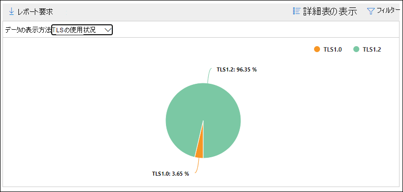

# セキュリティ & コンプライアンスセンターでの SMTP 認証クライアントの洞察とレポートSMTP Auth clients insight and report in the Security & Compliance Center

[メールフローのダッシュボード](mail-flow-insights-v2.md)と、[セキュリティ & コンプライアンスセンター](https://protection.office.com)で報告される smtp auth**クライアントの**[レポート](#smtp-auth-clients-report)では、組織内のユーザーまたはシステムアカウントによる smtp auth クライアント送信プロトコルの使用が強調されています。The **SMTP Auth clients** insight in the [Mail flow dashboard](mail-flow-insights-v2.md) and the associated [SMTP Auth clients report](#smtp-auth-clients-report) in the [Security & Compliance Center](https://protection.office.com) highlight the use of the SMTP AUTH client submission protocol by users or system accounts in your organization. この従来のプロトコル (エンドポイント smtp.office365.com を使用します) は基本認証のみを提供し、侵害されたアカウントが電子メールを送信するために使用されやすくなります。This legacy protocol (which uses the endpoint smtp.office365.com) only offers Basic authentication, and is susceptible to being used by compromised accounts to send email. 洞察とレポートを使用すると、SMTP 認証の電子メールの送信に関する異常な動作を確認できます。The insight and report allow you to check for unusual activity for SMTP AUTH email submissions. また、SMTP 認証を使用するクライアントまたはデバイスの TLS 使用状況データも表示されます。It also shows the TLS usage data for clients or devices using SMTP AUTH.

ウィジェットは、過去7日間に SMTP 認証プロトコルを使用したユーザーまたはサービスアカウントの数を示します。The widget indicates the number of users or service accounts that have used the SMTP Auth protocol in the last 7 days.

ウィジェットのメッセージ数をクリックすると、[ **SMTP Auth clients** ] ポップアップが表示されます。If you click the number of messages on the widget, an **SMTP Auth clients** flyout appears. フライアウトは、過去1週間の TLS 使用量とボリュームを集約したビューを提供します。The flyout provides an aggregated view of the TLS usage and volumes for the last week.

[ **Smtp auth clients レポート** ] リンクをクリックすると、次のセクションで説明されているように、smtp auth clients レポートに移動できます。You can click the **SMTP Auth clients report** link to go to the SMTP Auth clients report as described in the next section.

## SMTP Auth クライアントのレポートSMTP Auth clients report

### SMTP 認証クライアントレポートのレポートビューReport view for the SMTP Auth clients report

既定では、レポートには過去7日間のデータが表示されますが、データは過去90日間で利用可能です。By default, the report shows data for the last 7 days, but data is available for the last 90 days.

概要セクションには、次のグラフが含まれています。The overview section contains the following charts:

- **データの表示: 送信ボリューム**: 既定では、すべてのドメインから送信された SMTP Auth クライアントメッセージの数 ([**データの表示: 既定ではすべての送信者ドメイン** が選択されています)] を示しています。**View data by: Sending volume**: By default, the chart shows the number of SMTP Auth client messages that were sent from all domains (**Show data for: All sender domains** is selected by default). 結果を特定の送信者のドメインにフィルター処理するには、ドロップダウンリストから [ **データの表示]** をクリックし、送信者のドメインを選択します。You can filter the results to a specific sender domain by clicking **Show data for** and selecting the sender domain from the dropdown list. 特定のデータポイント (日単位) をポイントすると、メッセージ数が表示されます。If you hover a specific data point (day), the number of messages is shown.

  

- **データの表示方法: TLS 使用法**: 選択した期間におけるすべての SMTP Auth クライアントメッセージの tls 使用率を示します。**View data by: TLS Usage**: The chart shows the percentage of TLS usage for all SMTP Auth client messages during the selected time period. このグラフでは、以前のバージョンの TLS を使用しているユーザーとシステムアカウントを識別し、アクションを実行することができます。This chart allows you to identify and take action on users and system accounts that are still using older versions of TLS.

  

レポートビューで [ **フィルター** ] をクリックすると、 **開始日** と **終了日**を含む日付範囲を指定できます。If you click **Filters** in a report view, you can specify a date range with **Start date** and **End date**.

[ **要求レポート** ] をクリックして、レポートの詳細バージョンを電子メールメッセージで受信します。Click **Request report** to receive a more detailed version of the report in an email message. レポートを受信する日付の範囲と受信者を指定できます。You can specify the date range and the recipients to receive the report.

### SMTP Auth clients レポートの詳細表ビューDetails table view for the SMTP Auth clients report

[ **詳細テーブルの表示**] をクリックした場合、表示されている情報は、表示されていたグラフによって異なります。If you click **View details table**, the information that's shown depends on the chart you were looking at:

- **データの表示: 送信ボリューム**: 次の情報が表に表示されます。**View data by: Sending volume**: The following information is shown in a table:

  - **[送信者のアドレス]****Sender address**
  - **メッセージ数****Message count**

  行を選択すると、同じ詳細がフライアウトに表示されます。If you select a row, the same details are shown in a flyout.

- **データの表示方法: TLS 使用法**: 次の情報を表に示します。**View data by: TLS Usage**: The following information is shown in a table:

  - **[送信者のアドレス]****Sender address**
  - **TLS 1.0%**\***TLS1.0%**\*
  - **TLS 1.1%**\***TLS1.1%**\*
  - **TLS 1.2%**\***TLS1.2%**\*
  - **メッセージ数****Message count**

  \* この列には、送信者からのメッセージの割合と数が表示されます。\* This column shows both the percentage and number of messages from the sender.

詳細テーブルビューで [ **フィルター** ] をクリックすると、 **開始日** と **終了日**を含む日付範囲を指定できます。If you click **Filters** in a details table view, you can specify a date range with **Start date** and **End date**.

行を選択すると、同様の詳細がフライアウトに表示されます。If you select a row, similar details are shown in a flyout:

![SMTP Auth clients レポートの [TLS usage] ビューの詳細表からの詳細ポップアップ](../../media/mfi-smtp-auth-clients-report-tls-usage-view-view-details-table-details.png)

[ **要求レポート** ] をクリックして、レポートの詳細バージョンを電子メールメッセージで受信します。Click **Request report** to receive a more detailed version of the report in an email message. レポートを受信する日付の範囲と受信者を指定できます。You can specify the date range and the recipients to receive the report.

レポートビューに戻るには、[ **レポートの表示**] をクリックします。To go back to the reports view, click **View report**.

## 関連項目Related topics

メールフローダッシュボードの他の洞察の詳細については、「 [セキュリティ & コンプライアンスセンター」の「mail flow insights](mail-flow-insights-v2.md)」を参照してください。For information about other insights in the Mail flow dashboard, see [Mail flow insights in the Security & Compliance Center](mail-flow-insights-v2.md).
