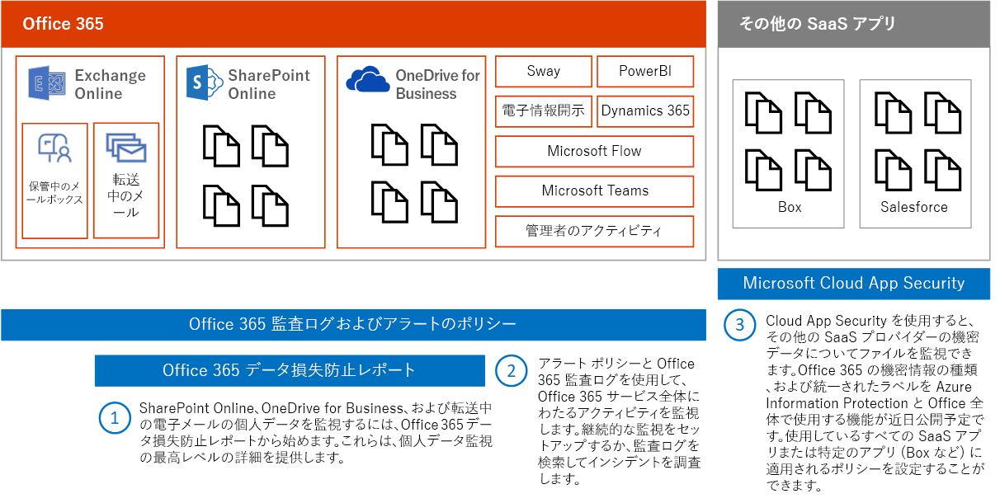
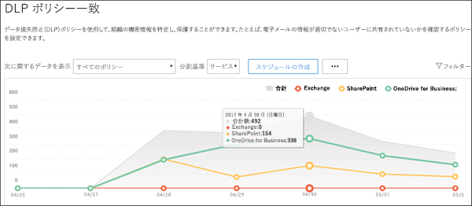
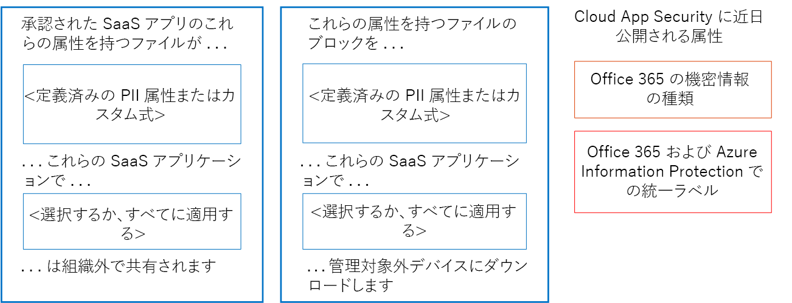
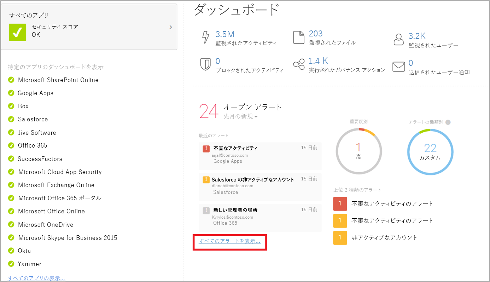

# 個人情報の漏えいを監視するMonitor for leaks of personal data

個人データの使用と転送を監視するために使用できるツールは数多くあります。このトピックでは、効果的な 3 つのツールについて説明します。There are many tools that can be used to monitor the use and transport of personal data. This topic describes three tools that work well.

この図について:In the illustration:

- まず、SharePoint Online、OneDrive for Business、転送中の電子メールの個人データを監視するための Microoft 365 データ損失防止レポートから開始します。このレポートは、個人データを監視するための最も詳細なレベルの内容を提供します。ただし、このレポートには Office 365 のすべてのサービスが含まれているわけではありません。Start with Microsoft 365 data loss prevention reports for monitoring personal data in SharePoint Online, OneDrive for Business, and email in transit. These provide the greatest level of detail for monitoring personal data. However, these reports don't include all services in Office 365.

- 次に、アラート ポリシーと監査ログを使用して、サービス全体のアクティビティを監視します。進行中の監視を設定するか、または監査ログを検索してインシデントを調査します。監査ログは、Sway、PowerBI、電子情報開示、Dynamics 365、Microsoft Flow、Microsoft Teams、管理アクティビティ、OneDrive for Business、SharePoint Online、転送中のメール、保存メールボックスなどのサービス全体で機能します。Skype の会話は保存メールボックスに含まれます。Next, use alert policies and the audit log to monitor activity across services. Setup ongoing monitoring or search the audit log to investigate an incident. The audit log works across services — Sway, PowerBI, eDiscovery, Dynamics 365, Microsoft Flow, Microsoft Teams, Admin activity, OneDrive for Business, SharePoint Online, mail in transit, and mailboxes at rest. Skype conversations are included in mailboxes at rest.

- 最後に、Microsoft Cloud App Security を使用して、他の SaaS プロバイダーの機密データを含むファイルを監視します。機密情報タイプと統合ラベルを Azure Information Protection と Cloud App Security が有効な Office で使用できる機能が近日公開予定です。すべての SaaS アプリまたは特定のアプリ (ボックスなど) に適用するポリシーを設定できます。Cloud App Security では、電子メールに添付されたファイルを含め、Exchange Online のファイルは検出されません。Finally, Use Microsoft Cloud App Security to monitor files with sensitive data in other SaaS providers. Coming soon is the ability to use sensitive information types and unified labels across Azure Information Protection and Office with Cloud App Security. You can setup policies that apply to all of your SaaS apps or specific apps (like Box). Cloud App Security doesn't discover files in Exchange Online, including files attached to email.

## データ損失防止レポートData loss prevention reports

データ損失防止 (DLP) ポリシーを作成したら、意図したとおりに動作し、コンプライアンスの遵守に役立っているか確認します。Office 365 の DLP レポートを使用すると、DLP ポリシーの一致項目、上書き、誤検知の数をすぐに確認したり、時間の経過とともに増加または減少する傾向があるかどうかを見極めたりできます。また、さまざまな方法でレポートをフィルター処理したり、グラフ上の系列の特定のポイントを選択して詳細情報を表示したりできます。After you create your data loss prevention (DLP) policies, you'll want to verify that they're working as you intended and helping you to stay compliant. With the DLP reports in Office 365, you can quickly view the number of DLP policy matches, overrides, or false positives; see whether they're trending up or down over time; filter the report in different ways; and view additional details by selecting a point on a line on the graph.

DLP レポートを使用すると、以下のことを行えます。You can use the DLP reports to:

- 特定の期間に絞り込み、スパイクや傾向の理由を理解します。Focus on specific time periods and understand the reasons for spikes and trends.

- 組織の DLP ポリシーに違反するビジネス プロセスを検出します。Discover business processes that violate your organization's DLP policies.

- DLP ポリシーのビジネスに及ぼす影響を理解します。Understand any business impact of the DLP policies.

- ユーザーがポリシーを上書きしたり、誤検知を報告したりしてポリシーのヒントを解決するときに送信する正当な理由を表示します。View the justifications submitted by users when they resolve a policy tip by overriding the policy or reporting a false positive.

- 特定の DLP ポリシーに関する一致箇所を表示することによって、そのポリシーのコンプライアンス遵守を確認します。Verify compliance with a specific DLP policy by showing any matches for that policy.

- 詳細ウィンドウで、DLP ポリシーに一致する機密データを含むファイルの一覧を表示します。View a list of files with sensitive data that matches your DLP policies in the details pane.

さらに、テスト モードで実行するときに、DLP レポートを使用して DLP ポリシーを微調整することができます。In addition, you can use the DLP reports to fine tune your DLP policies as you run them in test mode.

DLP レポートは、セキュリティ/コンプライアンス センターにあります。DLP reports are in the security center and the compliance center. [レポート] \> [レポートの表示] に移動します。Navigate to Reports \> View reports. [データ損失防止 (DLP)] の下で、[DLP ポリシーおよびルールの一致] または [DLP の誤検知と上書き] に移動します。Under Data loss prevention (DLP), go to either DLP policy and rule matches or DLP false positives and overrides.

詳細については、「[データ損失防止のレポートの表示](https://docs.microsoft.com/microsoft-365/compliance/view-the-dlp-reports)」を参照してください。For more information, see [View the reports for data loss prevention](https://docs.microsoft.com/microsoft-365/compliance/view-the-dlp-reports).

## 監査ログおよびアラートのポリシーaudit log and alert policies

監査ログには、Exchange Online、SharePoint Online、OneDrive for Business、Azure Active Directory、Microsoft Teams、Power BI、Sway などの サービスからのイベントが含まれます。The audit log contains events from Exchange Online, SharePoint Online, OneDrive for Business, Azure Active Directory, Microsoft Teams, Power BI, Sway, and other services.

セキュリティ/コンプライアンス センターでは、監査ログを監視およびレポートする 2 つの方法を提供しています。The security center and compliance center provide two ways to monitor and report against the audit log:

- アラート ポリシーの設定、アラートの表示、トレンドの監視には、セキュリティ センターまたはコンプライアンス センターのいずれかにあるアラート ポリシーとアラート ダッシュボード ツールを使用します。Setup alert policies, view alerts, and monitor trends — Use the alert policy and alert dashboard tools in either the security center or compliance center.

- 監査ログを直接検索するには、指定した日付の範囲ですべてのイベントを検索します。また、操作を実行したユーザー、操作、または対象オブジェクトなど、特定の条件に基づいて結果をフィルター処理することもできます。Search the audit log directly — Search for all events in a specified date rage. Or you can filter the results based on specific criteria, such as the user who performed the action, the action, or the target object.

情報セキュリティおよびコンプライアンス チームは、これらのツールを使用して、エンド ユーザーと管理者の両方がサービスで実行したアクティビティを予防的に確認することができます。特定のアクティビティが特定のサイト コレクションで発生した場合に (たとえば、GDPR 関連情報が含まれていることがわかっているサイトからコンテンツを共有する場合など)、電子メール通知を送信するように自動アラートを設定できます。これによってチームは、ユーザーをフォローアップして、企業のセキュリティ ポリシー遵守の徹底、追加のトレーニング提供などを行うことができます。Information security and compliance teams can use these tools to proactively review activities performed by both end users and administrators across services. Automatic alerts can be configured to send email notifications when certain activities occur on specific site collections - for example when content is shared from sites known to contain GDPR related information. This allows those teams to follow up with users to ensure that corporate security policies are followed, or to provide additional training.

情報セキュリティ チームは、監査ログを検索して疑いのあるデータ侵害を調査し、根本原因と違反の程度の両方を判断することもできます。この組み込み機能は、GDPR の第 33 条および第 34 条の遵守を円滑にします。これらの条項では、データ違反について GDPR 監督当局およびデータ主体に、特定期間内に通知することが要求されています。監査ログ エントリは、サービス内で 90 日間のみ保持されます。多くの場合、これらのログをより長期間保持することが推奨され、多くの企業もそれを必要としていました。Information security teams can also search the audit log to investigate suspected data breaches and determine both root cause and the extent of the breach. This built in capability facilitates compliance with article 33 and 34 of the GDPR, which require notifications be provided to the GDPR supervisory authority and to the data subjects themselves of a data breach within a specific time period. Audit log entries are only retained for 90 days within the service - it is often recommended and many organizations required that these logs be retained for longer periods of time.

Microsoft 管理アクティビティ API を使用して統一監査ログを購読し、必要に応じてログ エントリを保存し、高度なダッシュボードとアラートを提供することができるソリューションを活用できます。たとえば、[Microsoft Operations Management Suite (OMS)](https://docs.microsoft.com/azure/operations-management-suite/oms-solution-office-365) などです。Solutions are available which subscribe to the Unified Audit Logs through the Microsoft Management Activity API and can both store log entries as needed, and provide advanced dashboards and alerts. One example is [Microsoft Operations Management Suite (OMS)](https://docs.microsoft.com/azure/operations-management-suite/oms-solution-office-365).

アラート ポリシーと監査ログの検索については、以下を参照してください。More information about alert policies and searching the audit log:

- [Microsoft 365 セキュリティ/コンプライアンス センターのアラート ポリシーAlert policies in the Microsoft 365 security and compliance centers](https://docs.microsoft.com/microsoft-365/compliance/alert-policies)

- [Office 365 で監査ログを検索してユーザーと管理者のアクティビティを確認する](https://docs.microsoft.com/microsoft-365/compliance/search-the-audit-log) (概要)[Search the audit log for user and admin activity in Office 365](https://docs.microsoft.com/microsoft-365/compliance/search-the-audit-log) (introduction)

- [監査ログ検索を有効または無効にするTurn audit log search on or off](https://docs.microsoft.com/microsoft-365/compliance/turn-audit-log-search-on-or-off)

- [監査ログを検索するSearch the audit log](https://docs.microsoft.com/microsoft-365/compliance/search-the-audit-log-in-security-and-compliance)

- [Search-UnifiedAuditLog](https://docs.microsoft.com/powershell/module/exchange/search-unifiedauditlog) (コマンドレット)[Search-UnifiedAuditLog](https://docs.microsoft.com/powershell/module/exchange/search-unifiedauditlog) (cmdlet)

- [監査ログの詳細なプロパティDetailed properties in the audit log](https://docs.microsoft.com/microsoft-365/compliance/detailed-properties-in-the-office-365-audit-log)

## Microsoft Cloud App SecurityMicrosoft Cloud App Security

Microsoft Cloud App Security は、ネットワーク上で使用されている他の SaaS アプリや、これらのアプリとの間でやり取りされる機密データを検出するのに役立ちます。Microsoft Cloud App Security helps you discover other SaaS apps in use across your networks and sensitive data that is sent to and from these apps.

Microsoft Cloud App Security は、クラウド アプリのための詳細な可視化、きめ細かいコントロール、高度な脅威の防止を提供する包括的なサービスです。ネットワーク上のすべてのデバイスから 15,000 以上のクラウド アプリケーションを識別し、リスク スコアリングや継続的なリスク評価と分析を提供します。ファイアウォールやプロキシから情報を収集して、クラウドの使用状況とシャドー IT に関する完全な可視性とコンテキストを提供するため、仲介は不要です。Microsoft Cloud App Security is a comprehensive service providing deep visibility, granular controls and enhanced threat protection for your cloud apps. It identifies more than 15,000 cloud applications in your network-from all devices-and provides risk scoring and ongoing risk assessment and analytics. No agents required: information is collected from your firewalls and proxies to give you complete visibility and context for cloud usage and shadow IT.

クラウド環境をよりよく理解するために、Cloud App Security の調査機能は、承認および管理されているアプリのすべてのアクティビティ、ファイル、アカウントの詳細内容を可視化します。ファイル レベルの詳細な情報を取得し、クラウド アプリでのデータの移動を把握できます。To better understand your cloud environment, Cloud App Security investigate feature provides deep visibility into all activities, files and accounts for sanctioned and managed apps. You can gain detailed information on a file level and discover where data travels in the cloud apps.

たとえば、次の図は GDPR に役立つ 2 つのクラウド アプリケーション セキュリティ ポリシーを示しています。For examples, the following illustration demonstrates two Cloud App Security policies that can help with GDPR.

1 番目のポリシーは、選択した事前定義の PII 属性またはカスタム式を持つファイルが、選択した SaaS アプリから組織外で共有されると警告します。The first policy alerts when files with a predefined PII attribute or custom expression that you choose is shared outside the organization from the SaaS apps that you choose.

2 番目のポリシーは、管理対象外のデバイスへのファイル ダウンロードをブロックします。検索するファイル内の属性と、ポリシーを適用する SaaS アプリを選択します。The second policy blocks downloads of files to any unmanaged device. You choose the attributes within the files to look for and the SaaS apps you want the policy to apply to.

これらの属性タイプは、Cloud App Security に近日公開されます。These attribute types are coming soon to Cloud App Security:

- 機密情報の種類Sensitive information types

- Microsoft 365 および Azure Information Protection での統一ラベルUnified labels across Microsoft 365 and Azure Information Protection

### Cloud App Security ダッシュボードCloud App Security dashboard

まだ Cloud App Security の使用を開始していない場合は、まず開始してください。Cloud App Security には <https://portal.cloudappsecurity.com> からアクセスできます。If you haven't yet started to use Cloud App Security, begin by starting it up. To access Cloud App Security: <https://portal.cloudappsecurity.com>.

注: Cloud App Security の使用を開始するときやラベルを割り当てる前に、[一般設定] の [Azure Information Protection 分類ラベルについてファイルを自動的にスキャンする] を有効にしてください。設定後は、Cloud App Security は、変更されるまで既存ファイルを再スキャンしません。Note: Be sure to enable 'Automatically scan files for Azure Information Protection classification labels' (in General settings) when getting started with Cloud App Security or before you assign labels. After setup, Cloud App Security does not scan existing files again until they are modified.

詳しくは、以下の資料を参照してください。More information:

- [Cloud App Security を展開するDeploy Cloud App Security](https://docs.microsoft.com/cloud-app-security/getting-started-with-cloud-app-security)

- [Microsoft Cloud App Security の詳細情報More information about Microsoft Cloud App Security](https://www.microsoft.com/cloud-platform/cloud-app-security)

- [Microsoft Cloud App Security プロキシを使用して機密情報のダウンロードをブロックするBlock downloads of sensitive information using the Microsoft Cloud App Security proxy](https://docs.microsoft.com/cloud-app-security/use-case-proxy-block-session-aad)

## 個人データの共有を検出するためのファイル ポリシーとアクティビティ ポリシーの例Example file and activity policies to detect sharing of personal data

### PII (クレジット カード番号) を含むファイルの共有を検出するDetect sharing of files containing PII — Credit card number

承認されたクラウド アプリから、クレジット カード番号を含むファイルが共有されたときに警告します。Alert when a file containing a credit card number is shared from an approved cloud app.

<table>
<thead>
<tr class="header">
<th align="left"><strong>コントロール</strong><strong>Control</strong></th>
<th align="left"><strong>設定</strong><strong>Settings</strong></th>
</tr>
</thead>
<tbody>
<tr class="odd">
<td align="left">ポリシーの種類Policy type</td>
<td align="left">ファイル ポリシーFile policy</td>
</tr>
<tr class="even">
<td align="left">ポリシー テンプレートPolicy template</td>
<td align="left">テンプレートなしNo template</td>
</tr>
<tr class="odd">
<td align="left">ポリシーの重要度Policy severity</td>
<td align="left">高High</td>
</tr>
<tr class="even">
<td align="left">カテゴリCategory</td>
<td align="left">DLPDLP</td>
</tr>
<tr class="odd">
<td align="left">フィルター設定Filter settings</td>
<td align="left">
Access level = Public (Internet), Public, ExternalAccess level = Public (Internet), Public, External

App = &lt;select apps&gt; (特定の SaaS アプリに監視を制限する場合は、この設定を使用します)App = &lt;select apps&gt; (use this setting if you want to limit monitoring to specific SaaS apps)
</td>
</tr>
<tr class="even">
<td align="left">適用先Apply to</td>
<td align="left">すべてのファイル、すべての所有者All files, all owners</td>
</tr>
<tr class="odd">
<td align="left">内容の検査Content inspection</td>
<td align="left">
現在の式に一致するファイルを含む: All countries: Finance: Credit card numberIncludes files that match a present expression: All countries: Finance: Credit card number

関連するコンテキストを必要としない: オフ (これはキーワードと正規表現に一致します)Don't require relevant context: unchecked (this will match keywords as well as regex)

1 つでも一致するファイルを含むIncludes files with at least 1 match

違反の最後の 4 文字をマスク解除する: オンUnmask the last 4 characters of the violation: checked
</td>
</tr>
<tr class="even">
<td align="left">アラートAlerts</td>
<td align="left">
一致するファイルごとにアラートを作成する: オンCreate an alert for each matching file: checked

1 日のアラート制限: 1000Daily alert limit: 1000

電子メールとしてアラートを選択する: オンSelect an alert as email: checked

宛先: infosec@contoso.comTo: infosec@contoso.com
</td>
</tr>
<tr class="odd">
<td align="left">ガバナンスGovernance</td>
<td align="left">
Microsoft OneDrive for BusinessMicrosoft OneDrive for Business

非公開にする: 外部ユーザーの削除をオンMake private: check Remove External Users

その他のすべての設定: オフAll other settings: unchecked

Microsoft SharePoint OnlineMicrosoft SharePoint Online

非公開にする: 外部ユーザーの削除をオンMake private: check Remove External Users

その他のすべての設定: オフAll other settings: unchecked
</td>
</tr>
</tbody>
</table>

類似のポリシー:Similar policies:

- PII (メール アドレス) を含むファイルの共有を検出するDetect sharing of Files containing PII - Email Address

- PII (パスポート番号) を含むファイルの共有を検出するDetect sharing of Files containing PII - Passport Number

### Box for Business または OneDrive for Business の顧客データや人事データを検出するDetect Customer or HR Data in Box or OneDrive for Business

OneDrive for Business または Box for Business に Customer Data (顧客データ) または HR Data (人事データ) という名前のファイルがアップロードされたときに警告します。Alert when a file labeled as Customer Data or HR Data is uploaded to OneDrive for Business or Box.

注:Notes:

- Box の監視では、API Connector SDK を使用してコネクタを設定する必要があります。Box monitoring requires a connector be configured using the API Connector SDK.

- このポリシーには、現在プライベート プレビューになっている機能が必要です。This policy requires capabilities that are currently in private preview.

<table>
<thead>
<tr class="header">
<th align="left"><strong>コントロール</strong><strong>Control</strong></th>
<th align="left"><strong>設定</strong><strong>Settings</strong></th>
</tr>
</thead>
<tbody>
<tr class="odd">
<td align="left">ポリシーの種類Policy type</td>
<td align="left">アクティビティ ポリシーActivity policy</td>
</tr>
<tr class="even">
<td align="left">ポリシー テンプレートPolicy template</td>
<td align="left">テンプレートなしNo template</td>
</tr>
<tr class="odd">
<td align="left">ポリシーの重要度Policy severity</td>
<td align="left">高High</td>
</tr>
<tr class="even">
<td align="left">カテゴリCategory</td>
<td align="left">制御を共有Sharing Control</td>
</tr>
<tr class="odd">
<td align="left">操作対象Act on</td>
<td align="left">1 つのアクティビティSingle activity</td>
</tr>
<tr class="even">
<td align="left">フィルター設定Filter settings</td>
<td align="left">
アクティビティの種類 = ファイルのアップロードActivity type = Upload File

アプリ = Microsoft OneDrive for Business および BoxApp = Microsoft OneDrive for Business and Box

分類ラベル (現在はプライベート プレビュー): Azure Information Protection = 顧客データ、人事—給与データ、人事—従業員データClassification Label (currently in private preview): Azure Information Protection = Customer Data, Human Resources—Salary Data, Human Resources—Employee Data
</td>
</tr>
<tr class="odd">
<td align="left">アラートAlerts</td>
<td align="left">
アラートを作成する: オンCreate an alert: checked

1 日のアラート制限: 1000Daily alert limit: 1000

電子メールとしてアラートを選択する: オンSelect an alert as email: checked

宛先: infosec@contoso.comTo: infosec@contoso.com
</td>
</tr>
<tr class="even">
<td align="left">ガバナンスGovernance</td>
<td align="left">
すべてのアプリAll apps

ユーザーを検疫に入れる: オンPut user in quarantine: check

その他のすべての設定: オフAll other settings: unchecked

Office 365Office 365

ユーザーを検疫に入れる: オンPut user in quarantine: check

その他のすべての設定: オフAll other settings: unchecked
</td>
</tr>
</tbody>
</table>

類似のポリシー:Similar policies:

- 顧客データや人事データの大量ダウンロードを検出する — 顧客データや人事データを含む多数のファイルが、単一ユーザーによって短時間にダウンロードされたことが検出されたときに警告します。Detect large downloads of Customer data or HR Data — Alert when a large number of files containing customer data or HR data have been detected being downloaded by a single user within a short period of time.

- 顧客および人事データの共有を検出する — 顧客または人事データを含むファイルが共有されたときに警告します。Detect Sharing of Customer and HR Data — Alert when files containing Customer or HR Data are shared.
