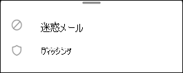

# Exchange Online で iOS および Android 用の Outlook で迷惑メールとフィッシング詐欺メールを報告するReport junk and phishing email in Outlook for iOS and Android in Exchange Online

[!INCLUDE [Microsoft 365 Defender rebranding](../includes/microsoft-defender-for-office.md)]

[ハイブリッド先進認証](https://docs.microsoft.com/microsoft-365/enterprise/hybrid-modern-auth-overview?view=o365-worldwide)を使用する Exchange online またはオンプレミスのメールボックスを含む Microsoft 365 組織では、IOS および Android 用の Outlook の組み込みのレポート作成オプションを使用して誤検知 (スパムとしてマークされた良好な電子メール)、誤検知 (無効な電子メールが許可されている)、および Exchange Online PROTECTION (EOP) へIn Microsoft 365 organizations with mailboxes in Exchange Online or on-premises mailboxes using [hybrid modern authentication](https://docs.microsoft.com/microsoft-365/enterprise/hybrid-modern-auth-overview?view=o365-worldwide), you can use the built-in reporting options in Outlook for iOS and Android to submit false positives (good email marked as spam), false negatives (bad email allowed), and phishing messages to Exchange Online Protection (EOP).

## 開始する前に把握しておくべき情報What do you need to know before you begin

- Exchange Online メールボックスを使用している組織内の管理者である場合は、セキュリティ & コンプライアンスセンターで送信ポータルを使用することをお勧めします。If you're an admin in an organization with Exchange Online mailboxes, we recommend that you use the Submissions portal in the Security & Compliance Center. 詳細については、「 [管理者による送信を使用して疑わしいスパム、フィッシング、url、およびファイルを Microsoft に送信する](admin-submission.md)」を参照してください。For more information, see [Use Admin Submission to submit suspected spam, phish, URLs, and files to Microsoft](admin-submission.md).

- 指定したメールボックスに、レポートされたメッセージをコピーまたはリダイレクトするように構成できます。You can configure reported messages to be copied or redirected to a mailbox that you specify. 詳細については、「 [Exchange Online でスパムおよびフィッシングメッセージをユーザーに送信するためのメールボックスを指定](user-submission.md)する」を参照してください。For more information, see [Specify a mailbox for user submissions of spam and phishing messages in Exchange Online](user-submission.md).

- Microsoft へのメッセージの報告の詳細については、「 [microsoft にメッセージとファイルを報告する](report-junk-email-messages-to-microsoft.md)」を参照してください。For more information about reporting messages to Microsoft, see [Report messages and files to Microsoft](report-junk-email-messages-to-microsoft.md).

  > [!NOTE]
  > 迷惑メール報告がユーザー送信ポリシーの Outlook に対して無効になっている場合、迷惑メールまたはフィッシングメッセージは迷惑メールフォルダーに移動され、管理者または Microsoft には報告されません。If junk email reporting is disabled for Outlook in the user submission policy, junk or phishing messages will be moved to the Junk folder and not reported to your admin or Microsoft.

## IOS および Android 用の Outlook でスパムメッセージとフィッシングメッセージを報告するReport spam and phishing messages in Outlook for iOS and Android

受信トレイ内のメッセージ、または迷惑メール以外の他の電子メールフォルダーについては、次の手順を使用して、iOS および Android 用のスパムおよびフィッシングメッセージを報告します。For messages in the Inbox, or any other email folder except Junk Email, use the following steps to report spam and phishing messages for iOS and Android:

1. 1つ以上のメッセージを選択します。Select one or more messages.
2. 右上隅にある3つの垂直点をタップします。In the top-right corner tap on the three vertical dots. [アクション] メニューが開きます。The action menu opens.

   ![[アクション] メニューから迷惑メールまたはフィッシング詐欺メールを報告する](../../media/Android-report-as-junk-dialog.png)

3. [ **迷惑メールを報告** ] をタップしてから、[ **迷惑メール** または **フィッシング詐欺**] を選択Tap **Report junk** and then select **Junk** or **Phishing**.

   

4. 表示されるダイアログで、[ **レポート** ] または [ **いいえ**] を選択できます。In the dialog that appears, you can choose **Report** or **No Thanks**. [ **いいえ**] を選択した場合、[ **迷惑** メール] をタップすると、メッセージは [迷惑メール] フォルダーに移動します。 **フィッシング** をタップすると、メッセージは [削除済みアイテム] フォルダーに移動します。On selecting **No Thanks**, if you tapped **Junk** the message moves to the Junk Email folder, if you tapped **Phishing** the message moves to the Deleted Items folder. [ **レポート** ] を選択して、メッセージのコピーも Microsoft に送信します。Select **Report** to also send a copy of the message to Microsoft.

   

気が変わった場合は、表示されるトースト通知で [ **元に戻す** ] を選択します。If you change your mind, select **Undo** on the toast notification that appears. メッセージは受信トレイフォルダーに残ります。The message remains in the Inbox folder.

## Outlook for iOS および Android 用の迷惑メールフォルダーから非スパムメッセージを報告するReport non-spam messages from the Junk folder in Outlook for iOS and Android

[迷惑メール] フォルダーで、次の手順を使用してスパム誤検知を報告します。In the Junk folder, use the following steps to report spam false positives:

1. 1つ以上のメッセージを選択します。Select one or more messages.
2. 右上隅にある3つの垂直点をタップします。In the top-right corner tap on the three vertical dots. [アクション] メニューが開きます。The action menu opens.

   ![[アクション] メニューから迷惑メールではないことを報告する](../../media/Android-not-junk-email.png)

3. **迷惑メールではない**をタップします。Tap **Not junk**.

トースト通知は、電子メールが受信トレイに移動されたことを示します。A toast notification appears that the email has moved to your Inbox. 気が変わった場合は、トースト通知で [ **元に戻す** ] を選択します。If you change your mind, select **Undo** on the toast notification. 電子メールは、迷惑メールフォルダーに残ります。The email remains in the Junk folder.
