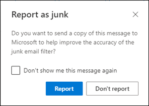

# <a name="report-junk-and-phishing-email-in-outlook-on-the-web-in-exchange-online"></a>Exchange Online の Outlook on the web で迷惑メールとフィッシング メールを報告する

Exchange Online にメールボックスがある Microsoft 365 組織では、Web 上の Outlook の組み込みのレポート オプション (Outlook Web App) を使用して、誤検知 (迷惑メールとしてマークされているメール)、偽陽性 (不適切なメールが許可される)、漏えいのメッセージ (不適切なメールで許可されます)、Exchange Online Protection (EOP) へのフィッシング メールを送信できます。

## <a name="what-do-you-need-to-know-before-you-begin"></a>はじめに把握しておくべき情報

- Exchange Online メールボックスを持つ組織内の管理者は、セキュリティ/コンプライアンス センターの提出ポータルを&ことをお勧めします。 詳細については、「管理者送信 [を使用して、スパム、フィッシング、URL、ファイルを Microsoft に送信する」を参照してください](admin-submission.md)。

- 管理者は、ユーザーが Web 上の Outlook でメッセージを Microsoft に報告する機能を無効にするか有効にできます。 詳細については、このトピックに後 [述する「Web 上の Outlook での迷惑メール レポートを無効にするまたは有効](#disable-or-enable-junk-email-reporting-in-outlook-on-the-web) にする」を参照してください。

- 報告されたメッセージを、指定したメールボックスにコピーまたはリダイレクトする構成ができます。 詳細については [、「Exchange Online でスパムやフィッシング メッセージのユーザーを送信するためのメールボックスを指定する」を参照してください](user-submission.md)。

- Microsoft へのメッセージの報告の詳細については、「メッセージと [ファイルを Microsoft に報告する」を参照してください](report-junk-email-messages-to-microsoft.md)。

## <a name="report-spam-and-phishing-messages-in-outlook-on-the-web"></a>Outlook on the web でスパムやフィッシングのメッセージを報告する

1. 受信トレイにあるメッセージまたはその他の [迷惑メール] 以外のメール フォルダーについては、以下のいずれかの方法を使用してスパム メッセージとフィッシング メッセージを報告します。

   - メッセージを選択し、ツール バー **の** [迷惑メール] をクリックして、[迷惑 **メールまたはフ** ィッシ **ングメール] を選択します**。

     

   - 1 つ以上のメッセージを選択し、右クリックして、迷惑メール **としてマークを付けて選択します**。

2. 表示されたダイアログ で、[レポート] を **クリックします**。 後で注意が必要な場合は、[ **レポートしない] をクリックします**。

   |迷惑メール|フィッシング|
   |:---:|:---:|
   |||

3. 選択したメッセージが分析用に Microsoft に送信されます。 メッセージが送信されたことを確認するには、 **[送信済みアイテム]** フォルダーを開いて、送信済みのメッセージを表示します。

## <a name="report-non-spam-and-phishing-messages-from-the-junk-email-folder-in-outlook-on-the-web"></a>Outlook on the web の [迷惑メール] フォルダーから、スパム以外やフィッシングしていないメッセージを報告する

1. 迷惑メール フォルダーで、次のいずれかの方法を使用して、スパムの誤検知またはフィッシング メッセージを報告します。

   - メッセージを選択し、ツール バー **上の [迷惑** メールしない] をクリックして、[ **迷惑メールやフィッ** シ **ングメール] を選択します**。

     

   - 1 つ以上のメッセージを選択し、右クリックして、迷惑メールでないメール **としてマークをマークします**。

2. 表示されるダイアログで情報を読み、レポート をクリック **します**。 後で注意が必要な場合は、[ **レポートしない] をクリックします**。

   |迷惑メールではないメール|フィッシング詐欺|
   |:---:|:---:|
   |||

3. 選択したメッセージが分析用に Microsoft に送信されます。 メッセージが送信されたことを確認するには、 **[送信済みアイテム]** フォルダーを開いて、送信済みのメッセージを表示します。

## <a name="disable-or-enable-junk-email-reporting-in-outlook-on-the-web"></a>Web 上の Outlook で迷惑メール レポートを無効または有効にする

既定では、ユーザーは Outlook on the web で分析するために、スパムの誤検知、検知漏れ、フィッシング メッセージを Microsoft に報告できます。 管理者は Exchange Online PowerShell で Web 上の Outlook のメールボックス ポリシーを構成して、ユーザーがスパムの誤検知やスパムの誤検知を Microsoft に報告しないようにすることができます。 フィッシング メッセージを Microsoft に報告する機能を無効にすることはできません。

### <a name="what-do-you-need-to-know-before-you-begin"></a>はじめに把握しておくべき情報

- Exchange Online PowerShell へ接続するには、「[Exchange Online PowerShell に接続する](https://docs.microsoft.com/powershell/exchange/connect-to-exchange-online-powershell)」を参照してください。

- これらの手順を実行する際には、あらかじめアクセス許可を割り当てる必要があります。 具体的には、Exchange Online**の受信者ポリシー****またはメール受信者**の役割が必要です。既定で **、組織管理役割**グループと**Recipient Management 役割グループに割**り当てられます。 Exchange Online の役割グループの詳細については、「Exchange Online で役割 [グループを変更する」を参照してください](https://docs.microsoft.com/Exchange/permissions-exo/role-groups#modify-role-groups)。

- 各組織には、OwaMailboxPolicy-Default という名前の既定のポリシーがありますが、カスタム ポリシーを作成することができます。 カスタム ポリシーは、既定のポリシーの前に、範囲を指定したユーザーに適用されます。 Web 上の Outlook のメールボックス ポリシーの詳細については、Exchange Online の [Outlook on the web のメールボックス ポリシーを参照してください](https://docs.microsoft.com/Exchange/clients-and-mobile-in-exchange-online/outlook-on-the-web/outlook-web-app-mailbox-policies)。

- 迷惑メール報告を無効にしても、Outlook on the web でメッセージを迷惑メール、または迷惑メールでないメールとしてマークする機能は削除されません。 迷惑メール フォルダー内のメッセージを選択して、**迷惑**メールでないメールを \> **Not junk**クリックしても、メッセージは引き続き受信トレイに移動します。 Selecting a message in any **Junk** other email folder and clicking \> **Junk** still moves the message into the Junk Email folder. 利用できなくなった機能は、メッセージを Microsoft に報告するオプションです。

### <a name="use-exchange-online-powershell-to-disable-or-enable-junk-email-reporting-in-outlook-on-the-web"></a>Exchange Online PowerShell を使用して、Web 上の Outlook で迷惑メール レポートを無効または有効にする

1. 既存の Outlook on the web メールボックス ポリシーと迷惑メール レポートの状態を検索するには、次のコマンドを実行します。

   ```powershell
   Get-OwaMailboxPolicy | Format-Table Name,ReportJunkEmailEnabled
   ```

2. Web 上の Outlook で迷惑メール レポートを無効または有効にするには、次の構文を使用します。

   ```powershell
   Set-OwaMailboxPolicy -Identity "<OWAMailboxPolicyName>" -ReportJunkEmailEnabled <$true | $false>
   ```

   この例では、既定のポリシーの迷惑メール報告を無効にします。

   ```powershell
   Set-OwaMailboxPolicy -Identity "OwaMailboxPolicy-Default" -ReportJunkEmailEnabled $false
   ```

   この例では、Contoso Managers という名前のカスタム ポリシーの迷惑メール報告を有効にします。

   ```powershell
   Set-OwaMailboxPolicy -Identity "Contoso Managers" -ReportJunkEmailEnabled $true
   ```

構文およびパラメーターの詳細については[、「Get-OwaMailboxPolicy」と](https://docs.microsoft.com/powershell/module/exchange/get-owamailboxpolicy)[「Set-OwaMailboxPolicy」を参照してください](https://docs.microsoft.com/powershell/module/exchange/set-owamailboxpolicy)。

### <a name="how-do-you-know-this-worked"></a>正常な動作を確認する方法

Web 上の Outlook での迷惑メール レポートが正常に有効または無効にされたことを確認するには、次のいずれかの手順を使用します。

- Exchange Online PowerShell で次のコマンドを実行し **、ReportJunkEmailEnabled プロパティの値** を確認します。

  ```powershell
  Get-OwaMailboxPolicy | Format-Table Name,ReportJunkEmailEnabled
  ```

- 影響を受けるユーザーのメールボックスを Outlook on the web で開き、[受信トレイ] でメッセージを選択して [**迷惑**メール] を \> **Junk**クリックし、メッセージを Microsoft に報告するプロンプトが表示されていないことを確認します。<sup>\*</sup>

- 影響を受けるユーザーのメールボックスを Outlook on the web で開き、[迷惑メール] フォルダーでメッセージを選択して [迷惑メール]**を** \> **Junk**クリックし、メッセージを Microsoft に報告するプロンプトが表示されていないことを確認します。<sup>\*</sup>

<sup>\*</sup> メッセージの報告中に、メッセージを報告するプロンプトを非表示にすることができます。 Outlook on the web でこの設定を確認するには、次の手順を実行します。

1. [Web **上の** ![ Outlook 設定] アイコンをクリックすると ](../../media/owa-settings-icon.png) \> **、[Outlook の設定をすべて迷惑メール]** \> **に表示します**。
2. [レポート **] セクション** で、次の値を確認します。 **レポートを送信する前に、次のことを確認します**。

   
