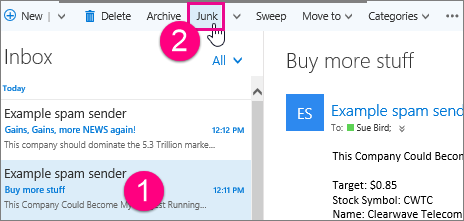
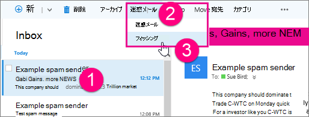

# Outlook on the web で迷惑メールとフィッシング詐欺を報告する

組織のユーザーが迷惑メールを受信したり、重要なメールがスパムと誤認されたため受信できなかったりすると、苛立つ原因になることがあります。Exchange Online Protection (EOP) スパム フィルターは精度を上げるための微調整が継続的に行われているため、お客様とエンド ユーザーはこのプロセスから恩恵を受けることができます。Microsoft Outlook on the web のユーザーは、組み込みの電子メール レポート オプションを使用して、迷惑メール (スパム) とフィッシング詐欺を報告できます。電子メールが迷惑メール (スパム) として誤って識別されたかどうかを Microsoft に通知することもできます。

## Outlook on the web で迷惑メール メッセージを送信する

迷惑メール メッセージを Microsoft に送信するには:

1. 迷惑メール メッセージをクリックしてから、ツールバーの **[迷惑メール]** をクリックします。これにより、メッセージが迷惑メール フォルダーに移動され、その送信者が受信拒否リストに追加されます。

   

   > [!NOTE]
   > または、メッセージを右クリックしてメニューを表示し、 **[迷惑メールにする]** をクリックします。

   迷惑メールメッセージは、**受信トレイ**または**削除済みアイテム**フォルダーから報告できます。

2. 迷惑メール メッセージのコピーを分析のために Microsoft に送信するかどうかを確認するダイアログ ボックスが開きます。Microsoft スパム分析チームにメッセージを送信する場合は、 **[報告]** をクリックします。今後の迷惑メール メッセージをプロンプトなしで Microsoft に自動的に送信する場合には、オプションで、 **[今後、このメッセージを表示しない]** チェック ボックスを選択します。

   

   > [!TIP]
   > **[今後、このメッセージを表示しない]** チェック ボックスを選択した場合でも、後で Outlook on the web の表示設定にアクセスすることによって、迷惑メールを報告するようにこの設定を変更することができます (これらの設定には、サインイン名の横にあるギア メニューからアクセスできます)。

## Outlook on the web でフィッシング詐欺メッセージを送信する

フィッシング詐欺メッセージを Microsoft に送信するには:

1. フィッシング詐欺メッセージをクリックして、 **[迷惑メール]** の横にある下向き矢印をクリックしてから、ツールバーの **[フィッシング]** をクリックします。 フィッシング詐欺メッセージの送信者は正当な送信者を偽装していることが多いため、Office 365 は送信者をブロックしません。 必要に応じて、「 [web 上の Outlook で迷惑メールとスパムをフィルター](https://support.office.com/article/db786e79-54e2-40cc-904f-d89d57b7f41d)する」の手順に従って、送信者を受信拒否リストに追加します。

   

   または、メッセージを右クリックしてメニューを表示し、 **[Mark as Phishing] (フィッシングとして報告する)** をクリックします。

   フィッシング詐欺メッセージは、**受信トレイ**または**削除済みアイテム**フォルダーから報告できます。

2. 組織によっては、フィッシング詐欺メールのコピーを分析のために Microsoft に送信するかどうかを尋ねるダイアログ ボックスが表示されます。メッセージを Microsoft スパム分析チームに送信するには、 **[報告]** をクリックします。この報告オプションは、現在、一部の組織でしか利用できません。そのため、フィッシング詐欺を Microsoft に報告するかどうかが尋ねられない場合があります。

## Outlook on the web で「迷惑メールではないメール」メッセージを送信する

Office 365 によってメッセージが迷惑メールとして誤って識別された場合は、メッセージを「迷惑メールではないメール」として Microsoft に送信します。

1. 迷惑メール フォルダーで、そのメッセージをクリックしてから、ツールバーの **[迷惑メールではないメール]** をクリックします。これにより、メッセージが **受信トレイ**に移動され、その送信者が差出人セーフ リストに追加されます。

   [迷惑メール] フォルダー内のメッセージを右クリックしてメニューを表示し、[迷惑メールで**はないメールとしてマーク**] をクリックすることもできます。

2. 迷惑メールではないメール メッセージのコピーを分析のために Microsoft に送信するかどうかを尋ねるダイアログ ボックスが表示されます。Microsoft スパム分析チームにメッセージを送信するには、**[報告]** をクリックします。

## 詳細情報

[迷惑メールやフィッシング詐欺について](https://support.microsoft.com/article/86c1d76f-4d5a-4967-9647-35665dc17c31)

[Microsoft Outlook 用迷惑メール報告アドイン](https://docs.microsoft.com/office365/securitycompliance/junk-email-reporting-add-in-for-microsoft-outlook)
