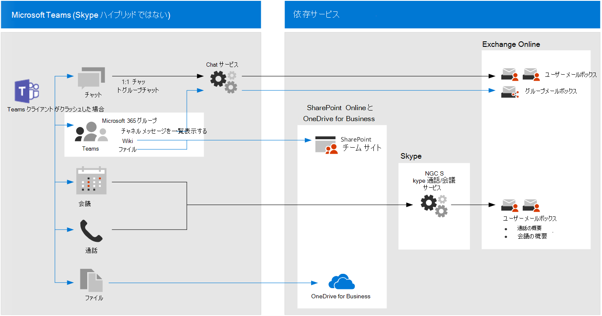

# Teams のチャット、グループ、およびファイルを保護するためのポリシーの推奨事項

この記事では、推奨される id とデバイスアクセスポリシーを実装して、Microsoft Teams のチャット、グループ、およびファイルや予定表などのコンテンツを保護する方法について説明します。 このガイダンスでは、 [共通の id およびデバイスアクセスポリシー](identity-access-policies.md)と、Teams 固有の追加情報を作成します。 Teams は他の製品と統合されているため、 [SharePoint サイトとファイルをセキュリティで保護するためのポリシー推奨事項](sharepoint-file-access-policies.md) と、 [電子メールをセキュリティ保護するためのポリシー推奨](secure-email-recommended-policies.md)事項も参照してください。

これらの推奨事項は、ニーズの粒度 (基準、機密、高規制) に基づいて適用できる、3つの異なるレベルのセキュリティと、Teams の保護に基づいています。 これらのセキュリティ層および推奨されるポリシーの詳細については、「 [id とデバイスのアクセス構成](microsoft-365-policies-configurations.md)」を参照してください。

この記事には、Teams の展開に関するその他の推奨事項が含まれており、組織外のユーザーを含む特定の認証状況について説明しています。 セキュリティを完全に向上させるには、このガイダンスに従う必要があります。

## 他の依存サービスの前に Teams を使い始める

Microsoft Teams の使用を開始するために、依存サービスを有効にする必要はありません。 これらはすべて "機能します" ということになります。 ただし、次のものを管理するための準備が必要です。

- Microsoft 365 グループ
- SharePoint チーム サイト
- OneDrive for Business
- Exchange メールボックス
- ストリーミングビデオおよび Planner プラン (これらのサービスが有効になっている場合)

## 共通ポリシーを更新して Teams を含める

Teams のチャット、グループ、およびコンテンツを保護するために、次の図は、共通 id およびデバイスアクセスポリシーから更新するポリシーを示しています。 更新するポリシーごとに、Teams および依存サービスがクラウドアプリの割り当てに含まれていることを確認してください。

[この画像のより大きいバージョンを表示する](https://github.com/MicrosoftDocs/microsoft-365-docs/raw/public/microsoft-365/media/microsoft-365-policies-configurations/identity-access-ruleset-teams.png)

Teams のクラウドアプリの割り当てに含める依存サービスは次のとおりです。

- Microsoft Teams
- SharePoint および OneDrive for Business
- Exchange Online
- Skype for Business Online
- Microsoft Stream (会議のレコーディング)
- Microsoft Planner (Planner タスクおよびプランデータ)

次の表に、すべての Office アプリケーションに対して、より広範なポリシーが設定されている [共通の id およびデバイスアクセスポリシー](identity-access-policies.md)で、再検討する必要があるポリシーと各ポリシーへのリンクを示します。

|保護レベル|Policies|Teams の実装に関するその他の情報|
|---|---|---|
|**Baseline**|[サインインリスクが *中* または *高* の場合は MFA を必須にする](identity-access-policies.md#require-mfa-based-on-sign-in-risk)|アプリの一覧に Teams および依存サービスが含まれていることを確認してください。 Teams にはゲストアクセスと外部アクセスのルールが含まれています。これについては、この記事の後半で説明します。|
||[先進認証をサポートしないクライアントはブロックする](identity-access-policies.md#block-clients-that-dont-support-modern-authentication)|クラウドアプリの割り当てに Teams および依存するサービスを含めます。|
||[高リスク ユーザーはパスワードを変更する必要がある](identity-access-policies.md#high-risk-users-must-change-password)|リスクの高いアクティビティがアカウントに対して検出された場合に、サインイン時に Teams ユーザーがパスワードを変更することを強制します。 アプリの一覧に Teams および依存サービスが含まれていることを確認してください。|
||[アプリデータ保護ポリシーを適用する](identity-access-policies.md#apply-app-data-protection-policies)|アプリの一覧に Teams および依存サービスが含まれていることを確認してください。 各プラットフォーム (iOS、Android、Windows) のポリシーを更新します。|
||[デバイスコンプライアンスポリシーの定義](identity-access-policies.md#define-device-compliance-policies)|このポリシーに Teams および依存するサービスを含めます。|
||[準拠 PC が必要](identity-access-policies.md#require-compliant-pcs-but-not-compliant-phones-and-tablets)|このポリシーに Teams および依存するサービスを含めます。|
|**機密**|[サインインリスクが *低*、*中*、*高* のときに MFA を必要とする](identity-access-policies.md#require-mfa-based-on-sign-in-risk)|Teams にはゲストアクセスと外部アクセスのルールが含まれています。これについては、この記事の後半で説明します。 このポリシーに Teams および依存するサービスを含めます。|
||[準拠 *して* いる pc とモバイルデバイスが必要](identity-access-policies.md#require-compliant-pcs-and-mobile-devices)|このポリシーに Teams および依存するサービスを含めます。|
|**厳しく規制**|[*常に* MFA が必要](identity-access-policies.md#require-mfa-based-on-sign-in-risk)|ユーザー id に関係なく、MFA は組織によって使用されます。 このポリシーに Teams および依存するサービスを含めます。 |
|

## Teams 依存サービスのアーキテクチャ

参考として、次の図は、サービスチームが依存していることを示しています。 詳細とその他の図については、「microsoft [Teams and related プロダクティビティ service In microsoft 365 IN IT アーキテクト](../../solutions/productivity-illustrations.md)」を参照してください。

[この画像のより大きいバージョンを表示する](https://github.com/MicrosoftDocs/microsoft-365-docs/raw/public/microsoft-365/media/microsoft-365-policies-configurations/identity-access-logical-architecture-teams.png)

## Teams のゲストおよび外部アクセス

Microsoft Teams では、以下を定義します。

- **ゲストアクセス** では、チームのメンバーとして追加し、すべての権限がチームのコミュニケーションとリソースにアクセスできるようにする、ゲストまたは外部ユーザーに対して AZURE AD B2B アカウントを使用します。

- Azure AD B2B アカウントを持たない外部ユーザーに対して **外部アクセス** を行います。 外部アクセスには、通話、チャット、および会議への招待と参加を含めることができますが、チームのメンバーシップやチームのリソースへのアクセスは含まれません。

条件付きアクセスポリシーは、対応する Azure AD B2B アカウントがあるため、Teams でのゲストアクセスにのみ適用されます。

<!--
In Azure AD, guest and external users are the same. The user type for both of these is Guest. Guest users are B2B users. Microsoft Teams differentiates between guest users and external users in the app. While it's important to understand how each of these are treated in Teams, both types of users are B2B users in Azure AD and the recommended policies for B2B users apply to both.

-->

Azure AD B2B アカウントを使用してゲストユーザーと外部ユーザーにアクセスを許可するために推奨されるポリシーについては、「 [ゲストおよび外部 B2B アカウントのアクセスを許可するためのポリシー](identity-access-policies-guest-access.md)」を参照してください。

### Teams でのゲスト アクセス

企業または組織の内部にあるユーザーのポリシーに加えて、管理者はゲストアクセスを有効にして、ユーザーごとに、組織外のユーザーが Teams のリソースにアクセスしたり、グループの会話、チャット、会議などの内部ユーザーと対話したりすることができます。

ゲストアクセスおよびその実装方法の詳細については、「  [Teams ゲストアクセス](https://docs.microsoft.com/microsoftteams/guest-access)」を参照してください。

### Teams での外部アクセス

外部アクセスは、ゲストアクセスと混同されることがあるため、これらの2つの非内部アクセスメカニズムが実際に大きく異なることを明確にすることが重要です。

外部アクセスは、teams のユーザーとの間で、外部ドメイン全体の Teams ユーザーが会議を検索、呼び出し、チャット、セットアップするための方法です。 Teams 管理者は、組織レベルで外部アクセスを構成します。 詳細については、「 [Microsoft Teams で外部アクセスを管理](https://docs.microsoft.com/microsoftteams/manage-external-access)する」を参照してください。

外部アクセスユーザーのアクセス権と機能は、ゲストアクセスで追加された個人数よりも少なくなります。 たとえば、外部アクセスユーザーは、Teams を使用して内部ユーザーとチャットすることはできますが、チームチャネル、ファイル、またはその他のリソースにアクセスすることはできません。

外部アクセスでは、Azure AD B2B ユーザーアカウントを使用しないため、条件付きアクセスポリシーを使用しません。

## Teams ポリシー

上記の一般的なポリシーの範囲外では、さまざまなチームの機能を管理するために構成できる Teams 固有のポリシーがあります。

### Teams およびチャネルのポリシー

Teams とチャネルは、Microsoft Teams でよく使用される2つの要素であり、teams やチャネルを使用する際にユーザーが実行できることとできないことを制御するために配置できるポリシーがあります。 グローバルチームを作成することはできますが、組織のユーザーが5000人以下の場合は、組織のニーズに合わせて、特定の目的のためにチームとチャネルを小さくした方が便利な場合があります。

既定のポリシーを変更するか、カスタムポリシーを作成することをお勧めします。このリンクでは、「 [Microsoft teams で teams ポリシーを管理する」に記載](https://docs.microsoft.com/microsoftteams/teams-policies)されているポリシーの管理について説明します。

### メッセージングポリシー

メッセージングやチャットは、既定のグローバルポリシーまたはカスタムポリシーを使用して管理することもできます。これにより、ユーザーは自分の組織に適した方法で相互に通信することができます。 この情報は、「 [Teams でのメッセージングポリシーの管理」](https://docs.microsoft.com/microsoftteams/messaging-policies-in-teams)で確認できます。

### ミーティング ポリシー

Teams の会議に関するポリシーを計画して実装しなくても、チームの討議は完了しません。 会議は、Teams の重要なコンポーネントであり、会議に関連するコンテンツの共有だけでなく、複数のユーザーに対して、ユーザーが正式に会うことができるようにしたり、一度に表示したりすることができます。 組織に適したポリシーを会議に沿って設定することが重要です。

詳細については、「 [Teams での会議ポリシーの管理」](https://docs.microsoft.com/microsoftteams/meeting-policies-in-teams) を参照してください。

### アプリのアクセス許可ポリシー

Teams では、チャネルや個人のチャットなど、さまざまな場所でアプリを使用することもできます。 セキュリティで保護されたコンテンツリッチな環境を維持するには、追加および使用できるアプリケーションに関するポリシーが必要です。

アプリのアクセス許可ポリシーの詳細については、「 [Microsoft Teams でアプリのアクセス許可ポリシーを管理](https://docs.microsoft.com/microsoftteams/teams-app-permission-policies)する」を参照してください。

## 次の手順

次の条件付きアクセスポリシーを構成します。

- [Exchange Online](secure-email-recommended-policies.md)
- [SharePoint](sharepoint-file-access-policies.md)
