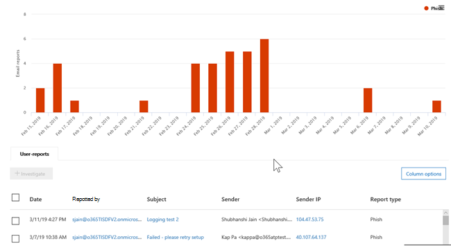

# 脅威エクスプローラーのビューとリアルタイムの検出

[脅威エクスプローラー](threat-explorer.md) (およびリアルタイムの検出レポート) は、セキュリティ運用チームがセキュリティコンプライアンスセンターで脅威を調査して対応するのに役立つ、強力でほぼリアルタイムのツールです &amp; 。 エクスプローラー (およびリアルタイム検出レポート) は、疑いのあるマルウェアおよびフィッシングに関する情報を、Office 365 の電子メールとファイル、および組織に対する他のセキュリティ上の脅威やリスクと共に表示します。

- [Office 365 Advanced Threat Protection](office-365-atp.md) (ATP) プラン2を使用している場合は、エクスプローラーがあります。
- Office 365 ATP Plan 1 を使用している場合は、リアルタイムの検出があります。

エクスプローラー (またはリアルタイムの検出レポート) を最初に開いたとき、既定のビューには過去7日間の電子メールマルウェアの検出が表示されます。 このレポートでは、[安全なリンク](atp-safe-links.md)によって検出された悪意のある Url、安全な[添付](atp-safe-attachments.md)ファイルによって検出された悪意のあるファイルなど、ATP の検出も表示できます。 このレポートを変更して、過去30日間のデータを表示することができます (ATP P2 有料サブスクリプションを使用)。 試用版サブスクリプションには過去7日間のデータのみが含まれます。

****

|サブスクリプション|ユーティリティ|データの日数|
|---|---|---|
|ATP P1 の試用版|リアルタイムの検出|7 |
|ATP P1 払い|リアルタイムの検出|31|
|ATP P1 の有料テスト ATP P2 試用版|脅威エクスプローラー|7 |
|ATP P2 試用版|脅威エクスプローラー|7 |
|ATP (有料)|脅威エクスプローラー|31|
|

表示する情報を変更するには、[**表示**] メニューを使用します。 ツールヒントは、どのビューを使用するかを判断するのに役立ちます。

![脅威エクスプローラーの [表示] メニュー](../../media/ThreatExplorerViewMenu.png)

ビューを選択したら、フィルターを適用してクエリを設定し、さらに分析を行います。 次のセクションでは、エクスプローラーで使用できるさまざまなビュー (またはリアルタイムの検出) について簡単に説明します。

## 電子メール > マルウェア

このレポートを表示するには、エクスプローラー (またはリアルタイムの検出**View**) で、[  >  **電子メール**の  >  **マルウェア**を表示する] を選択します。 このビューには、マルウェアが含まれていると識別された電子メールメッセージに関する情報が表示されます。

[**送信者**] をクリックして、表示オプションの一覧を開きます。 このリストを使用して、送信者、受信者、送信者ドメイン、件名、検出テクノロジ、保護状態などのデータを表示します。

たとえば、検出された電子メールメッセージに対して実行されたアクションを確認するには、リストで [**保護の状態**] を選択します。 オプションを選択し、[最新の情報に更新] をクリックして、そのフィルターをレポートに適用します。

グラフの下に、特定のメッセージの詳細を表示します。 リスト内の項目を選択すると、フライアウトウィンドウが開き、選択した項目の詳細を確認できます。

## 電子メール > フィッシング

このレポートを表示するには、エクスプローラー (またはリアルタイムの検出) で、[ **view**  >  **Email**  >  **フィッシング**] を選びます。 このビューには、フィッシングとして識別された電子メールメッセージが表示されます。

[**送信者**] をクリックして、表示オプションの一覧を開きます。 このリストを使用して、送信者、受信者、送信者ドメイン、送信者の IP、URL ドメイン、[verdict] などのデータを表示します。

たとえば、フィッシングとして識別された Url をユーザーがクリックしたときに実行された操作を確認するには、一覧で **[Verdict]** を選択し、1つ以上のオプションを選択して、[更新] ボタンをクリックします。

グラフの下に、特定のメッセージ、URL クリック、Url、および電子メールの送信元に関する詳細を表示します。

検出された URL など、リスト内の項目を選択すると、フライアウトウィンドウが開き、選択した項目の詳細を確認できます。

## 電子メール > の提出

このレポートを表示するには、エクスプローラー (またはリアルタイムの検出**View**) で、[  >  **電子メール**の送信を表示する] を選択し  >  **Submissions**ます。 このビューには、ユーザーが迷惑メール、迷惑メールではないメールとして報告した電子メールが表示されます。

[**送信者**] をクリックして、表示オプションの一覧を開きます。 この一覧を使用して、送信者、受信者、レポートの種類 (電子メールが迷惑メールではないか、迷惑メールではないか、またはフィッシング) ごとに情報を表示します。

たとえば、フィッシングとして報告された電子メールメッセージに関する情報を表示するには、[ **Sender**Report type] をクリックし、[フィッシング] を  >  **Report type**選択してから、[更新] ボタンをクリックし**Phish**ます。

グラフの下に、件名行、送信者の IP アドレス、メッセージを迷惑メールとして報告したユーザー、迷惑メール、フィッシングなど、特定の電子メールメッセージの詳細を表示します。

一覧から項目を選択すると、追加の詳細が表示されます。

## すべてのメール > メール

このレポートを表示するには、エクスプローラーで [すべてのメールを**表示**する] を選択し  >  **Email**  >  **All mail**ます。 このビューには、フィッシングまたはマルウェアによって悪意があると識別された電子メールや、悪意のあるメール (通常の電子メール、スパム、およびバルクメール) など、すべての電子メールアクティビティが表示されます。

> [!NOTE]
> **表示するデータが多すぎる**というエラーが表示された場合は、フィルターを追加し、必要に応じて、表示している日付範囲を絞り込んでください。

フィルターを適用するには、[**送信者**] を選択し、リスト内の項目を選択してから [最新の情報に更新] をクリックします。 この例では、**検出テクノロジ**をフィルタとして使用しています (複数のオプションを使用できます)。 送信者、送信者のドメイン、受信者、件名、添付ファイル名、マルウェアファミリ、保護状態 (Office 365 の脅威保護機能およびポリシーによって実行される操作)、検出テクノロジ (マルウェアの検出方法) などの情報を表示します。

グラフの下に、件名行、受信者、送信者、状態など、特定の電子メールメッセージの詳細を表示します。

## コンテンツ > マルウェア

このレポートを表示するには、エクスプローラー (またはリアルタイム検出) **View**で、[  >  **コンテンツ**  >  **マルウェア**の表示] を選択します。 このビューには[、SharePoint Online、OneDrive For business、Microsoft Teams で Office 365 Advanced Threat Protection](atp-for-spo-odb-and-teams.md)によって悪意のあるファイルとして識別されたファイルが表示されます。

マルウェアファミリ、検出テクノロジ (マルウェアの検出方法)、ワークロード (OneDrive、SharePoint、Teams) 別の情報を表示します。

グラフの下に、添付ファイルのファイル名、ワークロード、ファイルのサイズ、ファイルを最後に変更したユーザーなど、特定のファイルの詳細が表示されます。

## クリックフィルター機能

エクスプローラー (およびリアルタイム検出) を使用すると、クリックでフィルターを適用できます。 凡例の項目をクリックすると、その項目がレポートのフィルターになります。 たとえば、エクスプローラーのマルウェアビューを見ているとします。

![[脅威管理エクスプローラー] に移動します。 \>](../../media/cab32fa2-66f1-4ad5-bc1d-2bac4dbeb48c.png)

このグラフの [ **ATP 分析**] をクリックすると、次のような表示になります。

このビューでは、 [Office 365 ATP の安全な添付ファイル](atp-safe-attachments.md)によって分析されたファイルのデータを調べています。 チャートの下には、ATP の安全な添付ファイルによって検出された添付ファイルがある特定の電子メールメッセージに関する詳細が表示されます。

1つまたは複数のアイテムを選択すると、[ **Actions** ] メニューがアクティブ化され、選択したアイテムに対して選択できるいくつかの選択肢が提供されます。

![アイテムを選択すると、[アクション] メニューがアクティブになります。](../../media/95f127a4-1b2a-4a76-88b9-096e3ba27d1b.png)

クリックして特定の詳細に移動する機能を使用すると、脅威の調査に長い時間をかけることができます。

## クエリとフィルター

エクスプローラー (およびリアルタイムの検出レポート) には、上位の対象ユーザー、上位マルウェアファミリ、検出テクノロジなどの詳細を掘り下げて表示できる、さまざまなフィルターとクエリ機能があります。 各種類のレポートには、データの表示と探索にさまざまな方法が用意されています。

> [!IMPORTANT]
> エクスプローラーのクエリバー (またはリアルタイムの検出) では、アスタリスクや疑問符などのワイルドカード文字を使用しないでください。 電子メールメッセージの [**件名] フィールド**を検索すると、エクスプローラー (またはリアルタイムの検出) によって部分一致が実行され、ワイルドカード検索と同様の結果が得られます。
