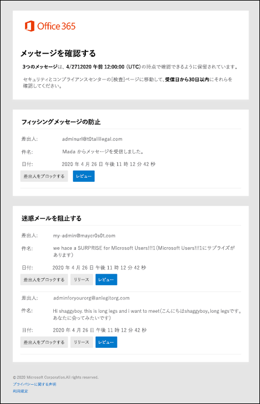

# ユーザーのスパム通知を使って検疫済みメッセージを解放して報告するUse user spam notifications to release and report quarantined messages

Exchange Online のメールボックスを使用している Microsoft 365 組織または Exchange Online のメールボックスを使用していないスタンドアロンの Exchange Online Protection (EOP) 組織では、危険な可能性があるメッセージまたは不要なメッセージは検疫済みメッセージとして保留されます。In Microsoft 365 organizations with mailboxes in Exchange Online or standalone Exchange Online Protection (EOP) organizations without Exchange Online mailboxes, quarantine holds potentially dangerous or unwanted messages. 詳細については [、EOP の検疫済みメッセージを参照してください](quarantine-email-messages.md)。For more information, see [Quarantined messages in EOP](quarantine-email-messages.md).

既定では、エンドユーザーのスパム通知はスパム対策ポリシーで無効になっています。By default, end-user spam notifications are disabled in anti-spam policies. 管理者がエンド [ユーザー向けスパム通知を有効にすると、](configure-your-spam-filter-policies.md#configure-end-user-spam-notifications)受信者 (自動マッピングが有効になっている共有メールボックスを含む) は、スパム、バルク メール、(2020 年 4 月に) フィッシングとして検疫されたメッセージに関する定期的な通知を受信します。When an admin [enables end-user spam notifications](configure-your-spam-filter-policies.md#configure-end-user-spam-notifications), recipients (including shared mailboxes with automapping enabled) will receive periodic notifications about their messages that were quarantined as spam, bulk email, or (as of April 2020) phishing.

共有メールボックスでは、エンド ユーザーのスパム通知は、共有メールボックスへの FullAccess アクセス許可が付与されたユーザーに対してのみサポートされます。For shared mailboxes, end-user spam notifications are only supported for users who are granted FullAccess permission to the shared mailbox. 詳細については [、「EAC を使用して共有メールボックスの委任を編集する」を参照してください](https://docs.microsoft.com/Exchange/collaboration-exo/shared-mailboxes#use-the-eac-to-edit-shared-mailbox-delegation)。For more information, see [Use the EAC to edit shared mailbox delegation](https://docs.microsoft.com/Exchange/collaboration-exo/shared-mailboxes#use-the-eac-to-edit-shared-mailbox-delegation).

エンド ユーザー スパム通知は、グループではサポートされていません。End User Spam notification is not supported for groups.

> [!NOTE]
> 高信頼フィッシング、マルウェア、またはメール フロー ルール (別名: トランスポート ルール) によって検疫されたメッセージは、管理者のみが使用できます。Messages that were quarantined as high confidence phishing, malware, or by mail flow rules (also known as transport rules) are only available to admins. 詳細については、「[EOP の管理者として検疫済みのメッセージやファイルを管理する](manage-quarantined-messages-and-files.md)」を参照してください。For more information, see [Manage quarantined messages and files as an admin in EOP](manage-quarantined-messages-and-files.md).

エンド ユーザー向けスパム通知には、検疫された各メッセージについて次の情報が含まれます。An end-user spam notification contains the following information for each quarantined message:

- **送信者**: 検疫されたメッセージの送信名と電子メール アドレス。**Sender**: The send name and email address of the quarantined message.

- **件**名: 検疫済みメッセージの件名行テキスト。**Subject**: The subject line text of the quarantined message.

- **日付**: メッセージが検疫された日付と時刻 (UTC)。**Date**: The date and time (in UTC) that the message was quarantined.

- **[受信拒否**] : このリンクをクリックして、その送信者を受信拒否リストに追加します。**Block Sender**: Click this link to add the sender to your Blocked Senders list. 詳細については、「メールの送信者 [をブロックする」を参照してください](https://support.microsoft.com/office/b29fd867-cac9-40d8-aed1-659e06a706e4)。For more information, see [Block a mail sender](https://support.microsoft.com/office/b29fd867-cac9-40d8-aed1-659e06a706e4).

- **リリース**: スパム (フィッシングでない) メッセージに関しては、セキュリティ センターのセキュリティ センターを検疫しなくても、メッセージ&解放できます。**Release**: For spam (not phishing) messages, you can release the message here without going to Quarantine the Security & Compliance Center.

- \*\*[Review](** 確認): このリンクをクリックしてセキュリティ & コンプライアンス センターの [検疫] に移動します。このセンターは、(メッセージが検疫された理由によって異なる) ビュー、解放、または報告できます。**Review**: Click this link to go to Quarantine in the Security & Compliance Center, where you can (depending on why the message was quarantined) view, release, delete or report your quarantined messages. 詳細については、「EOP でユーザーとして [検疫済みメッセージを検索して解放する」を参照してください](find-and-release-quarantined-messages-as-a-user.md)。For more information, see [Find and release quarantined messages as a user in EOP](find-and-release-quarantined-messages-as-a-user.md).

