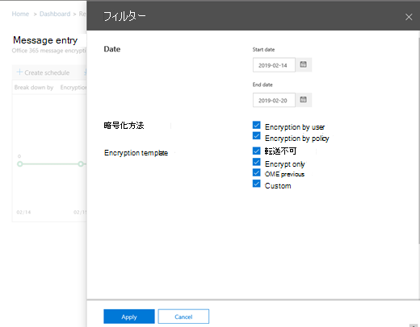
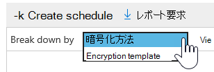
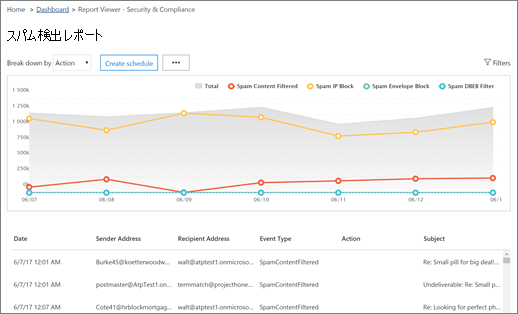
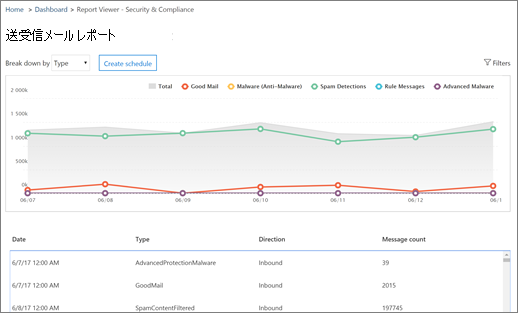

# セキュリティ&amp; /コンプライアンスセンターで電子メールのセキュリティレポートを表示する

[ &amp;セキュリティコンプライアンスセンター](https://protection.office.com)では、Office 365 のスパム対策、マルウェア対策、暗号化機能などの電子メールセキュリティ機能が組織を保護していることを確認するのに役立つさまざまなレポートが提供されています。 [必要なアクセス許可](#what-permissions-are-needed-to-view-these-reports)がある場合は、**レポート** \> **ダッシュボード**にアクセスすること&amp;によって、セキュリティコンプライアンスセンターでこれらのレポートを表示できます。
  

  
電子メールのセキュリティレポートには、次のようなものがあります。
- [侵害されたユーザーレポート (**新!**)](#compromised-users-report-new)
- [暗号化レポート](#encryption-report)
- [脅威保護の状態レポート](#threat-protection-status-report) 
- [マルウェア検出レポート](#malware-detections-report) 
- [上位マルウェアレポート](#top-malware-report)
- [[上位送信者および受信者] レポート](#top-senders-and-recipients-report)
- [スプーフィング検出レポート](#spoof-detections-report)
- [スパム検出レポート](#spam-detections-report)
- [送信および受信した電子メールレポート](#sent-and-received-email-report)
- [ユーザーによって報告されたメッセージレポート](#user-reported-messages-report)

## 侵害されたユーザーレポート (**新!**) 

このレポートは、Exchange Online Protection を使用しているすべてのユーザーが、疑わしいユーザーまたは制限されたユーザーとしてマークされたユーザーアカウント数を示しています。ユーザーアカウントが問題になっている可能性がある状態のいずれかを入力するか、またはそれ以外の場合にも使用できます。セキュリティ. 侵害されたユーザーレポートによって、不審または制限付きの状態でマークされたアカウントでスパイクや傾向を特定でき、セキュリティとテナントの wellness に関する問題が発生する可能性があります。

## 暗号化レポート

**暗号化レポート**には、組織のポリシーによって、またはエンドユーザーの制御によって暗号化された電子メールメッセージに関する情報が表示されます。 組織のセキュリティチームは、このレポートの情報を使用して、パターンを識別し、機密性の高い電子メールメッセージのポリシーを事前に適用または調整することができます。

このレポートを表示するには、セキュリティ & コンプライアンスセンターで、[**レポート** \> **ダッシュボード** \>の**暗号化レポート**] に移動します。

 

最初にレポートを開くと、過去7日間の電子メールメッセージで使用されていた暗号化方法に関するデータが表示されます。 レポートに表示される日付の範囲と詳細を変更するには、画面の右上隅にある [**フィルター** ] をクリックします。

   

[**分解**] メニューを使用して、データを暗号化テンプレート (またはメソッド) 別に表示することもできます。

また、[**データの表示**] メニューを使用して、上位5人の受信者ドメインに対する暗号化されたメッセージの数を表示するようにビューを変更できます。

新しい暗号化レポートを柔軟に使用することで、傾向を表示し、適切な操作を実行できます。 たとえば、ユーザーによって大量の電子メールメッセージが暗号化されている場合、暗号化ポリシーを追加して、特定のユースケースの暗号化を自動化することができます。 (詳細については、「 [Office 365 で電子メールメッセージを暗号化するためのメールフロールールを定義する](../../compliance/define-mail-flow-rules-to-encrypt-email.md)」を参照してください)。もう1つの例として、使用可能な暗号化テンプレートが多数あり、それを使用しているユーザーがいない場合は、その機能についてユーザーにトレーニングが必要かどうかを調べることができます。 

このレポートを使用すると、組織のセキュリティとコンプライアンスチームは、メッセージの暗号化の使用方法と、さらにアクションが必要かどうかを監視できます。 暗号化の詳細については、「 [Office の電子メールの暗号化 365](../../compliance/email-encryption.md)」を参照してください。

## 脅威保護の状態レポート

**脅威保護の状態**レポートは、Exchange Online Protection によって検出およびブロックされた悪意のある電子メールを示すスマートレポートです。 このレポートは、マルウェアまたはフィッシング詐欺として特定された電子メールを時間の経過とともに (最大90日間) 表示し、セキュリティ管理者が傾向を特定したり、ポリシーが調整を必要とするかどうかを判断したりするのに役立ちます。

> [!NOTE]
> 脅威保護の状態レポートは、 [Office 365 ATP](https://docs.microsoft.com/microsoft-365/security/office-365-security/office-365-atp)または[Exchange Online Protection](https://docs.microsoft.com/microsoft-365/security/office-365-security/what-is-eop) (EOP) のいずれかを使用しているお客様が利用できます。ただし、ATP のお客様の脅威保護状態レポートに表示される情報には、EOP のお客様に表示されるものとは異なるデータが含まれている可能性があります。 たとえば、EOP のお客様は、電子メールで検出されたマルウェアに関する情報を表示できますが、 [SharePoint Online、OneDrive、Microsoft Teams で検出された悪意のあるファイル](https://docs.microsoft.com/microsoft-365/security/office-365-security/atp-for-spo-odb-and-teams)に関する情報は、ATP 固有の機能です。 ([ATP レポートの詳細について](https://docs.microsoft.com/microsoft-365/security/office-365-security/view-reports-for-atp)は、を参照してください)。
  
このレポートを表示するには[、 &amp;セキュリティ/コンプライアンスセンター](https://protection.office.com)で、[**レポート** \> **ダッシュボード** \> **脅威保護の状態**] に移動します。
  

  
脅威保護の状態レポートを初めて開いたとき、既定では過去7日間のデータがレポートに表示されます。ただし、[**フィルター** ] をクリックして、最大90日間の日付範囲を変更することができます。 (試用版サブスクリプションを使用している場合は、30日間のデータに制限されることがあります)。

このレポートは、組織の[Exchange Online Protection 機能](https://docs.microsoft.com/microsoft-365/security/office-365-security/eop-features)の有効性と影響、および長期的な傾向を確認するのに役立ちます。 
  

  
悪意があると識別された電子メール、フィッシングとして識別された電子メール、マルウェアを含んでいると識別された電子メールのデータを表示するかどうかを選択することもできます。
  

  
## マルウェア検出レポート

**マルウェア検出**レポートは、組織のマルウェアが含まれているとして検出された受信メッセージと送信メッセージの数を示します。 
  
このレポートを表示するには[、 &amp;セキュリティ/コンプライアンスセンター](https://protection.office.com)で、[**レポート** \> **ダッシュボード** \> **マルウェア検出**] に移動します。
  

  
[脅威保護の状態レポート](#threat-protection-status-report)などの他のレポートと同様に、レポートには既定で過去7日間のデータが表示されます。 ただし、[**フィルター** ] を選択して、日付の範囲を変更できます。 
  
## 上位マルウェアレポート

**上位マルウェア**レポートには、 [Exchange Online](https://docs.microsoft.com/microsoft-365/security/office-365-security/eop-features)によって検出されたさまざまな種類のマルウェアが表示されます。 
  
このレポートを表示するには[、 &amp;セキュリティ/コンプライアンスセンター](https://protection.office.com)で、[ **Reports** \> **Dashboard** \> **Top マルウェア**] に移動します。
  

  
円グラフのくさび形の上にポインターを移動すると、マルウェアの種類の名前と、マルウェアを持っていることが検出されたメッセージの数を確認できます。
  
レポートをクリック (またはタップ) して、新しいブラウザーウィンドウでレポートを開きます。これにより、レポートの詳細が表示されます。
  

  
グラフの下に、検出されたマルウェアの一覧と、マルウェアを持っていることが検出されたメッセージの数が表示されます。
  
## [上位送信者および受信者] レポート

[**上位の送信者と受信者**] レポートは、上位の電子メール送信者を示す円グラフです。 
  
このレポートを表示するには[、 &amp;セキュリティ/コンプライアンスセンター](https://protection.office.com)で、[**レポート** \> **ダッシュボード** \>の**上位送信者および受信者**] に移動します。
  
![このレポートを表示するには、 &amp;セキュリティ/コンプライアンスセンターで、 \> [ \>レポートダッシュボードのトップ送信者と受信者] に移動します。](../../media/b5506b5c-2420-4a5a-9ea3-d654294ac838.png)
  
円グラフのくさび形の上にポインターを移動すると、送信または受信したメッセージの数が表示されます。
  
レポートをクリック (またはタップ) して、新しいブラウザーウィンドウでレポートを開きます。これにより、レポートの詳細が表示されます。
  
[**データの表示**] リストを使用して、上位の送信者、受信者、スパム受信者、およびマルウェア受信者のデータを表示するかどうかを選択します。 また、 [Exchange Online Protection](https://docs.microsoft.com/microsoft-365/security/office-365-security/what-is-eop)によって検出されたマルウェアの受信者を確認することもできます。 
  
![特定の情報を表示するには、[データの表示] リストを使用します。](../../media/bd91449f-7d42-4749-8666-7b44044049b8.png)
  
グラフの下に、上位の電子メール送信者または受信者の数と、指定された期間に送受信されたメッセージ数が表示されます。
  
## スプーフィング検出レポート

**スプーフィング検出**レポートには、検出されたスプーフィングメールメッセージの数と、それらのメッセージのうちどれが "good" (正当なビジネス上の理由で、メールのスプーフィングが行われたもの) であることが示されています。 
  
このレポートを表示するには[、 &amp;セキュリティ/コンプライアンスセンター](https://protection.office.com)で、[**レポート** \> **ダッシュボード** \>の**スプーフィングメール**] に移動します。
  
![セキュリティ&amp; /コンプライアンスセンターで、[レポート\>ダッシュボード\>のスプーフィングメール] に移動します。](../../media/0427e85c-9e40-4225-a0f0-e21a4e8b0e44.png)
  
グラフの1日をポイントすると、受信したスプーフィングメールメッセージの数を確認できます。
  
レポートをクリック (またはタップ) して、新しいブラウザーウィンドウでレポートを開きます。これにより、レポートの詳細が表示されます。 スプーフィング対策保護の詳細については、「 [Office 365 のスプーフィング対策保護](https://docs.microsoft.com/microsoft-365/security/office-365-security/anti-spoofing-protection)」を参照してください。
  
## スパム検出レポート

**スパム検出**レポートには、Exchange Online によってブロックされているすべてのスパムコンテンツが表示されます。 メッセージは、受信者ごとではなく、メッセージごとにカウントされます。 たとえば、電子メールメッセージが組織内の100の受信者に送信された場合は、1つのメッセージとして数えられます。
  
このレポートを表示するには[、 &amp;セキュリティ/コンプライアンスセンター](https://protection.office.com)で、[**レポート** \> **ダッシュボード** \> **スパム検出**] に移動します。
  
![このレポートを表示するには、 &amp;セキュリティ/コンプライアンスセンターで、 \> [ \> Reports Dashboard EOP Spam の検出] に移動します。](../../media/028cff3c-79ce-4ec0-8f0f-ec32ac28243a.png)
  
グラフの1日の上にカーソルを置くと、その日にブロックされたアイテムの数と、それらのアイテムがどのように分類されているかを確認できます。 たとえば、フィルター処理されたスパムメッセージの数と、ブロックされたインターネットプロトコル (IP) アドレスからのアイテムの数を確認できます。
  
レポートをクリック (またはタップ) して、新しいブラウザーウィンドウでレポートを開きます。これにより、レポートの詳細が表示されます。
  

  
グラフの下に、検出されたスパムアイテムの一覧が表示されます。 その他の情報を表示するアイテムを選択します。これには、受信または送信、メッセージ ID、受信者などの追加情報が表示されます。 スパム対策保護の詳細については、「 [Office 365 電子メールのスパム対策保護](https://docs.microsoft.com/microsoft-365/security/office-365-security/anti-spam-and-anti-malware-protection)」を参照してください。
  
## 送信および受信した電子メールレポート

**送信および受信**した電子メールレポートは、スパム検出、マルウェア、および "good" と識別された電子メールを含む、受信および送信電子メールに関する情報を示すスマートレポートです。 
  
このレポートを表示するには[、 &amp;セキュリティ/コンプライアンスセンター](https://protection.office.com)で、[**レポート** \> **ダッシュボード** \> **送受信メール**] に移動します。
  
![このレポートを表示するには、 &amp;セキュリティ/コンプライアンスセンターで、 \> [ \>レポートダッシュボード送受信メール] に移動します。](../../media/0e710ed0-1b0e-4dac-8796-94a01a710f3a.png)
  
グラフの1日の上にカーソルを置くと、受信したメッセージの数と、それらのメッセージがどのように分類されるかを確認できます。 たとえば、マルウェアが含まれているとして検出されたメッセージの数と、スパムとして識別されたメッセージの数を確認できます。
  
レポートをクリック (またはタップ) して、新しいブラウザーウィンドウでレポートを開きます。これにより、レポートの詳細が表示されます。
  
[**分類**] ボックスの一覧を使用すると、情報を種類別または方向 (受信および送信) 別に表示できます。 
  
![[分類] ボックスの一覧を使用して、種類または方向で情報を表示する](../../media/a5b30c94-d75f-4bfc-851a-cb155685b177.png)
  
グラフの下に、 **GoodMail**、 **SpamContentFiltered**などの電子メールカテゴリの一覧が表示されます。 カテゴリを選択して、マルウェアに対して行われたアクションや電子メールが受信または送信されたかどうかなどの追加情報を表示します。
  

電子メールインテリジェンスの詳細については、「 [Office 365 のメールフローインテリジェンス](https://docs.microsoft.com/microsoft-365/security/office-365-security/mail-flow-intelligence-in-office-365)」を参照してください。
  
## ユーザーによって報告されたメッセージレポート

ユーザーによって報告された**メッセージ**レポートには、ユーザーが[レポートメッセージアドイン](https://docs.microsoft.com/microsoft-365/security/office-365-security/enable-the-report-message-add-in)を使用して、迷惑メール、フィッシングの試行、または正常なメールとして報告した電子メールメッセージに関する情報が表示されます。
  
組織に対して構成されたスパムポリシーの例外やメールフロールールなどの配信理由を含む、各メッセージの詳細を表示できます。 詳細を表示するには、[ユーザーレポート] リスト内のアイテムを選択し、[**概要**] タブと [**詳細**] タブで情報を表示します。 
  

  
このレポートを表示するには[、 &amp;セキュリティ/コンプライアンスセンター](https://protection.office.com)で、次のいずれかの手順を実行します。
  
- [**脅威管理** \> ]**ダッシュボード** \>の**ユーザーによって報告**されたメッセージに移動します。
    
- [**脅威の管理** \> ] に移動して **、ユーザーから報告**されたメッセージを**確認** \>します。
    
![セキュリティ&amp; /コンプライアンスセンターで、[脅威管理\> ] \> [ユーザーから報告されたメッセージを確認する] を選択します。](../../media/e372c57c-1414-4616-957b-bc933b8c8711.png)
  
> [!IMPORTANT]
> ユーザーによって報告されたメッセージレポートが正常に機能するためには、Office 365 環境の**監査ログを有効にする必要があり**ます。 これは、通常、Exchange Online で監査ログの役割が割り当てられているユーザーによって行われます。 詳細については、「 [Office 365 監査ログ検索をオンまたはオフにする](https://docs.microsoft.com/microsoft-365/compliance/turn-audit-log-search-on-or-off)」を参照してください。 
  
## これらのレポートを表示するには、どのようなアクセス許可が必要ですか。

この記事に記載されているレポートを表示して使用するには、**セキュリティ&amp;コンプライアンスセンターと Exchange 管理センターの両方に対して適切な役割が割り当てられている必要があり**ます。

- セキュリティ&amp; /コンプライアンスセンターでは、次の役割のいずれかが割り当てられている必要があります。
    - 組織の管理
    - セキュリティ管理者 (Azure Active Directory 管理センターで割り当てることができます[https://aad.portal.azure.com](https://aad.portal.azure.com)()
    - セキュリティ閲覧者

- Exchange Online の場合は、Exchange 管理センター ([https://outlook.office365.com/ecp](https://outlook.office365.com/ecp)) または PowerShell コマンドレット (「 [Exchange online Powershell](https://docs.microsoft.com/powershell/exchange/exchange-online/exchange-online-powershell?view=exchange-ps)」を参照) のいずれかで、次のいずれかの役割が割り当てられている必要があります。
    - 組織の管理
    - 表示限定の組織管理
    - "View-Only Recipients/表示専用受信者" 役割
    - コンプライアンス管理

詳細については、次のリソースを参照してください。

- [Permissions in the Office 365 Security &amp; Compliance Center](https://docs.microsoft.com/microsoft-365/security/office-365-security/permissions-in-the-security-and-compliance-center)

- [Exchange Online の機能アクセス許可](https://docs.microsoft.com/exchange/permissions-exo/feature-permissions)
   
   
## レポートでデータが表示されない場合はどうなりますか。

レポートにデータが表示されない場合は、ポリシーが正しく設定されているかどうかを再確認してください。 詳細については、「 [Office 365 の脅威から保護](https://docs.microsoft.com/microsoft-365/security/office-365-security/protect-against-threats)する」を参照してください。
  
## 関連項目

[Office 365 の電子メールのスパム対策保護](https://docs.microsoft.com/microsoft-365/security/office-365-security/anti-spam-and-anti-malware-protection)
  
[Office 365 セキュリティ&amp; /コンプライアンスセンターのレポートと分析情報](https://docs.microsoft.com/microsoft-365/security/office-365-security/reports-and-insights-in-security-and-compliance)
  
[セキュリティ&amp; /コンプライアンスセンターでレポートのスケジュールを作成する](https://docs.microsoft.com/microsoft-365/security/office-365-security/create-a-schedule-for-a-report)
  
[セキュリティ&amp; /コンプライアンスセンターでカスタムレポートを設定およびダウンロードする](https://docs.microsoft.com/microsoft-365/security/office-365-security/set-up-and-download-a-custom-report)
  

