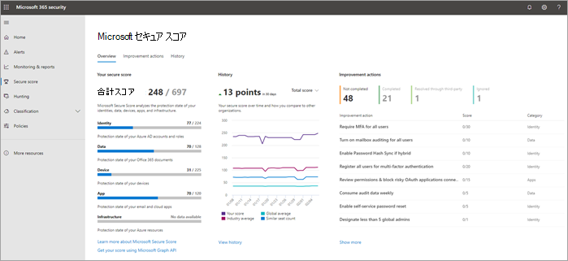

# 自宅からの作業をサポートするためのセキュリティチームのトップ12タスク

[Microsoft](https://www.microsoft.com/microsoft-365/blog/2020/03/10/staying-productive-while-working-remotely-with-microsoft-teams/)が主に自宅ベースの従業員をサポートしていて、突然お客様をサポートしている場合は、組織ができる限り安全に機能していることを確認することをお勧めします。 この記事では、セキュリティチームができる限り迅速に最も重要なセキュリティ機能を実装できるように、タスクに優先順位を付けます。

Microsoft のビジネスプランのいずれかを使用している小規模または中規模の組織の場合は、代わりに次のリソースを参照してください。

- [Office 365 および Microsoft 365 for business プランをセキュリティで保護するための10の方法のトップ](../admin/security-and-compliance/secure-your-business-data.md)
- [Microsoft 365 for a キャンペーン](https://docs.microsoft.com/microsoft-365/campaigns/) (Microsoft 365 Business の推奨セキュリティ構成を含む)

エンタープライズプランを使用しているお客様は、サービスプランに適用される次の表のタスクを完了することをお勧めします。 Microsoft 365 enterprise プランを購入するのではなく、サブスクリプションを結合する場合は、次の点に注意してください。

- Microsoft 365 E3 には Enterprise Mobility + Security (EMS) E3 および Azure AD P1 が含まれています。
- Microsoft 365 E5 に EMS E5 と Azure AD P2 が含まれる

****

|手順|タスク|すべての Office 365 Enterprise プラン|Microsoft 365 E3|Microsoft 365 E5|
|---|---|---|---|---|
|1 |[Azure 多要素認証 (MFA) を有効にする](#1-enable-azure-multi-factor-authentication-mfa)||||
|2 |[脅威からの保護](#2-protect-against-threats)||||
|3 |[Office 365 Advanced Threat Protection を構成する](#3-configure-office-365-advanced-threat-protection)||||
|4 |[Azure Advanced Threat Protection (ATP) を構成する](#4-configure-azure-advanced-threat-protection)||||
|5 |[Microsoft Threat Protection を有効にする](#5-turn-on-microsoft-threat-protection)||||
|6 |[電話とタブレットの Intune モバイルアプリ保護を構成する](#6-configure-intune-mobile-app-protection-for-phones-and-tablets)||||
|7 |[Intune アプリ保護を含むゲストの MFA および条件付きアクセスを構成する](#7-configure-mfa-and-conditional-access-for-guests-including-intune-mobile-app-protection)||||
|8 |[Pc をデバイス管理に登録し、準拠している Pc を必要とする](#8-enroll-pcs-into-device-management-and-require-compliant-pcs)||||
|9 |[クラウド接続のためにネットワークを最適化する](#9-optimize-your-network-for-cloud-connectivity)||||
|個|[ユーザーのトレーニング](#10-train-users)||||
|11 |[Microsoft Cloud App Security の使用を開始する](#11-get-started-with-microsoft-cloud-app-security)||||
|12 |[脅威を監視し、処理を実行する](#12-monitor-for-threats-and-take-action)||||
|

開始する前に、Microsoft 365 セキュリティセンターの [microsoft 365 のセキュリティスコア](https://docs.microsoft.com/microsoft-365/security/mtp/microsoft-secure-score) を確認してください。 一元管理されたダッシュボードから、Microsoft 365 の id、データ、アプリ、デバイス、およびインフラストラクチャのセキュリティを監視し、強化することができます。 推奨されるセキュリティ機能を構成し、セキュリティ関連のタスク (レポートの表示など) を実行する、またはサードパーティのアプリケーションまたはソフトウェアで推奨事項に対処するためのポイントが用意されています。 この記事の推奨されるタスクでは、スコアが上がります。

## 1: Azure 多要素認証 (MFA) を有効にする

自宅から仕事をしている従業員のセキュリティを向上させるには、1つの最適な方法は、MFA を有効にすることです。 まだプロセスが準備されていない場合は、このことを緊急パイロットとして扱って、行き詰まった従業員を支援するためのスタッフをサポートしていることを確認してください。 おそらくハードウェアセキュリティデバイスを配布できないようにするには、Windows Hello 生体認証アプリと Microsoft Authenticator などのスマートフォン認証アプリを使用します。

通常、Microsoft では、MFA を必要とする前に、ユーザーに対して多要素認証のためにデバイスを登録する14日を提供することをお勧めします。 しかし、従業員が急に自宅から働いている場合は、セキュリティの優先度として MFA を要求し、それを必要とするユーザーを支援する準備をします。

これらのポリシーを適用すると、数分で完了しますが、今後数日間にわたってユーザーをサポートする準備ができます。

****

|計画|推奨事項|
|---|---|
|Microsoft 365 プラン (Azure AD P1 または P2 なし)|[Azure AD でセキュリティの既定値を有効にします](https://docs.microsoft.com/azure/active-directory/fundamentals/concept-fundamentals-security-defaults)。 Azure AD のセキュリティの既定値には、ユーザーと管理者用の MFA が含まれています。|
|Microsoft 365 E3 (Azure AD P1 を使用)|[一般的な条件付きアクセス ポリシー](https://docs.microsoft.com/azure/active-directory/conditional-access/concept-conditional-access-policy-common)を使用して、次のポリシーを構成します。  - [管理者に MFA を要求する](https://docs.microsoft.com/azure/active-directory/conditional-access/howto-conditional-access-policy-admin-mfa)  - [すべてのユーザーに MFA を要求する](https://docs.microsoft.com/azure/active-directory/conditional-access/howto-conditional-access-policy-all-users-mfa)   - [従来の認証をブロックする](https://docs.microsoft.com/azure/active-directory/conditional-access/howto-conditional-access-policy-block-legacy)|
|Microsoft 365 E5 (Azure AD P2 を使用)|Azure AD Identity Protection を利用して、次の 2 つのポリシーを作成して、Microsoft の[条件付きアクセスと関連ポリシーの推奨されるセット](../enterprise/identity-access-policies.md)の実装を開始します。  - [サインインのリスクが中、または高のときに MFA を要求する](../enterprise/identity-access-policies.md#require-mfa-based-on-sign-in-risk)  - [先進認証をサポートしないクライアントはブロックする](../enterprise/identity-access-policies.md#block-clients-that-dont-support-modern-authentication) - [高リスク ユーザーはパスワードを変更する必要がある](../enterprise/identity-access-policies.md#high-risk-users-must-change-password)|
|

## 2: 脅威から保護します。

すべての Microsoft 365 プランには、さまざまな脅威保護機能が含まれています。 これらの機能に対する Bumping の保護は、数分で済みます。

- マルウェア対策保護
- 悪意のある Url およびファイルからの保護
- フィッシング対策保護
- スパム対策保護

開始点として使用できるガイダンスについては、「 [Office 365 の脅威から保護](office-365-security/protect-against-threats.md) する」を参照してください。

## 3: Office 365 Advanced Threat Protection を構成する

Office 365 Advanced Threat Protection (ATP) は、Microsoft 365 E5 および Office 365 E5 に含まれており、電子メールメッセージ、リンク (Url) およびコラボレーションツールがもたらす悪意のある脅威から組織を保護します。 これには、を構成するのに数時間かかる場合があります。

Office 365 ATP:

- 悪意のあるコンテンツの添付ファイルとリンクを検査するインテリジェントシステムを使用して、組織をリアルタイムで不明な電子メールの脅威から保護します。 これらの自動化されたシステムには、堅牢な分析プラットフォーム、ヒューリスティック、およびマシン学習モデルが含まれています。
- チームサイトおよびドキュメントライブラリ内の悪意のあるファイルを特定してブロックすることによって、ユーザーがファイルを共同したり、共有したりするときに、組織を保護します。
- コンピューターの学習モデルと高度な偽装検出アルゴリズムを avert フィッシング攻撃に適用します。

プランの概要を含む概要については、「 [Office 365 Advanced Threat Protection](office-365-security/office-365-atp.md)」を参照してください。

グローバル管理者は、次の保護を構成できます。

- [ATP の安全なリンクの設定](office-365-security/set-up-atp-safe-links-policies.md)
- [ATP の安全な添付ファイル機能のポリシーを設定する](office-365-security/set-up-atp-safe-attachments-policies.md)
- [「書き換えない」URL のカスタム リストを設定する](office-365-security/set-up-a-custom-do-not-rewrite-urls-list-with-atp.md)
- [ブロックする URL のカスタム リストを設定する](office-365-security/set-up-a-custom-blocked-urls-list-atp.md)

これらのワークロードに対して ATP を構成するには、Exchange Online 管理者および SharePoint Online 管理者と協力する必要があります。

- [SharePoint、OneDrive、Microsoft Teams 用の ATP を有効にする](office-365-security/turn-on-atp-for-spo-odb-and-teams.md)

## 4: Azure Advanced Threat Protection を構成する

[Azure Advanced Threat Protection](https://docs.microsoft.com/azure-advanced-threat-protection/what-is-atp) (azure ATP) は、クラウドベースのセキュリティソリューションであり、オンプレミスの Active Directory シグナルを活用して、組織に向けた高度な脅威、侵害された id、および悪意のある insider 操作を識別、検出、調査します。 オンプレミスとクラウドインフラストラクチャを保護し、依存関係または前提条件を持たず、すぐにメリットを得ることができるため、このことに注目してください。

- セットアップをすばやく取得するには、「 [AZURE ATP クイックスタート](https://docs.microsoft.com/azure-advanced-threat-protection/install-atp-step1) 」を参照してください。
- [ビデオを見る: AZURE ATP の概要](https://www.youtube.com/watch?reload=9&v=EGY2m8yU_KE)
- [AZURE ATP 展開の3つのフェーズ](https://docs.microsoft.com/azure-advanced-threat-protection/what-is-atp#whats-next)を確認する

## 5: Microsoft の脅威保護を有効にする

Office 365 ATP と Azure ATP が構成されたので、これらの機能の組み合わせた信号を1つのダッシュボードで表示できます。 [Microsoft Threat Protection](https://docs.microsoft.com/microsoft-365/security/mtp/microsoft-threat-protection) (MTP) により、アラート、インシデント、自動化された調査と応答、およびワークロード全体にわたる高度な検索が実現されます (Azure ATP、OFFICE 365 Atp、MICROSOFT Defender ATP、および Microsoft Cloud App Security) は、 [security.microsoft.com](https://security.microsoft.com)の単一のウィンドウに表示されます。

1つ以上の advanced threat protection サービスを構成した後、MTP を有効にします。 新機能は、継続的に MTP に追加されます。プレビュー機能を受信するには、をオプトインすることを検討してください。

- [MTP の詳細情報](https://docs.microsoft.com/microsoft-365/security/mtp/microsoft-threat-protection)
- [MTP を有効にする](https://docs.microsoft.com/microsoft-365/security/mtp/mtp-enable)
- [プレビュー機能のオプトイン](https://docs.microsoft.com/microsoft-365/security/mtp/preview)

## 6: 電話とタブレットの Intune モバイルアプリ保護を構成する

Microsoft Intune モバイルアプリケーション管理 (MAM) を使用すると、これらのデバイスを管理することなく、電話やタブレットで組織のデータを管理および保護することができます。 次に、動作のしくみを示します。

- デバイス上のどのアプリを管理するか、どのような動作を許可するかを決定する App Protection Policy (APP) を作成します (たとえば、マネージアプリからのデータが管理対象アプリにコピーされるのを防ぐなど)。 各プラットフォーム (iOS、Android) に対して1つのポリシーを作成します。
- アプリ保護ポリシーを作成したら、承認済みアプリとアプリデータ保護を必要とするように、Azure AD で条件付きアクセスルールを作成して、これらのポリシーを適用します。

アプリ保護ポリシーには多くの設定が含まれています。 幸いなことに、各設定について学習し、オプションを比較する必要はありません。 Microsoft では、開始点を推奨することで、設定の構成を簡単に適用できます。 [アプリ保護ポリシーを使用するデータ保護フレームワーク](https://docs.microsoft.com/mem/intune/apps/app-protection-framework)には、選択可能な3つのレベルが含まれています。

さらに、Microsoft は、すべての組織が出発点として使用することを推奨する条件付きアクセスと関連ポリシーのセットを使用して、このアプリ保護フレームワークを調整しています。 この記事のガイダンスを使用して MFA を実装した場合、その方法は少しです。

モバイルアプリの保護を構成するには、 [一般的な id およびデバイスアクセスポリシー](../enterprise/identity-access-policies.md)のガイダンスを使用します。

 1. IOS および Android 用のポリシーを作成するには、[ [アプリデータ保護ポリシーの適用](../enterprise/identity-access-policies.md#apply-app-data-protection-policies) ] ガイダンスを使用します。 レベル 2 (強化されたデータ保護) は、ベースラインの保護にお勧めします。
 2. [承認済みアプリとアプリ保護を必要](../enterprise/identity-access-policies.md#require-approved-apps-and-app-protection)とする条件付きアクセスルールを作成します。

## 7: Intune モバイルアプリ保護を含むゲストの MFA および条件付きアクセスを構成する

次に、引き続きゲストとの共同作業や操作を行うことができるようにしましょう。 Microsoft 365 E3 プランを使用していて、すべてのユーザーに MFA を実装している場合は、これを設定します。

Microsoft 365 E5 プランを使用していて、リスクベースの MFA に対して Azure Id 保護を利用している場合は、いくつかの調整を行う必要があります (これは、Azure AD Identity protection がゲストに拡張されないためです)。

- ゲストおよび外部ユーザーに対して MFA を常に要求する新しい条件付きアクセスルールを作成します。
- ゲストおよび外部ユーザーを除外するリスクベースの MFA の条件付きアクセスルールを更新します。

ゲストアクセスが Azure AD とどのように機能するかを理解し、影響を受けたポリシーを更新するために、 [ゲストと外部アクセスを許可および保護するための一般的なポリシーの更新](../enterprise/identity-access-policies-guest-access.md) に関するガイダンスを使用します。

作成した Intune モバイルアプリ保護ポリシーと、承認済みアプリおよびアプリ保護を要求するための条件付きアクセスルールを使用すると、ゲストアカウントに適用され、組織データを保護することができます。

> [!NOTE]
> 準拠している Pc を必要とするように Pc をデバイス管理に既に登録している場合は、デバイスのコンプライアンスを強制する条件付きアクセスルールからゲストアカウントを除外する必要もあります。

## 8: デバイスの管理に Pc を登録し、準拠している Pc を必要とする

従業員のデバイスを登録するには、いくつかの方法があります。 各方法は、デバイスの所有権 (個人または企業)、デバイスの種類 (iOS、Windows、Android)、および管理要件 (リセット、アフィニティ、ロック) に依存します。 この場合、並べ替えには少し時間がかかります。「 [Microsoft Intune でのデバイスの登録」を](https://docs.microsoft.com/mem/intune/enrollment/)参照してください。

これを行う最も簡単な方法は、 [Windows 10 デバイスの自動登録](https://docs.microsoft.com/mem/intune/enrollment/quickstart-setup-auto-enrollment)をセットアップすることです。

これらのチュートリアルを利用することもできます。

- [自動操縦を使用して Windows デバイスを Intune に登録する](https://docs.microsoft.com/mem/intune/enrollment/tutorial-use-autopilot-enroll-devices)
- [Apple Business Manager (ABM) の Apple 社の会社のデバイス登録機能を使用して、Intune に iOS/iPadOS デバイスを登録する](https://docs.microsoft.com/mem/intune/enrollment/tutorial-use-device-enrollment-program-enroll-ios)

デバイスを登録した後、 [一般的な id およびデバイスアクセスポリシー](../enterprise/identity-access-policies.md) のガイダンスを使用して、これらのポリシーを作成します。

- [デバイスコンプライアンスポリシーの定義](../enterprise/identity-access-policies.md#define-device-compliance-policies) : Windows 10 の推奨設定では、ウイルス対策保護が必要になります。 Microsoft 365 E5 がある場合は、Microsoft Defender Advanced Threat Protection を使用して従業員のデバイスの正常性を監視します。 他のオペレーティングシステムのコンプライアンスポリシーには、ウイルス対策保護とエンドポイント保護ソフトウェアが含まれていることを確認してください。
- 準拠している[pc を必要と](../enterprise/identity-access-policies.md#require-compliant-pcs-but-not-compliant-phones-and-tablets)する—これは、デバイスコンプライアンスポリシーを強制する Azure AD の条件付きアクセスルールです。

1つの組織のみがデバイスを管理できるので、Azure AD の条件付きアクセスルールからゲストアカウントを除外するようにしてください。 デバイスコンプライアンスを必要とするポリシーからゲストおよび外部ユーザーを除外しない場合、これらのポリシーによってこれらのユーザーがブロックされます。 詳細については、「 [一般ポリシーを更新してゲストおよび外部アクセスを許可および保護する](../enterprise/identity-access-policies-guest-access.md)」を参照してください。

## 9: クラウド接続のためにネットワークを最適化する

従業員の大規模な従業員が自宅からすぐに使用できるようにしている場合、この突然の接続パターンの切り替えは企業ネットワークインフラストラクチャに大きな影響を与える可能性があります。 多くのネットワークは、クラウドサービスを採用する前に拡張および設計されていました。 多くの場合、ネットワークはリモートワーカーに対する耐性がありますが、すべてのユーザーが同時にリモートで使用するようには設計されていません。

VPN コンセントレーター、中央ネットワーク出口装置 (プロキシ、データ損失防止デバイスなど)、中央のインターネット帯域幅、バックサーキット MPLS 回線、NAT 機能などのネットワーク要素は、それらを使用したビジネス全体の負荷に起因して、非常に高い負荷をかけた場所に突然配置されます。 最終的には、自宅からの作業に適応しているユーザーにとって、パフォーマンスと生産性が低下し、ユーザーの利便性が低くなります。

従来、企業ネットワークを介したトラフィックのルーティングによって提供された保護の一部は、ユーザーがアクセスしているクラウドアプリによって提供されます。 この記事のこの手順に達した場合は、Microsoft 365 サービスとデータ用の高度なクラウドセキュリティコントロールのセットを実装しています。 これらのコントロールが配置されているため、リモートユーザーのトラフィックを Office 365 に直接ルーティングする準備ができている場合があります。 引き続き他のアプリケーションへのアクセスに VPN リンクが必要な場合は、分割トンネリングを実装することで、パフォーマンスとユーザーの利便性を大幅に向上させることができます。 組織で契約を取得すると、適切に調整されたネットワークチームが1日以内にこれを達成できるようになります。

詳細については、ドキュメントの次のリソースを参照してください。

- [概要: VPN 分割トンネリングを使用してリモートユーザーの接続を最適化する](https://docs.microsoft.com/Office365/Enterprise/office-365-vpn-split-tunnel)
- [Office 365 向け VPN スプリット トンネリングの実装](https://docs.microsoft.com/Office365/Enterprise/office-365-vpn-implement-split-tunnel)

このトピックに関する最近のブログ記事:

- [リモートスタッフのトラフィックをすばやく最適化する方法 & インフラストラクチャの負荷を軽減する](https://techcommunity.microsoft.com/t5/office-365-blog/how-to-quickly-optimize-office-365-traffic-for-remote-staff-amp/ba-p/1214571#)
- [セキュリティ担当者のための別の方法と、今日の独自のリモート作業シナリオで先進のセキュリティ制御を実現する方法](https://www.microsoft.com/security/blog/2020/03/26/alternative-security-professionals-it-achieve-modern-security-controls-todays-unique-remote-work-scenarios/)

## 10: ユーザーをトレーニングする

トレーニングユーザーは、ユーザーやセキュリティ運用チームにとって多くの時間とイライラを節約できます。 経験豊富なユーザーは、添付ファイルを開いたり、疑わしい電子メールメッセージ内のリンクをクリックしたりする可能性が低くなり、疑わしい web サイトを避けられる可能性が高くなります。

Harvard ケネディ School [Cybersecurity キャンペーンハンドブック](https://go.microsoft.com/fwlink/?linkid=2015598&amp;clcid=0x409) は、フィッシング攻撃を識別するユーザーのトレーニングを含む、組織内でのセキュリティの認知度の強力な文化を確立するための優れたガイダンスを提供します。

Microsoft 365 には、組織内のユーザーに通知するための以下のリソースが用意されています。

****

|概念|リソース|
|---|---|
|Microsoft 365|[カスタマイズ可能な学習経路](https://docs.microsoft.com/office365/customlearning/) 
これらのリソースは、組織内のエンドユーザーのトレーニングをまとめる際に役立ちます。|
|Microsoft 365 セキュリティ|[学習モジュール: Microsoft 365 からの組み込みのインテリジェントセキュリティを使用して組織を保護します。](https://docs.microsoft.com/learn/modules/security-with-microsoft-365) 
このモジュールでは、Microsoft 365 のセキュリティ機能がどのように連携するかを説明し、これらのセキュリティ機能の利点を明確に示すことができます。|
|多要素認証|[2段階認証: 追加の検証ページとは](https://docs.microsoft.com/azure/active-directory/user-help/multi-factor-authentication-end-user-first-time) 
この記事では、エンドユーザーが多要素認証の内容と、組織で使用されている理由を理解するのに役立てることができます。|
|

このガイダンスに加えて、次の操作を実行することをお勧めします。この記事では、 [ハッカーやマルウェアからのアカウントとデバイスの保護](https://support.office.com/article/066d6216-a56b-4f90-9af3-b3a1e9a327d6.aspx)について説明します。 それらの操作を次に示します。

- 強力なパスワードの使用
- デバイスを保護する
- Windows 10 および Mac Pc でセキュリティ機能を有効にする (管理されていないデバイスの場合)

また、次の記事で推奨されている操作を実行して、ユーザーが個人のメールアカウントを保護することをお勧めします。

- [Outlook.com メールアカウントを保護する](https://support.microsoft.com/office/a4f20fc5-4307-4ece-8231-6d4d4bd8a9ba)

- [2段階認証を使用して Gmail アカウントを保護する](https://go.microsoft.com/fwlink/p/?linkid=2015688)

## 11: Microsoft Cloud App Security を使い始める

[Microsoft Cloud App Security](https://docs.microsoft.com/cloud-app-security) は、豊富な可視性、データ移動の制御、および高度な分析を提供して、すべてのクラウドサービス全体にわたる脅威を識別して対処します。 Cloud App Security の使用を開始すると、異常検出ポリシーが自動的に有効になりますが、クラウドアプリのセキュリティには7日間の最初の学習期間があり、すべての異常検出アラートが発生しているわけではありません。

今すぐ Cloud App Security を使い始めることができます。 後で、より高度な監視と制御をセットアップできます。

- [クイックスタート: Cloud App Security の使用を開始する](https://docs.microsoft.com/cloud-app-security/getting-started-with-cloud-app-security)
- [迅速な行動分析と異常検出を実現する](https://docs.microsoft.com/cloud-app-security/anomaly-detection-policy)
- [Microsoft Cloud App Security の詳細情報](https://docs.microsoft.com/cloud-app-security/what-is-cloud-app-security)
- [新機能と機能を確認する](https://docs.microsoft.com/cloud-app-security/release-notes)
- [基本的なセットアップ手順を参照してください。](https://docs.microsoft.com/cloud-app-security/general-setup)

## 12: 脅威を監視し、処理を実行する

Microsoft 365 には、状態を監視し、適切な操作を実行するいくつかの方法が含まれています。 最善の出発点は、Microsoft 365 セキュリティセンター ( [https://security.microsoft.com](https://security.microsoft.com) ) です。ここでは、組織の [Microsoft セキュリティスコア](https://docs.microsoft.com/microsoft-365/security/mtp/microsoft-secure-score)と、注意を要するアラートまたはエンティティを表示することができます。

- [Microsoft 365 セキュリティセンターの使用を開始する](https://docs.microsoft.com/microsoft-365/security/mtp/overview-security-center)
- [レポートを監視し、表示する](https://docs.microsoft.com/microsoft-365/security/mtp/monitoring-and-reporting)
- [Microsoft 365 のセキュリティポータルを参照してください。](https://docs.microsoft.com/microsoft-365/security/mtp/portals)

## 次の手順

おめでとうございます! 最も重要なセキュリティ保護の一部を迅速に実装し、組織のセキュリティをさらに強化しています。 これで、脅威保護機能 (Microsoft Defender Advanced Threat Protection を含む)、データ分類と保護機能、および管理アカウントの保護をさらに進める準備ができました。 Microsoft 365 のセキュリティに関する推奨事項の詳細については、「 [microsoft 365 security For Business 意思決定者 (bdm)](Microsoft-365-security-for-bdm.md)」を参照してください。

また、 [docs.microsoft.com/security](https://docs.microsoft.com/security)の Microsoft の新しいセキュリティセンターにアクセスしてください。
