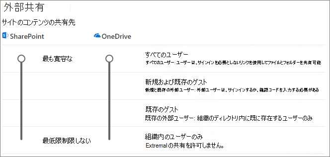

# チームでゲストと共同で作業する

ドキュメント、タスク、会話でゲストと共同作業を行う必要がある場合は、Microsoft Teams を使用することをお勧めします。 Teams は、常設チャットと、カスタマイズ可能で拡張可能なコラボレーションツールのセットを統合されたユーザーの環境で使用できる、Office および SharePoint で利用可能なすべてのコラボレーション機能を提供します。

この記事では、ゲストとの共同作業のためにチームをセットアップするために必要な Microsoft 365 の構成手順について説明します。

## ビデオ デモンストレーション

このビデオでは、このドキュメントで説明されている構成手順を示します。 

> [!VIDEO https://www.microsoft.com/videoplayer/embed/RE44NTr?autoplay=false]

## Azure の組織上の関係の設定

Microsoft 365 での共有は、 [Azure Active Directory の組織上の関係の設定](https://docs.microsoft.com/azure/active-directory/external-identities/delegate-invitations)によって最上位レベルで管理されます。 Azure AD でゲストの共有が無効または制限されている場合、これは Microsoft 365 で構成した共有設定よりも優先されます。

組織上の関係の設定を確認して、ゲストとの共有がブロックされないようにしてください。

組織上の関係の設定を設定するには

1. Microsoft Azure にログイン [https://portal.azure.com](https://portal.azure.com) します。
2. 左側のナビゲーションで、[ **Azure Active Directory**] をクリックします。
3. [**概要**] ウィンドウで、[**外部 ID**] をクリックします。
4. [ **組織の id** ] ウィンドウで、[ **外部グループ作業の設定**] をクリックします。
5. **管理者とゲスト招待元役割のユーザーが招待できる**ことと、**メンバーが招待**できることを確認します。どちらも **[はい]** に設定されています。
6. 変更を加えた場合は、[**保存**] をクリックします。

[ **共同作業の制限** ] セクションの設定に注意してください。 共同作業を行うゲストのドメインがブロックされていないことを確認します。

複数の組織のゲストを使用している場合は、ディレクトリデータへのアクセスを制限することをお客様に許可します。 これにより、他のユーザーがディレクトリ内のゲストであることを確認できなくなります。 これを行うには、[ **ゲストユーザーのアクセス制限**] で、[ゲストユーザー **がアクセスを制限しているのは、ディレクトリオブジェクトのプロパティとメンバーシップ] 設定** または **guest ユーザーアクセスが、自分のディレクトリオブジェクトのプロパティとメンバーシップに制限され**ています。

## Teams ゲストアクセス設定

Teams には、ゲストアクセス用のマスターオン/オフスイッチ、およびチーム内でゲストが実行できることを制御するさまざまな設定があります。 Teams でゲストアクセスを有効にする**には、** マスタースイッチで、 **teams でゲストアクセスを許可**する必要があります。

Teams でゲストアクセスが有効になっていることを確認し、ビジネスニーズに基づいてゲスト設定を調整してください。 これらの設定はすべてのチームに影響を与えることに注意してください。

Teams ゲスト アクセスの設定を行うには

1. [https://admin.microsoft.com](https://admin.microsoft.com) で、Microsoft 365 管理センターにログインします。
2. 左側のナビゲーションで [**すべて表示**] をクリックします。
3. [**管理センター**] で、[**Teams**] をクリックします。
4. Teams 管理センターの左側のナビゲーションで、[**組織全体の設定**] を展開して [**ゲスト アクセス**] をクリックします。
5. [**Teams でのゲスト アクセスを許可する**] が [**オン**] に設定されていることを確認します。
6. 追加のゲスト設定に必要な変更を加えて、[**保存**] をクリックします。

> [!NOTE]
> Teams のゲスト設定をオンにした後、有効になるまでには、最大で 24 時間かかる場合があります。

## Microsoft 365 グループのゲスト設定

Teams では、チームメンバーシップに Microsoft 365 グループを使用します。 Teams でゲストアクセスを機能させるには、Microsoft 365 Groups のゲスト設定をオンにする必要があります。

Microsoft 365 グループのゲスト設定を設定するには

1. Microsoft 365 管理センターの左側のナビゲーションで、[ **設定**] を展開します。
2. [ **組織の設定**] をクリックします。
3. 一覧で、[ **Microsoft 365 Groups**] をクリックします。
4. [組織外のユーザーにグループの **コンテンツへのアクセス** を許可する] および [ **グループの所有者に組織外のユーザーをグループに追加する** ] チェックボックスの両方がオンになっていることを確認します。
5. 変更を加えた場合は、[ **変更の保存**] をクリックします。

## SharePoint 組織レベルの共有設定

ファイル、フォルダー、リストなどの Teams コンテンツはすべて SharePoint に格納されます。 ゲストがこれらのアイテムに Teams でアクセスできるようにするには、SharePoint の組織レベルの共有設定でゲストとの共有が許可されている必要があります。

組織レベルの設定は、teams に関連付けられたサイトを含む、個々のサイトで使用可能な設定を決定します。 サイトの設定は、組織レベルの設定よりも制限することはできません。

認証されていないユーザーとのファイルとフォルダーの共有を許可する場合は、[ **すべて**のユーザー] を選択します。 すべてのゲストが認証を必要とするようにするには、[ **新規および既存のゲスト**] を選択します。 組織内のすべてのサイトで必要とされる最も厳しい設定を選択します。

SharePoint 組織レベルの共有設定を設定するには

1. Microsoft 365 管理センターで、左側のナビゲーションの [ **管理センター**] の下にある [ **SharePoint**] をクリックします。
2. SharePoint 管理センターの左側のナビゲーションで、[ **ポリシー** ] を展開し、[ **共有**] をクリックします。
3. SharePoint の外部共有が [ **すべてのユーザー** ] または **[既存のゲスト**] に設定されていることを確認します。
4. 変更を加えた場合は、[**保存**] をクリックします。

## SharePoint 組織レベルの既定のリンク設定

既定のファイルとフォルダーのリンク設定によって、ユーザーがファイルまたはフォルダーを共有するときに、どのリンクオプションが既定で表示されるかが決まります。 ユーザーは、必要に応じて、共有する前に、リンクの種類を他のオプションのいずれかに変更できます。

この設定は、組織内のすべての teams および SharePoint サイトに影響を与えることに注意してください。

ユーザーがファイルやフォルダーを共有するときに既定で選択されるリンクの種類を選択します。

- **リンクを持つすべてのユーザー** -ファイルとフォルダーの認証されていない共有を頻繁に行う場合は、このオプションを選択します。 *すべて*のリンクを許可し、偶発的な認証されていない共有について懸念している場合は、他のオプションのいずれかを既定値として検討します。 このリンクの種類は、 **すべて** の共有を有効にした場合にのみ使用できます。
- [**組織内のユーザーのみ**]-ほとんどのファイルとフォルダーの共有が組織内のユーザーと想定される場合は、このオプションを選択します。
- **特定のユーザー** -多数のファイルとフォルダーをゲストで共有することが予想される場合は、このオプションを検討してください。 この種類のリンクはゲストと連動しており、認証を必要とします。
 

SharePoint 組織レベルの既定のリンク設定を設定するには

1. SharePoint 管理センターの [共有] ページに移動します。
2. [ **ファイルとフォルダーのリンク**] で、使用する既定の共有リンクを選択します。
3. 変更を加えた場合は、[**保存**] をクリックします。

## チームの作成

次の手順では、ゲストとの共同作業に使用する予定のチームを作成します。

チームを作成するには
1. Teams の [ **teams** ] タブで、左側のウィンドウの下部にある [ **参加] または [チームの作成** ] をクリックします。
2. [ **チームの作成] を**クリックします。
3. [ **チームの新規作成] を**クリックします。
4. [ **プライベート** ] または [ **パブリック**] を選択します。
5. チームの名前と説明を入力し、[ **作成**] をクリックします。
6. [ **スキップ**] をクリックします。

後でユーザーを招待します。 次に、チームに関連付けられている SharePoint サイトのサイトレベルでの共有設定を確認することが重要です。

## SharePoint サイトレベルの共有設定

サイトレベルの共有設定をチェックして、このチームに必要なアクセスの種類が許可されていることを確認してください。 たとえば、組織レベルの設定をすべての **ユーザー**に設定しているが、すべてのゲストがこのチームの認証を必要とする場合は、サイトレベルの共有設定が **新規および既存のゲスト**に設定されていることを確認してください。

サイトレベルの共有設定を設定するには
1. SharePoint 管理センターの左側のナビゲーションで、[**サイト**] を展開して [**アクティブなサイト**] をクリックします。
2. 作成したチームのサイトを選択します。
3. リボンで [**共有**] をクリックします。
4. 共有が [ **すべてのユーザー** ] または **[既存のゲスト**] に設定されていることを確認します。
5. 変更を加えた場合は、[**保存**] をクリックします。

## ユーザーを招待する

これでゲスト共有の設定が構成されるようになり、チームへの内部ユーザーとゲストの追加を開始できるようになります。 

内部ユーザーをチームに招待するには
1. チームで、[ **その他のオプション** ] () をクリックし、[ **\*\*\*** メンバーの **追加**] をクリックします。
2. 招待するユーザーの名前を入力します。
3. **[追加]** をクリックして、**[閉じる]** をクリックします。

ゲストをチームに招待するには
1. チームで、[ **その他のオプション** ] () をクリックし、[ **\*\*\*** メンバーの **追加**] をクリックします。
2. 招待するゲストの電子メールアドレスを入力します。
3. [ **ゲスト情報の編集**] をクリックします。
4. ゲストの完全な名前を入力し、チェックマークをクリックします。
5. **[追加]** をクリックして、**[閉じる]** をクリックします。

## 関連項目

[認証されていないユーザーとファイルおよびフォルダーを共有するためのベスト プラクティス](best-practices-anonymous-sharing.md)

[ゲストと共有するときにファイルの偶発的な公開を制限する](share-limit-accidental-exposure.md)

[セキュリティで保護されたゲスト共有環境を作成する](create-secure-guest-sharing-environment.md)

[管理されたゲストで B2B エクストラネットを作成する](b2b-extranet.md)

[Azure AD B2B を使用した SharePoint と OneDrive の統合](https://docs.microsoft.com/sharepoint/sharepoint-azureb2b-integration-preview)