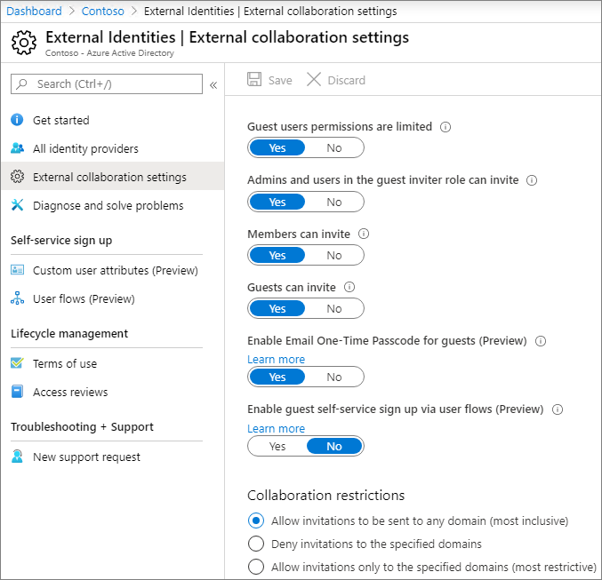
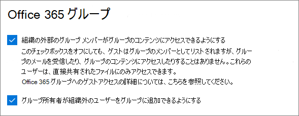

# サイトでゲストと共同で作業するCollaborate with guests in a site

ドキュメント、データ、およびリスト間でゲストと共同作業を行う必要がある場合は、SharePoint サイトを使用できます。If you need to collaborate with guests across documents, data, and lists, you can use a SharePoint site. モダン SharePoint サイトは、Microsoft 365 グループに接続されており、サイトメンバーシップを管理したり、共有されたメールボックスや予定表などのその他のコラボレーションツールを提供したりすることができます。Modern SharePoint sites are connected to Microsoft 365 Groups and can manage the site membership and provide additional collaboration tools such as a shared mailbox and calendar.

この記事では、ゲストとのグループ作業のために SharePoint サイトをセットアップするために必要な Microsoft 365 の構成手順について説明します。In this article, we'll walk through the Microsoft 365 configuration steps necessary to set up a SharePoint site for collaboration with guests.

## ビデオ デモンストレーションVideo demonstration

このビデオでは、このドキュメントで説明されている構成手順を示します。This video shows the configuration steps described in this document. 

> [!VIDEO https://www.microsoft.com/videoplayer/embed/RE44Llg?autoplay=false]

## Azure の組織上の関係の設定Azure Organizational relationships settings

Microsoft 365 での共有は、Azure Active Directory の組織上の関係の設定によって最上位レベルで管理されます。Sharing in Microsoft 365 is governed at its highest level by the organizational relationships settings in Azure Active Directory. Azure AD でゲストの共有が無効または制限されている場合、これは Microsoft 365 で構成した共有設定よりも優先されます。If guest sharing is disabled or restricted in Azure AD, this will override any sharing settings that you configure in Microsoft 365.

組織上の関係の設定を確認して、ゲストとの共有がブロックされないようにしてください。Check the organizational relationships settings to ensure that sharing with guests is not blocked.

組織上の関係の設定を設定するにはTo set organizational relationship settings

1. Microsoft Azure にログイン[https://portal.azure.com](https://portal.azure.com)します。Log in to Microsoft Azure at [https://portal.azure.com](https://portal.azure.com).
2. 左側のナビゲーションで、[ **Azure Active Directory**] をクリックします。In the left navigation, click **Azure Active Directory**.
3. [**概要**] ウィンドウで、[組織上の**関係**] をクリックします。In the **Overview** pane, click **Organizational relationships**.
4. [組織上の**関係**] ウィンドウで、[**設定**] をクリックします。In the **Organizational relationships** pane, click **Settings**.
5. **管理者とゲスト招待元役割のユーザーが招待できる**ことと、**メンバーが招待**できることを確認します。どちらも **[はい]** に設定されています。Ensure that **Admins and users in the guest inviter role can invite** and **Members can invite** are both set to **Yes**.
6. 変更を加えた場合は、[**保存**] をクリックします。If you made changes, click **Save**.

[**共同作業の制限**] セクションの設定に注意してください。Note the settings in the **Collaboration restrictions** section. 共同作業を行うゲストのドメインがブロックされていないことを確認します。Make sure that the domains of the guests that you want to collaborate with aren't blocked.

## Microsoft 365 グループのゲスト設定Microsoft 365 Groups guest settings

モダン SharePoint サイトでは、Microsoft 365 グループを使用してサイトアクセスを制御します。Modern SharePoint sites use Microsoft 365 Groups to control site access. SharePoint サイトでゲストアクセスを機能させるには、Microsoft 365 グループのゲスト設定をオンにする必要があります。The Microsoft 365 Groups guest settings must be turned on in order for guest access in SharePoint sites to work.

Microsoft 365 グループのゲスト設定を設定するにはTo set Microsoft 365 Groups guest settings

1. Microsoft 365 管理センターの左側のナビゲーションで、[**設定**] を展開します。In the Microsoft 365 admin center, in the left navigation, expand **Settings**.
2. [**サービス] [& アドイン**] をクリックします。Click **Services & add-ins**.
3. 一覧で、[ **Microsoft 365 Groups**] をクリックします。In the list, click **Microsoft 365 Groups**.
4. [組織外のユーザーにグループの**コンテンツへのアクセス**を許可する] および [**グループの所有者に組織外のユーザーをグループに追加する**] チェックボックスの両方がオンになっていることを確認します。Ensure that the **Let group members outside your organization access group content** and **Let group owners add people outside your organization to groups** check boxes are both checked.
5. 変更を加えた場合は、[**変更の保存**] をクリックします。If you made changes, click **Save changes**.

## SharePoint 組織レベルの共有設定SharePoint organization level sharing settings

ゲストが SharePoint サイトにアクセスできるようにするには、SharePoint の組織レベルの共有設定でゲストとの共有が許可されている必要があります。In order for guests to have access to SharePoint sites, the SharePoint organization-level sharing settings must allow for sharing with guests.

組織レベルの設定によって、個々のサイトで使用可能な設定が決まります。The organization-level settings determine what settings are available for individual sites. サイトの設定は、組織レベルの設定よりも制限することはできません。Site settings cannot be more permissive than the organization-level settings.

認証されていないファイルとフォルダーの共有を許可する場合は、[**すべてのユーザー**] を選択します。If you want to allow unauthenticated file and folder sharing, choose **Anyone**. 組織外のすべてのユーザーが認証を受けることができるようにするには、[**新規および既存のゲスト**] を選択します。If you want to ensure that all people outside your organization have to authenticate, choose **New and existing guests**. 組織内のすべてのサイトで必要とされる最も厳しい設定を選択します。Choose the most permissive setting that will be needed by any site in your organization.

SharePoint 組織レベルの共有設定を設定するにはTo set SharePoint organization level sharing settings

1. Microsoft 365 管理センターで、左側のナビゲーションの [**管理センター**] の下にある [ **SharePoint**] をクリックします。In the Microsoft 365 admin center, in the left navigation, under **Admin centers**, click **SharePoint**.
2. SharePoint 管理センターの左側のナビゲーションで、**[共有]** をクリックします。In the SharePoint admin center, in the left navigation, click **Sharing**.
3. SharePoint の外部共有が [**すべてのユーザー** ] または **[既存のゲスト**] に設定されていることを確認します。Ensure that external sharing for SharePoint is set to **Anyone** or **New and existing guests**.
4. 変更を加えた場合は、[**保存**] をクリックします。If you made changes, click **Save**.

## サイトを作成するCreate a site

次の手順では、ゲストとの共同作業に使用する予定のサイトを作成します。The next step is to create the site that you plan to use for collaborating with guests.

サイトを作成するにはTo create a site
1. SharePoint 管理センターで、**[サイト]** の下側にある **[アクティブなサイト]** をクリックします。In the SharePoint admin center, under **Sites**, click **Active sites**.
2. **[作成]** をクリックします。Click **Create**.
3. [**チームサイト**] をクリックします。Click **Team site**.
4. サイト名を入力し、グループの所有者 (サイト所有者) の名前を入力します。Type a site name and enter a name for the Group owner (site owner).
5. [**詳細設定**] で、これをパブリックサイトまたはプライベートサイトにするかどうかを選択します。Under **Advanced settings**, choose if you want this to be a public or private site.
6. [ **次へ**] をクリックします。Click **Next**.
7. [**完了**] をクリックします。Click **Finish**.

後でユーザーを招待します。We'll invite users later. 次に、このサイトのサイトレベルでの共有設定を確認することが重要です。Next, it's important to check the site-level sharing settings for this site.

## SharePoint サイトレベルの共有設定SharePoint site level sharing settings

サイトレベルの共有設定をチェックして、このサイトに必要なアクセスの種類が許可されていることを確認してください。Check the site-level sharing settings to make sure that they allow the type of access that you want for this site. たとえば、組織レベルの設定をすべての**ユーザー**に設定した場合に、すべてのゲストがこのサイトの認証を行うようにするには、サイトレベルの共有設定が**新規および既存のゲスト**に設定されていることを確認します。For example, if you set the organization-level settings to **Anyone**, but you want all guests to authenticate for this site, then make sure the site-level sharing settings are set to **New and existing guests**.

サイトは、認証されていないユーザー (**すべてのユーザー**の設定) と共有できませんが、個別のファイルやフォルダーは使用できます。Note that the site cannot be shared with unauthenticated people (**Anyone** setting), but individual files and folders can.

サイトレベルの共有設定を設定するにはTo set site-level sharing settings
1. SharePoint 管理センターの左側のナビゲーションで、[**サイト**] を展開して [**アクティブなサイト**] をクリックします。In the SharePoint admin center, in the left navigation, expand **Sites** and click **Active sites**.
2. 作成したサイトを選択します。Select the site that you just created.
3. リボンで [**共有**] をクリックします。In the ribbon, click **Sharing**.
4. 共有が [**すべてのユーザー** ] または **[既存のゲスト**] に設定されていることを確認します。Ensure that sharing is set to **Anyone** or **New and existing guests**.
5. 変更を加えた場合は、[**保存**] をクリックします。If you made changes, click **Save**.

## ユーザーを招待するInvite users

ゲスト共有の設定が構成されるようになったため、内部ユーザーとゲストのサイトへの追加を開始できます。Guest sharing settings are now configured, so you can start adding internal users and guests to your site. サイトアクセスは、関連付けられた Microsoft 365 グループによって制御されるため、ユーザーを追加します。Site access is controlled through the associated Microsoft 365 Group, so we'll be adding users there.

内部ユーザーをグループに招待するにはTo invite internal users to a group
1. ユーザーを追加するサイトに移動します。Navigate to the site where you want to add users.
2. 右上の [**メンバー** ] をクリックします。Click **Members** in the upper right.
3. **[メンバーの追加]** をクリックします。Click **Add members**.
4. サイトに招待するユーザーの名前または電子メールアドレスを入力し、[**保存**] をクリックします。Type the names or email addresses of the users that you want to invite to the site, and then click **Save**.

ゲストユーザーをサイトから追加することはできません。Guest users can't be added from the site. Web 上の Outlook を使用してそれらを追加する必要があります。You need to add them using Outlook on the web.

グループにゲストを招待するにはTo invite guests to a group
1. Web 上の Outlook の [**グループ**] で、メンバーを追加するグループをクリックします。In Outlook on the web, under **Groups**, click the group where you want to add members.
2. グループの連絡先カードを開いて、[**その他のオプション**(...)] の下にある [**メンバーの追加**] をクリックします。Open the group contact card, and then, under **More options** (...), click **Add members**.
3. 招待するゲストの電子メールアドレスを入力し、[**追加**] をクリックします。Type the email addresses of the guests that you want to invite, and then click **Add**.
4. **[閉じる]** をクリックします。Click **Close**.

## 関連項目See Also

[認証されていないユーザーとファイルおよびフォルダーを共有するためのベスト プラクティスBest practices for sharing files and folders with unauthenticated users](best-practices-anonymous-sharing.md)

[ゲストと共有するときにファイルの偶発的な公開を制限するLimit accidental exposure to files when sharing with guests](share-limit-accidental-exposure.md)

[セキュリティで保護されたゲスト共有環境を作成するCreate a secure guest sharing environment](create-secure-guest-sharing-environment.md)

[管理されたゲストで B2B エクストラネットを作成するCreate a B2B extranet with managed guests](b2b-extranet.md)

