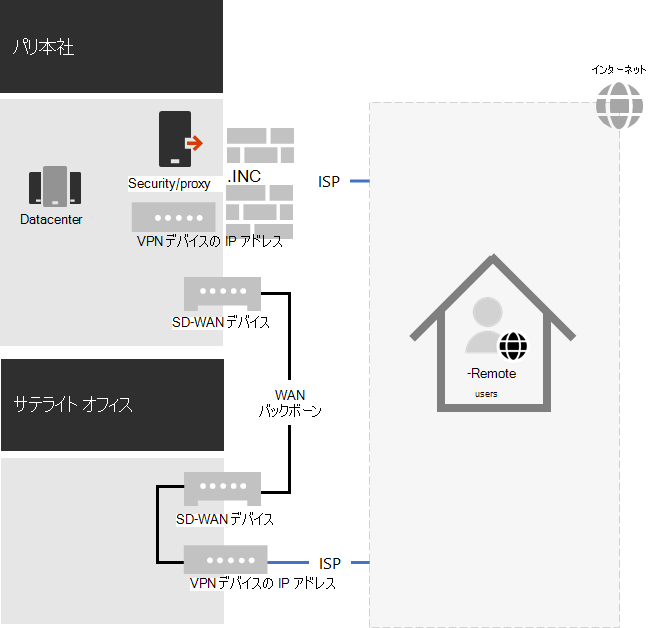
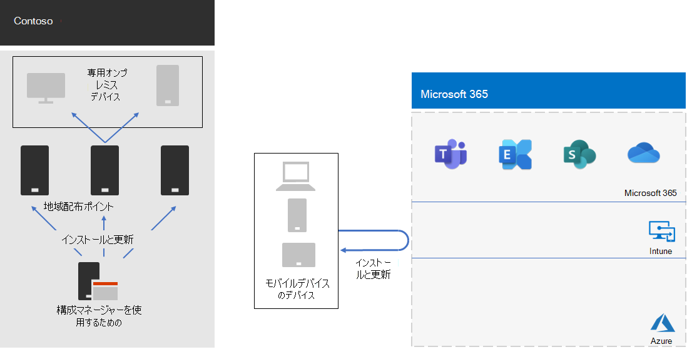

# Contoso 社の COVID-19 の応答と、リモートおよびオンサイト作業のサポートContoso's COVID-19 response and support for remote and onsite work

Contoso 社では、常にリモートワーカーをサポートしており、パリ本社の中央 VPN サーバーを介してオンプレミスのリソースにアクセスしました。Contoso had always supported its remote workers, who accessed on-premises resources through a central VPN server in the Paris headquarters. Contoso 社は、すべてのリモートワーカーに管理されたラップトップを発行しました。Contoso had issued all remote workers a managed laptop. オンプレミスのワーカーは、デスクトップコンピューターとラップトップを混在させることができました。On-premises workers had a mixture of desktop computers and laptops.

## COVID に対する Contoso の応答Contoso’s response to COVID-19

COVID-19 pandemic が始まっている状態では、突然、重要なワーカーはリモートワーカーでした。With the onset of the COVID-19 pandemic, suddenly all but essential workers were remote workers. Contoso 社は、従業員を在宅勤務に移行させることによって反応し、Microsoft 365 cloud services を使用してオンプレミスのリソースへのリモートアクセスを通じて主な活動を実施しています。Contoso responded by shifting its workforce to work from home and conduct its primary activities through remote access to on-premises resources and online using Microsoft 365 cloud services.

Contoso 社では、既にリモートで作業している従業員の25% をサポートするために、パリ本社オフィスにリモートアクセス VPN サーバーがありましたが、迅速に移行することにより、そのリモートアクセスのキャパシティを拡大して、90% の人員をサポートしていました。Contoso had remote access VPN servers in the Paris headquarters office to support the 25% of its already remote workforce, but quickly moved to scale up it's remote access capacity to support 90% of its workforce. Contoso 社は、リモートアクセス VPN サーバーを各サテライトオフィスに展開して、リモートワーカーが Contoso イントラネットにアクセスするために地域的 close エントリポイントを使用するようにしました。Contoso deployed remote access VPN servers in each satellite office so that remote workers would use a regionally close entry point for access to the Contoso intranet.

Contoso 社は、分割トンネリング用のラップトップ、タブレット、スマートフォンにインストールされている VPN クライアントの構成も更新して、Office 365 エンドポイントの最適化セットのトラフィックが VPN 接続をバイパスしてインターネット上で直接送信されるようにしました。Contoso also updated the configuration of VPN clients installed on laptops, tablets, and smart phones for split tunneling so that traffic for the Optimize set of Office 365 endpoints bypassed the VPN connection and was sent directly over the internet. 詳細については、「 [VPN 分割トンネリングを使用してリモートユーザー用に Office 365 接続を最適化する](../enterprise/microsoft-365-vpn-split-tunnel.md)」を参照してください。For more information, see [Optimize Office 365 connectivity for remote users using VPN split tunneling](../enterprise/microsoft-365-vpn-split-tunnel.md).

これは、パリ本社および各サテライトオフィスにインストールされた VPN デバイスを使用した構成の結果です。Here is the resulting configuration with VPN devices installed in the Paris headquarters and each of the satellite offices. 

VPN クライアントがインストールされているリモートワーカーは、DNS を使用して地域的の最も近い office を検索し、そこにインストールされている VPN デバイスに接続します。A remote worker with the installed VPN client uses DNS to find the regionally closest office and connects to the VPN device installed there. 分割トンネリングでは、Microsoft 365 の最適化エンドポイントへのトラフィックは、地域的に最も近い Microsoft 365 のネットワークの場所に直接送信されます。With split tunneling, traffic to Microsoft 365 Optimize endpoints gets sent directly to the regionally closest Microsoft 365 network location. 他のすべてのトラフィックは、vpn デバイスへの VPN 接続を介して送信されます。All other traffic gets sent over the VPN connection to the VPN device.

## Contoso 社のリモートおよびオンサイト作業のサポートContoso’s support for remote and onsite work

地域ロックダウン時にほとんどのリモートワーカーをサポートするように初期変更を行った後、Contoso 社は、次のような作業を行うことができる、リモートおよびオンサイトの作業をサポートするインフラストラクチャの変更を行いました。After the initial changes were made to support mostly remote workers during regional lockdowns, Contoso made infrastructure changes to support remote and onsite work in which a worker could be:

- 常にリモート。Always remote.
- 常にオンプレミス。Always on-premises.
- リモートとオンプレミスの組み合わせ。A combination of remote and on-premises.

Microsoft 365 の id、セキュリティ、およびコンプライアンス機能は、信頼度がゼロになるように設計されており、ユーザーとデバイスの場所に関係なく動作します。Microsoft 365 identity, security, and compliance features are designed for Zero Trust and to work regardless of the location of the user and their device. 詳細については、「 [ゼロ信頼](https://www.microsoft.com/security/business/zero-trust)」を参照してください。For more information, see [Zero Trust](https://www.microsoft.com/security/business/zero-trust).

ただし、インストールするソフトウェアは社内またはインターネットソースから入手できるため、ソフトウェアの新規インストールと更新プログラムの管理はデバイスの場所によって異なります。However, managing new installs and updates of software is dependent on the location of the device because the software to install could come from an on-premises or an internet source. Contoso 社の IT アーキテクトは、新しいインストールを設計し、ワーカーではなくデバイスの場所に基づいてインフラストラクチャを更新します。Contoso IT architects designed their new installs and updates infrastructure based on the location of the device, rather than the worker.

これらは、オンプレミスとローミングの2種類のデバイスを指定していました。They designated two types of devices: dedicated on-premises and roaming.

### 専用オンプレミスDedicated on-premises

専用のオンプレミスデバイスは、Contoso イントラネットから離れたままで、VPN クライアントがインストールされていないデスクトップまたはサーバーコンピューターです。A dedicated on-premises device is a desktop or server computer that never leaves the Contoso intranet and does not have a VPN client installed. これらのオンプレミスデバイスは、Microsoft エンドポイント構成マネージャーとその配布ポイントを引き続き使用して、Windows 10、Microsoft 365 Apps for enterprise、エッジブラウザーをインストールします。These on-premises devices continue to use Microsoft Endpoint Configuration Manager and its distribution points for installs and updates of Windows 10, Microsoft 365 Apps for enterprise, and the Edge browser.

### 節約Roaming

ローミングデバイスは Contoso イントラネットを離れることができ、多くの office ワーカーと、Contoso VPN クライアントがインストールされているスマートフォンやタブレットなどのすべてのリモートワーカーとその他の組織所有のデバイスに対して発行されたラップトップを含んでいます。A roaming device can leave the Contoso intranet and includes laptops issued to many office workers and all remote workers and other organization-owned devices such as smart phones and tablets with the Contoso VPN client installed. 

これらのデバイスは、いつでもインターネットに接続できるため、Intune またはその他のクラウドベースのサービスを使用して、Windows 10、Microsoft 365 Apps for enterprise、および Edge をインストールします。Because these devices can be connected to the Internet at any given time, they use Intune or other cloud-based services for installs and updates of Windows 10, Microsoft 365 Apps for enterprise, and Edge. これらのユーザーは、既存のオンプレミス構成マネージャーの配布ポイントを使用しません。They do not use the existing on-premises Configuration Manager distribution points.

これは、ローミングデバイスのインストールと更新が、オンプレミスの間にインターネット経由で行われ、イントラネットに接続されることを意味します。This means some of the installs and updates for roaming device will be done over the internet while they are on-premises and connected to the intranet. しかし、Contoso 社の IT アーキテクトは、イントラネットの帯域幅をインターネットに最適化するよりも構成の簡略化が重要であると判断しました。特に、ほとんどのリモートワーカーがほとんどの場合、イントラネットに接続されていない場合。But Contoso IT architects decided that simplicity of configuration was more important than optimization of intranet bandwidth to the internet, especially when most remote workers are seldom connected to the intranet.

最終的なインフラストラクチャは次のとおりです。Here is the resulting infrastructure.

インストールと更新の動作は、デバイスのコンピューターアカウントをこれらのグループのいずれかのメンバーにすることによって決まります。Install and update behavior is determined by making the computer accounts of devices a member of one of these groups:

- OnPremDevicesOnPremDevices

  デバイス上の Configuration Manager クライアントは、配布ポイントを使用してインストールと更新を行います。The Configuration Manager client on the device uses distribution points for installs and updates.

- RoamingDevicesRoamingDevices

  デバイス上の Intune およびその他の設定は、インストールと更新に Microsoft 365 ネットワークの使用を指定します。Intune and other settings on the device specify the use of the Microsoft 365 network for installs and updates.

## 新しいオンボードプロセスNew onboarding process

新しいワーカーまたはデータセンター内の新しいサーバーに対して発行された新しい専用オンプレミスのデバイスの場合、ワーカーがサインインすると、OnPremDevices グループ内のデバイスのメンバーシップに基づいた Configuration Manager クライアントは、Windows 10、Microsoft 365 Apps 用アプリ、およびオンプレミス構成マネージャー配布ポイントからのエッジに対する最新の更新プログラムをダウンロードしFor a new dedicated on-premises device issued to a new worker or for a new server in a datacenter, when the worker signs in, the Configuration Manager client based on the device's membership in the OnPremDevices group downloads and installs the latest updates for Windows 10, Microsoft 365 Apps for enterprise, and Edge from on-premises Configuration Manager distribution points. 完了すると、専用のオンプレミスデバイスが使用できるようになります。また、これらの配布ポイントを継続的に更新するために使用します。When complete, the dedicated on-premises device is ready for use and uses these distribution points for ongoing updates.

新しいリモートデバイスが新しい作業者に対して発行されると、そのワーカーが RoamingDevices グループのメンバーシップに基づいてデバイスにサインインすると、Intune cloud service およびその他のサービスに接続し、Windows 10、Microsoft 365 Apps for enterprise、および Edge 用の最新の更新プログラムをダウンロードしてインストールします。For a new remote device issued to a new worker, when the worker signs in, the device, based on its membership in the RoamingDevices group, contacts the Intune cloud service and other services and downloads and installs the latest updates for Windows 10, Microsoft 365 Apps for enterprise, and Edge. 完了すると、リモートデバイスは使用できる状態になります。また、インストールされている VPN クライアントを使用して、オンプレミスのリソースにアクセスし、Microsoft 365 ネットワークに更新を継続して実行します。When complete, the remote device is ready for use and uses the installed VPN client for access to on-premises resources and the Microsoft 365 network for ongoing updates.

## 次の手順Next step

組織内の[リモートワーカーを](empower-people-to-work-remotely.md)強化します。[Empower the remote workers](empower-people-to-work-remotely.md) in your organization.
