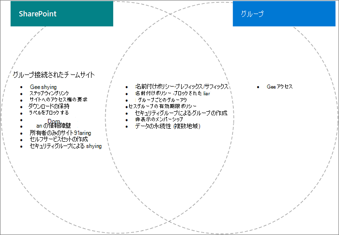

# Microsoft 365 グループと SharePoint の間の設定の相互作用Settings interactions between Microsoft 365 Groups and SharePoint

Microsoft 365 グループおよび Microsoft 365 の SharePoint の一部の設定 (特に、共有とグループおよびチームサイトの作成に関連する) は、互いに重複しています。Some settings for Microsoft 365 Groups and SharePoint in Microsoft 365, particularly related to sharing and group and team site creation, overlap with each other. この記事では、これらの相互作用と、これらの設定の使用方法に関するベストプラクティスについて説明します。This article provides descriptions of these interactions and best practices for how to work with these settings.

## Microsoft 365 グループへの SharePoint 設定の影響The effects of SharePoint settings on Microsoft 365 groups

|SharePoint の設定SharePoint setting|説明Description|Microsoft 365 グループへの影響Effect on Microsoft 365 groups|推奨事項Recommendation|
|:-----------------|:----------|:-----------------------------|:-------------|
|組織とサイトの外部共有External sharing for organization and site|サイト、ファイル、およびフォルダーを組織外のユーザーと共有できるかどうかを決定します。Determines if sites, files, and folders can be shared with people outside the organization.|SharePoint とグループの設定が一致しない場合、グループのゲストはサイトへのアクセスをブロックされる可能性があります。また、外部アクセスはサイトでは使用できませんが、グループにはアクセスできない場合があります。If SharePoint and groups settings don't match, guests in the group may be blocked from accessing the site, or external access may be available in the site but not the group.|共有設定を変更するときは、グループの設定と、グループに接続されたチームサイトの SharePoint サイトの設定の両方を確認します。When changing sharing settings, check both Groups settings and SharePoint site settings for group-connected team sites.  「 [サイト内のゲストを使用して共同作業を](https://docs.microsoft.com/microsoft-365/solutions/collaborate-in-site)行う」を参照してください。See [Collaborate with guests in a site](https://docs.microsoft.com/microsoft-365/solutions/collaborate-in-site).|
|ドメイン許可/ブロックDomain allow/block|指定したドメインとのコンテンツの共有を許可または禁止します。Allows or prevents content being shared with specified domains.|グループは、SharePoint の許可または禁止リストを認識しません。Groups does not recognize SharePoint allow or block lists. SharePoint で許可されていないドメインのユーザーが、グループを介して SharePoint にアクセスできる可能性があります。Users from domains disallowed in SharePoint could gain access to SharePoint through a group.|Azure AD と SharePoint のドメインの許可/ブロック一覧を管理します。Manage domain allow/block lists for Azure AD and SharePoint together. ドメインを許可およびブロックするための、組織全体のガバナンスプロセスを作成します。Create an org-wide governance process for allowing and blocking domains.  「 [SharePoint ドメインの設定](https://docs.microsoft.com/sharepoint/restricted-domains-sharing)」および「 [Azure AD ドメインの設定](https://docs.microsoft.com/azure/active-directory/b2b/allow-deny-list)」を参照してください。See [SharePoint domain settings](https://docs.microsoft.com/sharepoint/restricted-domains-sharing) and [Azure AD domain settings](https://docs.microsoft.com/azure/active-directory/b2b/allow-deny-list)|
|特定のセキュリティ グループ内のユーザーにのみ、外部との共有を許可します。Allow only users in specific security groups to share externally|サイト、フォルダー、およびファイルを外部で共有できるセキュリティグループを指定します。Specifies security groups who can share sites, folders, and files externally.|この設定は、グループを外部で共有するグループの所有者には影響しません。This setting does not affect group owners sharing groups externally. グループゲストは、関連付けられた SharePoint サイトにアクセスできます。Group guests have access to the associated SharePoint site.||
|SharePoint サイトの共有設定SharePoint site sharing settings|グループメンバーシップの外部にあるサイトを直接共有できるユーザーを決定します。Determines who can share the site directly outside of group membership. これは、グループまたはサイトの所有者によって構成されます。This is configured by the group or site owner.|この設定は、グループに直接影響を与えませんが、ユーザーをサイトに追加して、他のグループリソースにアクセス権を持たないようにすることができます。This setting does not affect the group directly, but it can allow users to be added to a site and not have access to other group resources|この設定を使用してサイトの共有を直接制限し、グループを使用してサイトアクセスを管理することを検討してください。Consider using this setting to limit sharing of the site directly and manage site access through the group.|
|ユーザーが SharePoint のスタートページおよび OneDrive からサイトを作成できるようにするLet users create sites from the SharePoint start page and OneDrive|ユーザーが新しい SharePoint サイトを作成できるかどうかを指定します。Specifies if users can create new SharePoint sites.|この設定を無効にした場合でも、グループを作成することで、グループに接続されたチームサイトを作成することができます。If this setting is turned off, users can still create group-connected team sites by creating a group.||

## SharePoint での Microsoft 365 groups の設定の効果The effects of Microsoft 365 groups setting on SharePoint

|Microsoft 365 グループの設定Microsoft 365 groups setting|説明Description|SharePoint に対する影響Effect on SharePoint|推奨事項Recommendation|
|:---------------------------|:----------|:-------------------|:-------------|
|名前付けポリシーNaming policies|グループの名前のプレフィックスとサフィックス、およびグループの作成に対してブロックする単語を指定します。Specifies group name prefixes and suffixes, and blocked words for group creation|グループに接続されたチームサイトを作成するユーザーにはポリシーが適用されますが、他のテンプレートを使用して通信サイトやサイトを作成することはありません。Policies are enforced for users creating group-connected team sites, but not communication sites or sites with other templates.|必要に応じて、コミュニケーションサイト用の別の命名ガイドを作成します。Create separate naming guidance for communication sites if needed.|
|グループのゲスト アクセスGroup guest access|組織外のユーザーをグループに追加できるかどうかを指定します。Specifies if people outside the organization can be added to groups.|SharePoint とグループの設定が一致しない場合、グループのゲストはサイトへのアクセスをブロックされる可能性があります。また、外部アクセスはサイトでは使用できませんが、グループにはアクセスできない場合があります。If SharePoint and groups settings don't match, guests in the group may be blocked from accessing the site, or external access may be available in the site but not the group.|共有設定を変更するときは、グループの設定と、グループに接続されたチームサイトの SharePoint サイトの設定の両方を確認します。When changing sharing settings, check both Groups settings and SharePoint site settings for group-connected team sites.  「[サイトでゲストと共同作業を](https://docs.microsoft.com/microsoft-365/solutions/collaborate-in-site)行う」を参照してください。See [Collaborate with guests in a site](https://docs.microsoft.com/microsoft-365/solutions/collaborate-in-site)|
|セキュリティグループによるグループの作成Group creation by security group|グループは、特定のセキュリティグループのメンバーのみが作成できます。Groups can only be created by members of a specific security group.|セキュリティグループのメンバーではないユーザーは、グループに接続されたチームサイトを作成できません。Users who are not members of the security group will not be able to create a group-connected team site.|グループを要求するプロセスに、サイトを要求するための手順が含まれていることを確認してください。Be sure your process for requesting a group includes instructions for requesting a site.|
|グループの有効期限ポリシーGroup expiration policy|アクティブに使用されていないグループが自動的に削除されるまでの期間を指定します。Specifies a time period after which groups that are not actively used will be automatically deleted.|グループが削除されると、関連付けられている SharePoint サイトも削除されます。When the group is deleted, the associated SharePoint site is also deleted. アイテム保持ポリシーによって保護されたコンテンツは保持されます。Content protected by retention policies is retained.|有効期限ポリシーを使用して、未使用のグループとサイトが無秩序に増大しないようにします。Use expiration policies to avoid sprawl of unused groups and sites.|

## 関連項目Related topics

[組織外のユーザーとの共同作業Collaborating with people outside your organization](https://docs.microsoft.com/microsoft-365/solutions/collaborate-with-people-outside-your-organization)

[SharePoint のサイト作成を管理するManage site creation in SharePoint](https://docs.microsoft.com/sharepoint/manage-site-creation)