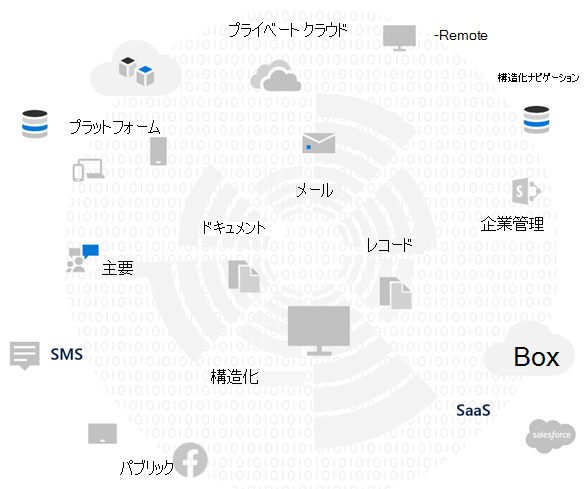

# Microsoft 365 を使用してデータのプライバシーリスクを評価し、機密アイテムを識別する

組織が対象とするデータプライバシーに関する規制とリスクを評価することは、関連する改善措置を実装する前の重要な手順の1つです。これは、Microsoft 365 の機能とサービスで実現可能なものを含みます。 

## 潜在的に適用可能なデータプライバシー規制

データプライバシー規制に関する、より幅広い規制フレームワークに関する参考資料については、 [Microsoft サービスの信頼ポータル](https://servicetrust.microsoft.com/)と、[一般的なデータ保護規則 (GDPR) の規則に関する一連の記事](../compliance/gdpr.md)、および業界または地域で対象となる可能性のある他の規制に関する資料を参照してください。

### GDPR

GDPR は、最もよく知られ、データプライバシー規制の内容を示しています。これにより、欧州連合 (EU) の一部である特定または特定可能な個人に関連する個人データの収集、保存、処理、および共有を規制します。 

GDPR の記事4に従います。 

- 「個人データ」とは、特定された、または特定された自然な人物 (「データの主題」) に関連する情報を意味します。識別可能な自然な人物とは、名前、識別番号、場所のデータ、オンライン識別子、またはその自然の人物の物理、physiological、遺伝子、メンタル、経済、文化的、またはソーシャル id に固有の1つまたは複数の要素を参照することによって、直接的または間接的に特定できるユーザーのことです。

### ISO 27001

ISO 27001 などの他の標準に準拠することは、ユーザー、プロセス、およびテクノロジの各スペクトラムにわたる正当なプロキシとして、いくつかのヨーロッパの監督機関によっても認識されています。 ISO-27001 主導の保護メカニズムの重複を規定する標準は、特定の状況でプライバシーに関する義務を満たすプロキシとして考えることができます。

### その他のデータプライバシー規制

その他の著名なデータプライバシー規制では、個人データの取り扱い要件も指定します。

米国では、カリフォルニアの消費者保護法 ([Ccpa](../compliance/ccpa-faq.md))、HIPAA ヒットエコー (米国の医療保険法)、および Graham 対象なる ACT (GLBA) が含まれます。 その他の状態固有の規制は、インプレースまたは開発にも適用されます。 

その他の例として、ドイツの National GDPR 実装法 (BDSG)、ブラジルのデータ保護法 (LGPD)、その他多くの例があります。

## Microsoft 365 テクニカルコントロールカテゴリへの規制のマッピング

データプライバシーに関連する規制の多くには重複する要件があるため、技術的な統制スキームを開発する前に、対象となる規制について理解しておく必要があります。 

この総合的なソリューションの記事で後で参照できるように、この表では、データのプライバシーに関する規制をサンプリングした抜粋を示します。 

| 規定 | 記事/セクション | 記載 | 適用可能なテクニカルコントロールカテゴリ |
|:-------|:-----|:-------|:-------|
| GDPR | 記事 5 (1) (f) | 個人データの適切なセキュリティを確保する方法で処理されるのは、承認されていないまたは違法な処理に対する保護や、適切な技術または組織の測定値 (「誠実」と「機密」) を使用した、個人データの適切なセキュリティを確保する方法です。  |  いずれ   ID   デバイス   脅威保護   情報を保護する   情報を管理する   検出と対応 |
|  | 記事 (32) (1) (a) | アートの状態、実装のコスト、および処理の性質、範囲、コンテキスト、および目的について、また、自然責任者の権利と自由についてのさまざまな確率と重大度を考慮したうえで、コントローラーとプロセッサは適切な技術および組織上の手段を実装し、リスクに適したレベルのセキュリティを確保する必要があります。(必要に応じて alia 間を含む): (a) 個人データの仮名化と暗号化。 | 情報を保護する |
|  | 記事 (13) (2) (a) | "...コントローラーは、個人データを取得するときに、公正で透過的な処理を行うために、(a) 個人データを保存する期間、または可能でない場合には、その期間を決定するために使用される基準を確実にするために必要な、次の追加情報を使用してデータ主体に提供します。 | 情報を管理する |
|  | 記事 (15) (1) (e) | データサブジェクトは、自分または個人のデータが処理されているかどうかについて、コントローラーの確認から取得する権限を持っているものとします。その場合は、個人データと次の情報にアクセスできます。 (e) 個人データの訂正または消去、またはデータの対象に関する個人データの処理の制限、またはそのような処理に対するオブジェクトの制限 | 検出と対応 |
| LGPD | 記事46 | エージェントを処理するには、セキュリティ、技術、および管理上の手段を採用します。これにより、破棄、損失、改変、通信、または不適切な種類の不正な処理による、不正なアクセスおよび偶発的または違法な状況から個人データを保護することができます。 | 情報を保護する   情報を管理する   検出と対応|
|  | 記事48 | コントローラーは、データ主体に対してリスクまたは関連性に関する損害を与える可能性があるセキュリティインシデントの発生に関して、national 権限とデータに対して通信する必要があります。 | 検出と対応 |
| HIPPA | 45 CFR 164.312 (e) (1) | 技術セキュリティ対策を実装して、電子通信ネットワークを介して送信されている、電子情報保護された健康情報への無許可アクセスを防ぎます。 | 情報を保護する |
|  | 45 C.F.R. 164.312 (e) (2) (ii) | 必要に応じて、電子的に保護された正常性の情報を暗号化するメカニズムを実装します。 | 情報を保護する |
|  | 45 CFR 164.312 (c) (2) | 電子的な保護された正常性の情報が不正な方法で変更または破壊されていないことを corroborate するための電子メカニズムを実装します。 | 情報を管理する |
|  | 45 CFR 164.316 (b) (1) (i) | この subpart がドキュメント化するために、アクション、アクティビティ、または評価が必要な場合は、アクション、アクティビティ、または評価の記録 (電子メールがある場合があります) 記録を保持します。 | 情報を管理する |
|  | 45 CFR 164.316 (b) (1) (ii) | このセクションの段落 (b) (1) に必要なドキュメントは、作成日から6年間、または最後に有効になっていた日付から、後の方に維持してください。 | 情報を管理する |
|  | 45 C.F.R. 164.308 (a) (1) (ii) (D) | 監査ログ、アクセスレポート、セキュリティインシデント追跡レポートなど、情報システムアクティビティの記録を定期的にレビューする手順を実装します。 | 検出と対応 |
|  | 45 C.F.R. 164.308 (a) (6.0) (ii) | 疑われる、または既知のセキュリティインシデントを特定して対応します。対象となるエンティティまたはビジネスの関連企業に知られているセキュリティインシデントの影響を practicable、有害な影響を軽減します。セキュリティインシデントとその結果を文書化します。 | 検出と対応 |
|  | 45 C.F.R. 164.312 (b) | 電子的に保護された健康情報を含む、情報システムでのアクティビティを記録および調査するための、ハードウェア、ソフトウェア、および手順のメカニズムを実装します。 | 検出と対応 |
| CCPA | 1798.105 (c) | このセクションの各部分 (a) に基づいてコンシューマーの個人情報を削除するために、コンシューマーから検証可能な要求を受け取った企業は、そのコンシューマーの個人情報をレコードから削除し、任意のサービスプロバイダーに依頼して、顧客の個人情報をレコードから削除する必要があります。 | 検出と対応 |
|  | 1798.105 (d) | (1798.105 への例外 (c)   ビジネスまたはサービスプロバイダーがコンシューマーの個人情報を保持する必要がある場合は、次の目的でコンシューマーの個人情報を削除する必要がある場合に、そのプロバイダーがコンシューマーの個人情報を削除するように要求する必要はありません。 (詳細については、現在の規制を参照してください)。 | 検出と対応 |
|||||

>[!Important]
>これは完全なリストではありません。 記載されているテクニカルコントロールカテゴリへの関連するセクションの適用に関する詳細については、[コンプライアンスマネージャー](../compliance/compliance-manager-overview.md)または法務/コンプライアンスアドバイザーを参照してください。
>

## データの理解

組織内および組織外のさまざまなユーザーデータの種類がシステムを操作する際には、組織に適用される業界や政府の規制に従って、個人データ保護戦略全体に影響を与える可能性がある重要な要因があります。 これには、個人データの格納場所、その種類、およびそのうちのどのような状況で収集されたかが含まれます。
 

### データの移植性 

データは、処理、絞り込み、その他のバージョンが処理されるときに、時間の経過と共に移動します。 初期スナップショットは十分ではありません。 データを把握するための継続的なプロセスが必要です。 これは、大量の個人データを処理する大規模な組織にとって最も大きな課題の1つです。 「データを知っておく」の問題を解決できない組織では、非常に高いリスクと、規制機関による罰金が発生する可能性があります。

 
### 個人データの場所

データプライバシーに関する規制に対処するには、現在または将来において、個人データが存在する可能性があると考えられる一般的な概念に頼ることはできません。 データプライバシーに関する規制では、組織が個人データを継続的にどこにいるかを把握していることを証明する必要があります。 これにより、Microsoft 365 環境を含む個人情報を保存するためのすべてのデータソースの初期スナップショットを取得し、継続的な監視と検出のメカニズムを確立することが重要になります。

データのプライバシー規制に関連する全体的な準備状況とリスクをまだ評価していない場合は、次の3段階のフレームワークを使用して作業を開始してください。 

>[!Note]
>この記事とその内容は、法的勧告サービスの場所を取得することを意図したものではありません。 ここでは、評価の初期段階で役に立つことがある、基本的なガイダンスとツールへのリンクを示します。
>
 
## 手順 1: 組織の個人データシナリオについて基本的な理解を深めます。 

現在管理している個人データの種類、保存場所、管理対象の保護コントロール、ライフサイクルの管理方法、およびアクセス権を持つユーザーに基づいて、データのプライバシーリスクを軽減する必要があります。 

出発点として、Microsoft 365 環境に存在する個人データの種類を把握しておくことが重要です。 使用するカテゴリ:

- 毎日のビジネス機能を実行するために必要な従業員データ
- 企業間 (B2B) シナリオにおいて、組織がビジネスの顧客、パートナー、その他の関係に関して持っているデータ
- 組織が企業間 (B2C) シナリオで管理しているオンラインサービスに情報を提供するユーザーに対して、組織が持っているデータ

ここでは、組織の一般的な部署に関するさまざまな種類のデータの例を示します。

通常、データプライバシー規制の対象となる個人データの多くは、Microsoft 365 の外部で収集および保存されます。 Microsoft 365 でデータのプライバシーを調査するためには、コンシューマー向けの web アプリケーションまたはモバイルアプリケーションからの個人データを Microsoft 365 にエクスポートする必要があります。 

このソリューションでは解決されない web アプリケーションや CRM システムに関しては、Microsoft 365 のデータプライバシーの公開がより制限されている場合があります。

リスクプロファイルを評価する際に、次の一般的なデータプライバシーのコンプライアンスの課題についても検討することが重要です。

 - **個人データの配布。** 特定の件名に関する情報の散在 適切な統制が実施されていることを規制機関に納得されているか。 必要に応じて、調査および修復できますか。
- **Exfiltration に対する保護。** 特定の種類またはソースの個人データを侵害から保護する方法と、そのような場合に応答する方法を教えてください。
- **保護対リスク。** リスクに関してどのような情報保護メカニズムが適しているか、また、エンドユーザーの介入が必要な場合にビジネス継続性と生産性を維持し、エンドユーザーの影響を最小限に抑える方法。 たとえば、手動での分類または暗号化を使用する必要がありますか。
- **個人データの保存期間。** 有効なビジネス上の理由により、個人データを含む情報を保持する必要がある期間と、ビジネス継続性の保持ニーズとバランスをとって過去の保存期間を回避する方法。
- **データ主体要求を処理する。** データ主体要求 (DSRs) を処理し、匿名化、墨消し、削除などの是正措置を行うために必要なメカニズムは何ですか。
- **継続的な監視とレポート。** さまざまなデータの種類とソースについて、どのような種類の日常の監視、調査、およびレポートの手法を使用できますか。
- **データ処理に関する制限。** これらの方法によって収集または保存された情報のデータ使用に関する制限は、組織がプライバシー統制で反映される必要があるか。 たとえば、販売担当者が個人データを使用しないというコミットメントは、組織がその情報を販売組織に関連付けられているシステムで転送または保存することを防止するために、メカニズムを配置する必要がある場合があります。

### 毎日のビジネス機能を実行するために必要な従業員データ

自然に組織にとって、従業員が従業員のデータを収集する必要があります。従業員は、従業員のアグリーメントで合意された内容に基づいています。 ユーザーが会社に勤務している限り、これは通常は問題ではありません。 組織は、悪意のある俳優が exfiltration をかけたり従業員の個人データをリークしたりしないように、メカニズムを適所に配置することができます。 

ユーザーが会社を去った場合、組織では通常、ユーザーアカウントの削除、メールボックスと個人用ドライブの使用停止、人事システムなどの従業員の状態の変更を行うためのプロセス、手順、および保持と削除のスケジュールがあります。 訴訟が関係している状況では、従業員または他の当事者が法的調査を行うと、組織のシステムに格納されている個人データに関する情報を取得するのに有効な理由がある場合があります。 場合によっては、そのようなデータを削除または匿名化することが必要になることがあります。 

このようなニーズに対応するために、組織は予防的、検出、および修復のニーズを解決するためのプロセスと手順を実施する必要があります。このような要求を促進するには、従業員に関する情報が、ビジネス継続性にとって重要であると考えられることがあることにご注意ください。 たとえば、個人がファイルを作成したか、関数を実行した情報などです。 

>[!Note]
>Microsoft 365 の個人データに関する調査および修復の手法については、「 [monitor and 応え](information-protection-deploy-monitor-respond.md)」の記事を参照してください。 また、自動分類と保護スキームを使用して、組織内で個人データが制御されるようにしたり、悪意のある出演者が組織を離れないようにすることもできます。 詳細については、「 [protect information information](information-protection-deploy-protect-information.md) 」を参照してください。
>
 
### 組織が B2B シナリオのビジネス顧客について持っているデータ

組織では、ビジネス継続性を確保するためにさまざまなシステムに顧客名とトランザクションの記録を保持する必要があり、不注意または悪意のある exfiltration フィルターからその情報を保護する必要がある場合があるため、B2B 情報のコレクションも問題になります。 従業員データと同様に、組織には、このようなデータを保護し、定義された保持と削除のスケジュールに従って期間を延長するための、ポリシー、手順、および技術制御を用意する必要があります。 

通常、外部の顧客、パートナー、および組織がビジネスを行うその他のエンティティに対する契約では、エンティティが組織との関係を持つときとその後の両方で、保護、保持、削除を含む、そのようなデータの処理に対して言語のアドレッシングが行われます。 

### 組織が B2C シナリオで管理しているオンラインサービスに情報を提供しているユーザーに関するデータ

このカテゴリは、お客様のデータ漏洩の多くのパブリックインスタンスが原因で、データのプライバシーを考慮している人のうちの最も多くの人です。 これは、プロバイダーに対する契約の下にあるサードパーティのような意図的なものでも、悪意のあるアクターによる excontrolなどの意図しないものでもかまいません。 コンシューマーデータの保護は、EU がこれらの規制を制定する主な理由の1つです。 GDPR および CCPA などのデータプライバシーに関する規制では、以下のことを計画する必要があります。

- [アクションプラン](../compliance/gdpr-action-plan.md)と[アカウンタビリティの準備チェックリスト](../compliance/gdpr-arc-office365.md)
- [データ保護影響評価](../compliance/gdpr-data-protection-impact-assessments.md)
- [ブリーチ通知](../compliance/gdpr-breach-office365.md)
- [データ サブジェクト要求](../compliance/gdpr-dsr-office365.md)

組織でコンシューマーが直接使用されていないデータ収集を大量に実行しない場合、このカテゴリの方が問題になることがあります。 ただし、コンプライアンスを実現するために、これらの記事で説明されているプロセスを実行する必要がある場合もあります。

### ステップ1の概要

リスクとデータのプライバシー規制に対する影響を理解することは、組織の個人データシナリオを基本的に理解することに基づいた重要な最初の手順です。

お客様が Microsoft 365 環境の個人データを所有していない場合、または環境の特定の部分に限定されている場合に、技術的な制御が必要になるのは、コンシューマータイプのデータがある場合だけではなく、環境のリスクの高い部分のみに限られている場合があります。

Microsoft 365 のコンプライアンススコアのように、外部の組織または標準コントロールセットに推奨されている場合もありますが、お客様の実装の選択は、実際のリスクの露呈度を定量化するために、データ在庫の認識に基づいて行う必要があります。

ほとんどの組織では、上記のシナリオのいずれかに公開されています。 総合的なアプローチを評価することが重要です。

## 手順 2: データプライバシー規制への準拠の準備状況を評価する

GDPR に固有ですが、無料の[MICROSOFT GDPR 評価ツール](https://www.microsoft.com/cyberassessment/en/gdpr/uso365)で検討されている質問は、全体的なデータプライバシーの準備状況を理解するために役立ちます。 

米国またはブラジルの LGPD の CCPA など、他のデータプライバシー規制の対象となる組織は、GDPR と重複してプロビジョニングされているため、このツールの準備によってもメリットがあります。

GDPR 評価は、次のセクションで構成されます。

| Section | 説明 |
|:-------|:-----|
| ガバナンス | <ol><li>プライバシーポリシーでは、どのようなデータ情報が処理されているかを明示的に記述していますか。 </li><li>プライバシー影響評価 (Pia) を定期的に実行していますか? </li><li> ツールを使用して個人情報 (PI) を管理していますか? </li><li> 特定の個人で PI データを使用してビジネスを遂行する法的権限があるかどうか。 データの同意を追跡していますか。 </li><li> 監査コントロールの追跡、実装、管理を行いますか。 データリークを監視していますか? </li></ol>|
| 削除と通知 | <ol><li>ユーザーのデータへのアクセス方法について明示的な指示がありますか。 </li><li> オプトインの同意を処理するためのプロセスを文書化してありますか。 </li><li> データの自動削除プロセスがありますか。 </li><li>   顧客とやり取りする際に id を検証するプロセスはありますか。 </li></ol>|
| リスク軽減と情報セキュリティ | <ol><li>ツールを使用して非構造化データをスキャンしていますか。 </li><li>すべてのサーバーが最新の状態になっていますか。ファイアウォールを利用して保護していますか。 </li><li>サーバーのバックアップを定期的に実行していますか。 </li><li>データリークを積極的に監視していますか? </li><li>保存されているデータと転送中のデータを暗号化していますか。 </li></ol>|
| ポリシー管理 | <ol><li>バインド会社のルール (BCRs) をどのように管理しますか? </li><li>データの同意を追跡していますか。 </li><li> 1 ~ 5、5、完全にカバーされた段階で、コントラクトはデータ分類と処理要件をカバーしますか? </li><li>インシデント対応計画を定期的にテストしていますか。 </li><li>アクセスを管理するためにどのようなポリシーを使用するか。 </li></ol>|
|||
 
## 手順 3: Microsoft 365 環境で発生する機密情報の種類を特定します。 

この手順には、特定の規制統制の対象となる特定の機密情報の種類に加えて、Microsoft 365 環境でそのような情報が発生していることが含まれます。 

個人を含む環境でコンテンツを検索することは強力なタスクであり、以前はコンプライアンス検索、電子情報開示、高度な電子情報開示、DLP、監査を使用しています。 

Microsoft コンプライアンス管理センターの新しい**データ分類**ソリューションを使用すると、[コンテンツエクスプローラー](../compliance/data-classification-content-explorer.md)の機能が非常に簡単になります。これは、個人データに関連するものを含む、組み込みの機密情報の種類またはカスタムの機密情報の種類のいずれかで動作します。
 
### 機密情報の種類

Microsoft コンプライアンス管理センターには100を超える機密情報の種類が事前に組み込まれており、そのほとんどは個人データの識別と検索に関連しています。 これらの組み込みの機密情報の種類は、正規表現 (regex) または関数によって定義されたパターンに基づいて、クレジットカード番号、銀行口座番号、パスポート番号などを識別して保護するのに役立ちます。 詳細については、「[機密情報の種類で検索される情報](../compliance/what-the-sensitive-information-types-look-for.md)」を参照してください。

従業員 Id のカスタム書式や、組み込みの機密情報の種類で既に取り上げられていないその他の個人情報など、組織固有または地域の機密アイテムの種類を識別して保護する必要がある場合は、次の方法でカスタムの機密情報の種類を作成できます。 

- PowerShell
- 完全に一致するデータが含まれるカスタムルール (EDM)
- コンプライアンスセンターの管理 UI (「コンプライアンス[スコアとコンプライアンスマネージャーの使用](information-protection-deploy-compliance.md)」の記事で強調表示されている)

既存の組み込みの機密情報の種類をカスタマイズすることもできます。

詳細については、以下の記事を参照してください。

- [組み込みの機密情報の種類をカスタマイズする](../compliance/customize-a-built-in-sensitive-information-type.md)
- [カスタムの機密情報の種類:](../compliance/custom-sensitive-info-types.md)
- [セキュリティ/コンプライアンス センターでカスタムの機密情報の種類を作成する](../compliance/create-a-custom-sensitive-information-type.md)
- [セキュリティ/コンプライアンス センター PowerShell でカスタムの機密情報の種類を作成する](../compliance/create-a-custom-sensitive-information-type-in-scc-powershell.md)
- [正確なデータ一致に基づく分類を使用してカスタムの機密情報の種類を作成する](../compliance/create-custom-sensitive-information-types-with-exact-data-match-based-classification.md)

### コンテンツエクスプローラー

お客様の環境で機密性の高いアイテムが発生するかどうかを判断するための重要なツールは、Microsoft 365 コンプライアンス管理センターの新しい[コンテンツエクスプローラー](../compliance/data-classification-content-explorer.md)です。 このツールは、機密情報の種類の発生や結果の表示のために、Microsoft 365 サブスクリプション全体の最初のスキャンおよび継続的なスキャンを行うための自動化されたツールです。
 
新しいコンテンツエクスプローラーツールを使用すると、組み込みの機密情報の種類またはカスタムの情報のいずれかを使用して、環境内の機密アイテムの場所をすばやく識別できます。 これには、プロセスの確立と、機密アイテムのプレゼンスと場所を定期的に調査する責任が割り当てられることがあります。

この記事で強調表示されているその他の手順と共に、これにより、全体的なリスクの危険度、準備状況、および重要なアイテムの場所を特定し、計画した Microsoft 365 の構成と監視を通じて保護することができます。 

### ご使用の環境で個人データを識別するその他の方法

コンテンツエクスプローラーに加えて、組織はコンテンツ検索機能にアクセスして、高度な検索条件やカスタムフィルターを使用して、環境内の個人データを検索するためのカスタム検索を作成できます。

個人データの検出にコンテンツ検索を使用するための詳細なガイダンスについては、[この記事](../compliance/search-for-and-find-personal-data.md)で説明します。 [GDPR および CCPA につい](../compliance/gdpr-dsr-office365.md#introduction-to-dsrs)ても、コンテンツ検索とその他の探索手法が dsrs で検討されています。

Microsoft 365 の個人データに関する調査と修復の手法に関する追加の洞察は、[モニターと応答の記事](information-protection-deploy-monitor-respond.md)に記載されています。
