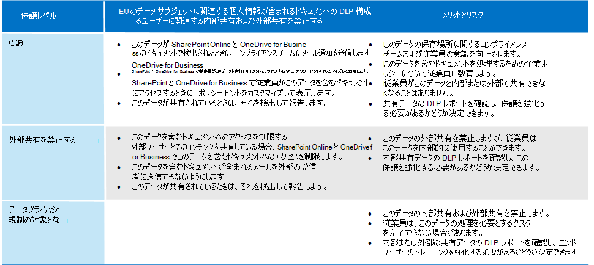

# 情報をデータプライバシーの規則に従って保護する

サブスクリプションでは、さまざまな情報保護コントロールを使用して、データのプライバシーに関するコンプライアンスのニーズや規制に対処することができます。 これには、一般的なデータ保護規則 (GDPR)、HIPAA ヒット (米国の医療保険のプライバシー法)、カリフォルニアコンシューマー保護法 (CCPA)、およびブラジルのデータ保護法 (LGPD) が含まれます。

これらのコントロールは、次のソリューション領域にあります。

- 秘密度ラベル
- データ損失防止 (DLP)
- Office メッセージの暗号化 (OME)
- Teams および sites のアクセス制御

>[!Note]
>このソリューションは、データのプライバシー規制に従って情報を保護するためのセキュリティとコンプライアンスの機能について説明します。 Microsoft 365 のセキュリティ機能の完全な一覧については、「 [microsoft 365 のセキュリティに関するドキュメント](https://docs.microsoft.com/microsoft-365/security/)」を参照してください。 Microsoft 365 のコンプライアンス機能の完全な一覧については、「 [microsoft 365 コンプライアンスのドキュメント](https://docs.microsoft.com/microsoft-365/compliance/)」を参照してください。
>

## 情報保護コントロールに影響を与えるデータプライバシー規制

以下に、情報保護の統制に関連するデータプライバシー規制の例を示します。

- GDPR 記事 5 (1) (f))
- GDPR 記事 (32) (1) (a)
- LGPD 記事46
- HIPAA のエコー (45 CFR 164.312 (e) (1))
- HIPAA のエコー (45 C.F.R. 164.312 (e) (2) (ii))

上記の各項目の詳細については、「[データプライバシーのリスクを評価し、機密アイテムを識別](information-protection-deploy-assess.md)する」の記事を参照してください。

情報保護のためのデータプライバシーの規則をお勧めします。

- 損失や不正なアクセス、使用状況、送信に対する保護。
- 保護機構のリスクベースのアプリケーション。
- 必要に応じて暗号化を使用します。

組織では、他の法令遵守のニーズやビジネス上の理由など、他の目的のために Microsoft 365 のコンテンツを保護することもできます。 情報保護のための情報保護スキームの確立は、全体的な情報保護の計画、実装、および管理の一環として行う必要があります。

Microsoft 365 で情報保護スキームの使用を開始するには、次のセクションに、関連する機能と、Microsoft 365 の改善アクションの簡単な一覧を示します。 この一覧には、データのプライバシー規制に適用される機能と改善アクションが含まれています。 ただし、以前のバージョンよりも優先される新しい機能がある場合は、リストに古いテクノロジは含まれません。 たとえば、SharePoint と OneDrive の Information Rights Management (IRM) はリストには含まれていませんが、機密ラベルが含まれています。

## Microsoft 365 で情報保護を管理する

Microsoft[情報保護ソリューション](../compliance/protect-information.md)には、microsoft 365、microsoft Azure、および microsoft Windows にわたるさまざまな統合機能が含まれています。 Microsoft 365 では、情報保護ソリューションには次のものが含まれています。

- [カスタマー キーによるサービスの暗号化](../compliance/customer-key-overview.md)
- [機密情報の種類](../compliance/what-the-sensitive-information-types-look-for.md)(「[データプライバシーのリスクを評価し機密アイテムを識別](information-protection-deploy-assess.md)する」の記事を参照)
- [機密ラベル](../compliance/sensitivity-labels.md) 
  - サービス/コンテナーレベル
  - クライアント側/コンテンツレベル
  - SharePoint および OneDrive での保存データの自動化
- データ損失防止 (DLP)
- [Office 365 Message encryption の新機能 (OME)](../compliance/ome.md)と OME [Advanced message encryption](../compliance/ome-advanced-message-encryption.md)

また、サイトおよびライブラリレベルの保護は、あらゆる保護スキームに含める重要なメカニズムです。

Microsoft 365 以外の情報保護機能の詳細については、以下を参照してください。

- [Microsoft Cloud Application Security (MCAS)](https://docs.microsoft.com/cloud-app-security/)
- [Azure Information Protection](https://docs.microsoft.com/azure/information-protection/what-is-information-protection)
- [Microsoft エンドポイントマネージャー](https://www.microsoft.com/microsoft-365/microsoft-endpoint-manager)
- [Windows 情報保護](https://docs.microsoft.com/windows/security/information-protection/windows-information-protection/protect-enterprise-data-using-wip)

## 秘密度ラベル

Microsoft Information Protection フレームワークからの機密ラベルを使用すると、ユーザーの生産性やコラボレーション機能が妨げられることなく、組織のデータを分類して保護することができます。

### 機密ラベルの前提条件

以下で強調表示されている機密ラベルベースの機能のいずれかを実装する前に、これらの作業を完了してください。

1. 次の点について理解します。
   - **ビジネス要件。** 企業に機密ラベルを適用する業務上の理由を確立します。 たとえば、情報保護のためのデータプライバシー要件。
   - **機密ラベル機能。** 機密ラベルは複雑になる可能性があるので、開始する前に[機密ラベルの文書](../compliance/sensitivity-labels.md)を必ずお読みください。
   - **重要な注意点**機密ラベルは Microsoft コンプライアンス管理センターで管理されますが、対象化およびアプリケーションのオプションは大きく異なります。
      - サイト、グループ、およびチームには、コンテナーレベルでの機密ラベルがあります (この設定は、コンテナー内のコンテンツには適用されません)。 これらは、サイト、グループ、またはチームがプロビジョニングされたときに適用されるユーザーおよびグループに公開されます。
      - アクティブなコンテンツには、機密ラベルがあります。 これらは、ユーザーまたはグループに対しても、手動で適用するか、または次のように自動的に適用されます。
        - このファイルは、ユーザーのデスクトップまたは SharePoint サイトに対して開く/編集/保存されます。
        - 電子メールは、ドラフトおよび送信されます。
      - Exchange を経由して送信される電子メールに加えて、SharePoint と OneDrive の保存ファイルへの自動アプリケーション用の機密ラベルがあります。 これらは、すべてのサイトまたは特定のサイトを対象としており、これらの環境に保存されているファイルに自動的に適用されます。

2. 過去または代替の方法での現在の機密ラベルの合理化

   - Azure Information Protection

      現在の秘密度のラベル付けスキームは、既存の[Azure Information Protection](../compliance/sensitivity-labels.md#sensitivity-labels-and-azure-information-protection)のラベル実装と調整する必要がある場合があります。
   - OME

      電子メール保護と、OME のような既存の電子メール暗号化方法に対してモダン感度ラベルを使用することを計画している場合は、それらを共存させることができますが、どちらのシナリオを適用するかを理解しておく必要があります。 「 [Office 365 Message Encryption new capabilities (OME)](#office-365-message-encryption-ome-new-capabilities)」を参照してください。これには、モダン感度ラベルと OME ベースの保護を比較した表が含まれます。

3. より広範な情報保護スキームへの統合を計画します。 OME との共存の上に、現在の機密ラベルを Microsoft 365 データ損失防止 (DLP) や Microsoft Cloud App Security などの side-by-side 機能で使用できます。 データのプライバシーに関連する情報保護の目標を達成するには、「[機密ラベルと Microsoft Cloud App Security](../compliance/sensitivity-labels.md#sensitivity-labels-and-microsoft-cloud-app-security) 」を参照してください。

4. 機密ラベルの分類と制御スキームを開発します。 「[データ分類と機密ラベルの分類」を](https://aka.ms/dataclassificationwhitepaper)参照してください。

### 一般的なガイダンス

1. **スキーマの定義。** 技術的な機能を使用してラベルと保護を適用する前に、組織全体で分類スキーマを定義する作業を行います。 分類スキーマが既に存在する場合は、個人データの追加が容易になります。 
2. **作業の開始** 最初に、実装するラベルの数と名前を決定します。 使用するテクノロジとラベルの適用方法について心配することなく、このアクティビティを実行します。 このスキーマは、社内およびその他のクラウドサービスに存在するデータを含め、組織全体で汎用的に適用します。
3. **その他の推奨事項**ポリシー、ラベル、および条件を設計および実装するときは、次の推奨事項に従うことを検討してください。

   - **既存の分類スキーマを使用します (存在する場合)。** 多くの組織では、既に何らかの形式でデータ分類を使用しています。 既存のラベルスキーマを慎重に評価し、可能な場合はそのスキーマをそのまま使用します。 エンドユーザーに認識される使い慣れたラベルを使用することで、導入が促進されます。
   - **小規模に開始します。** 作成できるラベルの数には、実質的に制限はありません。 ただし、ラベルとサブラベルの数が多いと導入が遅くなる可能性があります。
   - **シナリオとユースケースを使用します。** 組織内の一般的なユースケースを特定し、その対象となるデータプライバシー規制から導き出されたシナリオを使用します。 構想のラベルと分類の構成が実際に機能するかどうかを確認します。
   - **新しいラベルのすべての要求に質問を入力します。** すべてのシナリオまたはユースケースで、新しいラベルが必要かどうか、または既に所有しているものを使用できますか。 ラベルの数を最小限に抑えると、導入が向上します。
   - **主要な部署のサブラベルを使用します。** 部署によっては、特定のラベルを必要とする特定のニーズがあります。 これらのラベルを既存のラベルのサブラベルとして定義し、グローバルにではなくユーザーグループに割り当てられるスコープ付きポリシーを使用することを検討してください。
   - **スコープ設定ポリシーを検討します。** ユーザーのサブセットを対象とするポリシーでは、ラベルのオーバーロードが禁止されます。 スコープ設定されたポリシーを使用すると、役割または部署固有のラベルまたはサブラベルを、その特定の部署で働く従業員だけに割り当てることができます。 
   - **わかりやすいラベル名を使用します。** 専門用語、標準、頭字語をラベル名として使用しないようにしてください。 エンドユーザーに resonate ている名前を使用して、導入を改善します。 PII、PCI、HIPAA、LBI]、MBI、HBI などのラベルを使用する代わりに、会社以外、パブリック、一般、機密、および高機密情報などの名前を考慮します。

### サイト、グループ、teams の機密ラベルを作成および展開する

Microsoft 365 コンプライアンスセンターで[機密ラベル](../compliance/sensitivity-labels-teams-groups-sites.md)を作成すると、それらをこれらのコンテナーに適用できるようになります。

- Microsoft Teams サイト
- Microsoft 365 グループ (以前の Office 365 グループ)
- SharePoint サイト

これらのコンテナーのコンテンツを保護するには、次のラベル設定を使用します。

- Microsoft 365 グループに接続されたチームサイトのプライバシー (公開または非公開)
- 外部ユーザーアクセス
- 非管理対象デバイスからのアクセス

データのプライバシーを保護するために、機密性の高い個人データを含むコンテンツを格納するために使用されるコンテナーの外部共有を禁止するには、データを含むファイルをプライベートとしてマークし、管理されたデバイスを必要とします。

### コンテンツの機密ラベルを作成および展開する

ファイルに適用される機密ラベルを使用すると、コンテンツを暗号化し、コンテンツをウォーターマークし、Office アプリケーションのコンテンツ (Outlook、web 上の Office など) に関するその他のコントロールを定義できます。

機密ラベルを使用して組織のデータの保護を開始する準備ができたら、次のようにします。

1. **ラベルを作成する。** コンテンツのさまざまなレベルに対する組織の分類方法に従って、秘密度ラベルを作成して名前を付けます。 分類分類の開発の詳細については、「[データ分類と機密ラベル](https://aka.ms/dataclassificationwhitepaper)の分類」ホワイトペーパーを参照してください。
2. **各ラベルの機能を定義する。** 各ラベルに関連付ける必要がある保護設定を構成します。 たとえば、低機密コンテンツ ("General" ラベルなど) にヘッダーまたはフッターのみを適用し、より高い機密度のコンテンツ ("社外秘" ラベルなど) にウォーターマークを設定し、暗号化を有効にすることができます。
3. **ラベルを発行する。** 秘密度ラベルの構成が完了したら、ラベル ポリシーを使用してラベルを公開します。 ラベルを使用する必要があるユーザーとグループおよび使用するポリシー設定を決定します。 1つのラベルが再利用可能です。 一度定義した後、別のユーザーに割り当てられた複数のラベルポリシーに含めることができます。

Microsoft 365 コンプライアンスセンターから機密ラベルを発行すると、そのラベルが作成または編集されたときにコンテンツを分類して保護するために、ユーザーが[Office アプリ](../compliance/sensitivity-labels-office-apps.md)に表示され始めます。

データのプライバシーを保護するため、機密情報が含まれる電子メールやコンテンツに、暗号化やその他のルールを使用して機密ラベルを手動で適用します。

>[!Note]
>電子メールに暗号化が有効になっている機密ラベルには、OME と重複する機能があります。 「[セキュリティで保護された電子メールのシナリオと OME および機密ラベルの比較](#secure-email-scenarios-comparison-with-ome-and-sensitivity-labels)」を参照してください。

### ユーザーがドキュメントを編集するとき、または電子メールを作成するときのクライアント側の自動ラベル付け

機密ラベルを作成すると、指定した条件に一致する場合に電子メールを含む、そのラベルをコンテンツに[自動的に割り当てる](../compliance/apply-sensitivity-label-automatically.md)ことができます。

機密ラベルを自動的にコンテンツに適用する機能が重要である理由は次のとおりです。

- ユーザーのトレーニングは、一部の分類方法をいつ使用するかについてのみ必要。
- ユーザーへの依存は、一部のコンテンツを正しく分類するためにのみ必要。
- ユーザーはポリシーについて把握する必要がなくなり、自分たちの仕事に集中できる。

自動ラベル付けは、ラベルを自動的に適用するだけでなく、ユーザーへのラベルの推奨をサポートします。 ただし、どちらの場合も、ユーザーはラベルを承諾または拒否するかどうかを決定し、コンテンツの正しいラベル付けを行います。

このクライアント側のラベル付けでは、ドキュメントを保存する前であってもラベルを適用できるため、ドキュメントの遅延が最小限に抑えられます。 ただし、すべてのクライアント アプリが自動ラベル付けをサポートしているわけではありません。 この機能は、Azure Information Protection の統一されたラベル付けクライアントと、[いくつかのバージョンの Office アプリ](../compliance/sensitivity-labels-office-apps.md#support-for-sensitivity-label-capabilities-in-apps)でサポートされています。

構成手順については、「 [Office アプリの自動ラベル付けを構成する方法](../compliance/sensitivity-labels-office-apps.md#support-for-sensitivity-label-capabilities-in-apps)」を参照してください。

データのプライバシーを保護するため、機密の個人情報を含むコンテンツの機密ラベルを自動的に適用します。

### コンテンツが既に保存されている場合のサービス側の自動ラベル付け

この方法は、機密ラベルを使用した自動分類と呼ばれます。 また、保存されているデータ (SharePoint および OneDrive のドキュメントの場合) と転送中のデータ (Exchange で送受信される電子メールの場合) の自動ラベルと呼ばれることもあります。 Exchange では、メールボックス内のメールは保存されません。
 
このラベル付けは、ユーザーアプリケーションではなくサービスによって適用されるため、アプリユーザーの用途とバージョンについて心配する必要はありません。 その結果、この機能は、組織全体ですぐに使用できるようになります。また、規模に応じたラベル付けに適しています。 自動ラベル付けポリシーでは、ユーザーがラベル付けプロセスを操作しないので、推奨されるラベル付けをサポートしていません。 代わりに、管理者は、実際にラベルを適用する前に、コンテンツの正しいラベル付けを行うために、シミュレーション モードでポリシーを実行します。

構成手順については、「 [SharePoint、OneDrive、Exchange の自動ラベル付けポリシーを構成する方法](../compliance/apply-sensitivity-label-automatically.md#how-to-configure-auto-labeling-policies-for-sharepoint-onedrive-and-exchange)」を参照してください。

重要なサイト内のデータプライバシーについては、機密情報を含むコンテンツを自動暗号化するために、秘密のラベルをプッシュします。

## データ損失防止 

Microsoft 365 で[データ損失防止 (DLP)](../compliance/data-loss-prevention-policies.md)を使用して、内部と外部の両方で個人情報を含むデータの共有など、危険、偶発的、または不適切な共有を検出、警告、ブロックすることができます。

DLP では、次のことが可能になります。

- 危険な共有アクティビティを識別して監視します。
- 適切な決定を行うために、コンテキスト内のガイダンスを使用してユーザーを教育します。
- Inhibiting の生産性を持たないコンテンツに対してデータの使用ポリシーを適用します。
- 分類とラベル付けを統合して、共有時にデータを検出して保護します。

### DLP のサポートされているワークロード

Microsoft 365 コンプライアンスセンターの DLP ポリシーを使用すると、Exchange Online、SharePoint、OneDrive、Microsoft Teams など、Microsoft 365 の多くの場所で機密アイテムを識別、監視、および自動保護することができます。

たとえば、任意の OneDrive サイトに保存されているクレジットカード番号を含むドキュメントを特定したり、特定のユーザーの OneDrive サイトのみを監視したりすることができます。

また、機密アイテムを識別し、DLP ポリシーを適用する機能を含む、ローカルにインストールされたバージョンの Excel、PowerPoint、および Word の機密アイテムを監視および保護することもできます。 DLP は、ユーザーがこれらの Office アプリからコンテンツを共有するときの継続的な監視を提供します。

この図は、個人データを保護する DLP の例を示しています。

DLP は、正常性レコードが含まれるドキュメントまたは電子メールを識別し、そのドキュメントへのアクセスを自動的にブロックするか、電子メールの送信をブロックするために使用されます。 DLP は、ポリシーヒントを使用して受信者に通知し、エンドユーザーと管理者に通知を送信します。

### DLP の計画

の DLP ポリシーを計画します。 

- ビジネス要件。

- 「[データプライバシーのリスクを評価し、機密性の高いアイテムを識別](information-protection-deploy-assess.md)する」の説明に従って、組織のリスクベースの評価を行います。

- その他の情報保護およびガバナンスメカニズムの導入、またはデータのプライバシーの計画。

- 「[データプライバシーのリスクを評価し、機密性の高いアイテムを識別](information-protection-deploy-assess.md)する」の説明に従って、評価作業に基づいて個人データに対して特定した機密情報の種類。 DLP ポリシー条件は、機密情報の種類と保持ラベルの両方に基づくことができます。

- 保存期間のラベル DLP 条件を指定する必要があります。 詳細については、「組織の記事[のデータプライバシー規制に関する情報を管理する](information-protection-deploy-govern.md)」を参照してください。

- 継続的な DLP ポリシー管理。組織内のユーザーが機密情報の種類、保持ラベル、規制、コンプライアンスポリシーの変更に関するポリシーを運用および調整する必要があります。

DLP ポリシー条件では機密ラベルを使用できませんが、機密情報の種類に基づいて自動適用される機密ラベルだけで、アクセスを防止するための特定の保護シナリオを実現することが可能です。 堅牢な機密のラベル付けが行われている場合は、次の理由から DLP を使用して保護を強化するかどうかを検討します。

  - DLP を使用すると、ファイルの共有ができなくなります。 機密ラベルは、アクセスを禁止するだけです。

  - DLP には、ルール、条件、アクションの観点から、より詳細なレベルで制御することができます。

  - DLP ポリシーは、Teams のチャットおよびチャネルメッセージに適用できます。 機密ラベルは、ドキュメントと電子メールにのみ適用できます。

### DLP ポリシー

DLP ポリシーは、Microsoft コンプライアンス管理センターで構成されており、保護レベル、ポリシーが検索する機密情報の種類、および対象となるワークロードを指定します。 これらの基本コンポーネントは、保護とデータの種類を識別することで構成されます。

GDPR を認識するための DLP ポリシーの例を次に示します。

DLP ポリシーの作成と適用の詳細については、[この記事](../compliance/create-test-tune-dlp-policy.md)を参照してください。

### データプライバシーの保護レベル

次の表は、DLP を使用して保護を強化する3つの構成を示しています。

最初の構成である認識は、データのプライバシー規制のためのコンプライアンスニーズに対応するために、開始点と最小レベルの保護として使用できます。

>[!Note]
>保護のレベルに応じて、情報を共有してアクセスするユーザーの機能が低下し、生産性や毎日のタスクの完了に影響を与える可能性があります。
>

保護レベルを強化する際に、より安全な環境で従業員が生産性を高められるようにするには、新しいセキュリティポリシーおよび手順についてトレーニングを行い、それを教育するための時間を取ります。

### DLP での機密ラベルの使用例

機密ラベルを DLP と共に使用して、高度に規制された環境でデータのプライバシーを提供することができます。 統合展開の主要な手順は次のとおりです。

1. データのプライバシーに関する規制やその他のビジネス要件について説明します。
2. ターゲットのデータソース、種類、および所有権は、データのプライバシーに関する懸念を基準として特徴付けられています。
3. 要件に対処し、データプライバシーのホットスポットを保護および管理する全体的な戦略。
4. データプライバシー管理戦略に対処するための段階的なアクションプランは、所定の場所に配置されます。

これらの要素を決定したら、機密情報の種類、秘密のラベル付け分類、および DLP ポリシーを使用できます。 この図は例を示しています。

[この画像のより大きいバージョンを表示する](https://github.com/MicrosoftDocs/microsoft-365-docs/raw/public/microsoft-365/media/information-protection-deploy-protect-information/information-protection-deploy-protect-information-sensitivity-lables-dlp.png)

この図に示されているように、DLP および機密ラベルを使用したデータ保護シナリオをいくつか示します。

| シナリオ | プロセス |
|:-------|:-----|
| A | <ol><li>コンテンツの機密ラベルは、管理者によって、コンテンツや電子メールに対する手動または自動アプリケーション用のユーザーおよびグループに公開されます。 </li><li>ユーザー A は、暗号化またはその他の設定が適用されたコンテンツと対話するときに、手動で、または自動的にラベルを適用します。 </li><li>ユーザー A は、保護された電子メールまたはファイルをゲストユーザーとしてユーザー B に送信します。 </li></ol> |
| B | ユーザー A が電子メールやファイルをユーザー B に送信できないように、管理者によってユーザー a が発行した DLP ポリシー。 |
| C |  Teams チームまたは SharePoint サイトをプロビジョニングするユーザー A に対して、"所有者に招待できません" という設定を持つ機密ラベルがユーザー A に公開されます。 サイトの他のユーザーが、ユーザー B でファイルを共有しようとしていますが、DLP によってブロックされています。 |
| D | 自動アプリケーションからサイトへのコンテンツの機密ラベルが1つ以上のサイトに公開され、保護された別のレイヤーが提供され、保護されたサイトになります。 |
|||

## Office 365 Message Encryption (OME) 新機能

患者の医療情報、顧客や従業員の情報など、機密アイテムを交換するために電子メールを使用することがよくあります。 メール メッセージの暗号化を使用すると、意図した受信者のみがメッセージの内容を表示できるようになります。

[OME](../compliance/ome.md)を使用すると、組織内外のユーザー間で暗号化されたメッセージを送受信できます。 OME は、Outlook.com、Yahoo!、Gmail、その他の電子メールサービスと連携して動作します。 OME を使用すると、意図した受信者のみがメッセージの内容を表示できるようになります。

データのプライバシーを保護するために、OME を使用して機密アイテムを含む内部メッセージを保護します。 Office 365 Message Encryption は、Azure Information Protection の一部である Microsoft Azure Rights Management (Azure RMS) 上に構築されたオンライン サービスです。 このサービスには、メールをセキュリティで保護するための暗号化、ID、および認証ポリシーが含まれています。 メッセージを暗号化するには、アクセス許可管理のテンプレートである転送不可オプションおよび暗号化のみオプションを使用します。

また、この保護を適用するメールフロールールを定義することもできます。 たとえば、特定の受信者に宛てられたすべてのメッセージの暗号化、または件名行に特定のキーワードの単語が含まれているルールを作成し、受信者がメッセージの内容をコピーまたは印刷できないように指定することもできます。

さらに、OME [Advanced Message Encryption](../compliance/ome-advanced-message-encryption.md)を使用すると、外部の受信者に対するより柔軟な制御と、暗号化された電子メールへのアクセスを必要とするコンプライアンスの義務を満たすことができます。 Microsoft 365 で OME Advanced Message Encryption を使用すると、機密情報の種類を検出する自動ポリシーを使用して、組織外で共有される機密メールを制御することができます。 

データのプライバシーを保護するため、外部のユーザーとメールを共有する必要がある場合は、有効期限を指定してメッセージを取り消すことができます。 外部の受信者に送信されるメッセージの有効期限は、失効日と設定のみを行うことができます。

### セキュリティで保護された電子メールシナリオ OME と機密ラベルとの比較

暗号化を使用して電子メールに適用される OME と機密ラベルにはいくつかの重複があるため、この表に示されているように、どちらのシナリオを適用するかを理解することが重要です。

| シナリオ | 機密ラベル | OME |
|:-------|:-----|:-------|
| 内部 + パートナー   内部ユーザーと信頼できるパートナーとの間で安全に通信および共同作業を行う | 推奨–完全にカスタマイズされた分類と保護を備えたラベル | あり。 [暗号化のみ] または [分類なしで保護を転送しない] |
| 外部関係者   外部/コンシューマーユーザーと安全に通信および共同作業を行う | あり。ラベルで受信者を事前定義する | 推奨–受信者に基づくジャストインタイム保護 |
| 有効期限/失効を含む内部 + パートナー   有効期限と失効がある内部ユーザーおよび信頼できるパートナーとメールおよびコンテンツのアクセスを制御する | ユーザーがファイルを手動で追跡および取り消すことができるように、アクセス時間を使用して、ユーザーが完全にカスタマイズされた保護を推奨 | いいえ–内部メールの失効または有効期限がありません |
| 有効期限/失効を含む外部の関係者   有効期限と失効を使用して、外部/コンシューマーユーザーのメールおよびコンテンツのアクセスを制御する | はい。ユーザーは手動でファイルを追跡できます。 | 推奨 (E5) –管理者はセキュリティ & コンプライアンスセンターからメールを取り消すことができます。 |
| 自動ラベル付け   組織は、特定の機密コンテンツや特定の受信者によるメール/添付ファイルの自動保護を希望しています。 | 推奨 (E5)-Exchange および Outlook クライアントでの自動ラベル付け、メールフロールールと DLP ポリシーを強化する | あり。暗号化のみを使用したメールフロールールと DLP ポリシー、または保護を転送しない |
||||

この2つの方法では、エンドユーザーと管理者のエクスペリエンスにも違いがあります。

## 機密性の高いデータを保護する Teams

Teams でのデータプライバシー規制の対象となる個人データを格納することを計画している組織の場合は、「 [Configure a Teams with security 分離](secure-teams-security-isolation.md)」を参照してください。これは、次のように詳細なガイダンスおよび構成手順を提供します。

- ID と デバイス アクセス
- プライベートチームの作成
- 基になるチームサイトのアクセス許可のロックダウン
- 暗号化付きのグループベースの機密ラベル
